# PROJECT_SPEC.md — VietHeritageLOD

> **Nguồn duy nhất có thẩm quyền để triển khai project.** Tài liệu này được viết lại từ PDF ý tưởng `IdeaProject/Semantic Web Project.pdf` và prompt yêu cầu viết Master Implementation Specification. Tài liệu không phải proposal và không phải bản tóm tắt. Mọi contract, schema, command, test, threshold, tên file và tiêu chí dưới đây là quyết định implementation bắt buộc.

> **Quy ước mức yêu cầu:** `MUST` = bắt buộc và blocking; `SHOULD` = nên thực hiện nhưng không blocking; `MAY` = optional/stretch goal. Không được thay thế một quyết định `MUST` bằng implementation khác nếu chưa cập nhật chính thức file này.

---

# 0. Document Control

| Trường | Giá trị |
|---|---|
| Project Name | VietHeritageLOD |
| Tên đầy đủ | Đồ thị tri thức Linked Open Data về Di sản Văn hóa Việt Nam |
| Specification Version | 1.6.2 |
| Status | Implementation baseline — FINAL |
| Ngày phát hành specification | 2026-09-22 |
| Deadline presentation | 2026-10-10 |
| Thời lượng | 7 tuần |
| Team size | 4 thành viên |
| Primary language | Python >=3.12,<3.14 |
| Primary RDF serialization | Turtle (`.ttl`) |
| Source document | `IdeaProject/Semantic Web Project.pdf` |
| Prompt document | `spect-prompt.txt` |
| Specification authority | File này tại repository root |
| Task runner duy nhất | GNU Make (`Makefile`) |
| Development base URI | `http://localhost:3030/vietheritage` |
| Fuseki dataset | `vietheritage` |
| Canonical Linked Data gateway | `http://localhost:3030/vietheritage` | Explorer origin serving URI/content negotiation |
| Public Fuseki query endpoint | `http://localhost:3031/vietheritage/sparql` | Query/read Graph Store only |
| Private Fuseki loader service | `http://localhost:3031/vietheritage-admin` | Local loader/admin writes only |

| Coverage baseline | Official Cục Di sản văn hóa registry snapshot at `https://dsvh.gov.vn/` |
| Coverage claim | 100% of valid records in selected official registry categories; no unbounded claim over all cultural facts |

Nếu code, README, issue, slide hoặc quyết định trong conversation mâu thuẫn với `PROJECT_SPEC.md`, `PROJECT_SPEC.md` là nguồn authoritative. Chỉ một commit cập nhật version của file này mới được thay đổi requirement.

## 0.1 Thuật ngữ

| Thuật ngữ | Định nghĩa trong project |
|---|---|
| Official registry | Registry catalog published by Cục Di sản văn hóa at `dsvh.gov.vn`, used to define the coverage universe |
| Registry entity | Valid item in an official registry snapshot, with `registry_id` or deterministic identity from canonical source URL + category + label |
| Site | A resource in `vh:HeritageSite` or a subclass |
| Full-domain coverage | Every valid registry entity in all baseline categories is present in canonical data; missing enrichment never removes the entity |
| Coverage snapshot | Registry retrieval with timestamp, source URLs, counts, checksums and failure manifest |
| Area | Một `vh:AdministrativeArea` |
| External link | Assertion đã được kiểm tra, chủ yếu là `owl:sameAs` tới Wikidata hoặc DBpedia |
| Golden dataset | Dataset nhỏ, cố định, dùng cho test offline |
| Full dataset | Dataset thu được từ pipeline collection đầy đủ |
| Verified link | Link có trạng thái `verified` trong review manifest và được đưa vào RDF final |
| Run | Một lần thực thi pipeline với `run_id` duy nhất |
| CQ | Competency Question |
| Fixture | Dữ liệu test cố định |

---

# 1. Tổng quan Project

## 1.1 Bài toán

Thông tin về di sản văn hóa Việt Nam được công bố trong nhiều danh mục chính thức và được bổ sung bởi Wikipedia tiếng Việt cùng các dataset Linked Open Data. VietHeritageLOD dùng registry chính thức của Cục Di sản văn hóa làm coverage baseline; Wikipedia, Wikidata và DBpedia không quyết định entity nào thuộc full dataset.

VietHeritageLOD xây dựng Knowledge Graph theo từng snapshot bằng pipeline sau:

1. Thu thập mọi item hợp lệ từ các category chính thức của registry di sản.
2. Dùng Wikipedia tiếng Việt và MediaWiki API để enrich các entity đã có trong registry.
3. Lưu raw record của registry và enrichment, kèm provenance và trạng thái thiếu dữ liệu.
4. Chuẩn hóa label, entity type, ngày, tọa độ, category và missing value.
5. Gán identity ổn định, ưu tiên `registry_id`; collision chưa giải quyết được làm run FAIL.
6. Ánh xạ mọi registry entity vào ontology VietHeritage và các vocabulary chuẩn.
7. Sinh RDF/Turtle, bao gồm cả entity chỉ có dữ liệu registry.
8. Tạo link Wikidata theo QID deterministic và tạo candidate DBpedia để review.
9. Nạp RDF vào Fuseki và tạo LPG projection từ cùng canonical data vào Neo4j.
10. Cung cấp SPARQL endpoint và 10 query tương ứng với 10 Competency Question.
11. Chỉ claim full-domain coverage khi coverage report chứng minh 100% registry record hợp lệ đã vào canonical dataset.

### 1.1.1 Phạm vi claim “toàn bộ”

Trong specification này, “toàn bộ dữ liệu của domain” được hiểu theo một boundary có thể kiểm chứng:

> Toàn bộ entity hợp lệ trong snapshot của các category chính thức đã cấu hình trên Cục Di sản văn hóa.

Project không claim đã thu thập mọi fact lịch sử, mọi bài viết hoặc mọi quan hệ có thể tồn tại ngoài các registry category đó. Entity có trong registry nhưng thiếu Wikipedia enrichment vẫn phải được giữ với `source_status=registry_only`.

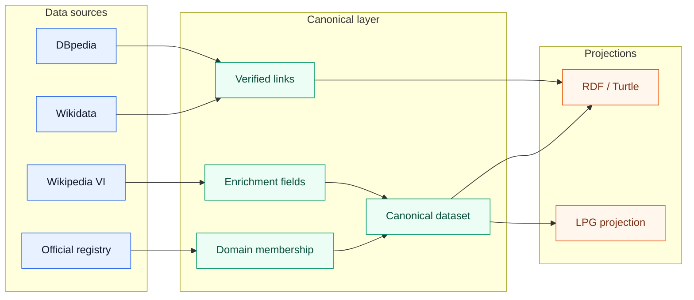

## 1.2 Đối tượng sử dụng

- Sinh viên/người học Semantic Web.
- Nhà nghiên cứu văn hóa và lịch sử.
- Người cần truy vấn di sản theo địa điểm, loại, nhân vật, sự kiện hoặc thời kỳ.
- Coding Agent triển khai project theo file specification này.

## 1.3 Giá trị Semantic Web

Project MUST thể hiện đủ các điểm sau:

- RDF representation.
- RDFS class/property hierarchy.
- OWL semantics có inference thực tế.
- SPARQL graph pattern, aggregation và path query.
- URI ổn định.
- External identity links.
- Provenance.
- Reasoning.
- Five-Star Linked Open Data.

Project MUST NOT trở thành một web application thông thường rồi chỉ thêm RDF ở cuối.

## 1.4 Nguyên lý Semantic Web áp dụng vào domain

Project MUST áp dụng, không chỉ định nghĩa suông, bốn nguyên lý cốt lõi của Semantic Web vào domain di sản văn hóa Việt Nam.

### 1.4.1 Open World Assumption (OWA)

> Không có `registry+wikipedia` hoặc `owl:sameAs` cho một entity KHÔNG có nghĩa entity đó không tồn tại link hoặc không có enrichment. Nó chỉ có nghĩa project chưa quan sát được fact đó tại snapshot hiện tại.

Áp dụng cụ thể:

- Registry entity thiếu Wikipedia page vẫn giữ `source_status=registry_only` (Section 12.4.1), KHÔNG bị coi là "không có mô tả".
- `ASK` query kiểm tra `owl:sameAs` trả `false` chỉ có nghĩa chưa tìm được verified link, KHÔNG được diễn giải thành "entity này chắc chắn không tồn tại trên Wikidata/DBpedia".
- Coverage claim (Section 12.4.2) là closed-world CÓ CHỦ ĐÍCH: `registry_valid_records == canonical_registry_derived_entities` biến full-domain claim thành một tập đóng có thể kiểm chứng, khác với OWA mặc định của RDF. Đây là lý do coverage phải dùng invariant riêng thay vì dựa vào `ASK`/absence-as-false.

### 1.4.2 Non-Unique Name Assumption (NUNA)

> Hai URI khác nhau (một `vhr:registry-...` nội bộ và một Wikidata QID) không mặc nhiên là hai entity khác nhau, và cũng không mặc nhiên là cùng một entity.

Áp dụng cụ thể:

- `owl:sameAs` CHỈ được sinh khi có QID deterministic hoặc DBpedia candidate `verified` (Section 22–23); KHÔNG suy luận từ label giống nhau.
- Identity contract (Section 13) không dùng fuzzy matching chính vì NUNA: hai label giống nhau không đủ để khẳng định cùng một thực thể.
- Khi cần khẳng định hai resource nội bộ khác nhau (ví dụ hai di tích trùng tên ở hai tỉnh), RDF generator SHOULD cân nhắc `owl:differentFrom` cho fixture golden dataset để minh họa NUNA, dù không phải blocking requirement.

### 1.4.3 AAA — Anybody can say Anything about Anything

> Wikipedia, Wikidata và DBpedia có thể phát biểu thêm về một resource do registry định nghĩa; điều này không làm registry mất authority.

Áp dụng cụ thể:

- DEC-002/DEC-027/DEC-028 (Phụ lục A) đã chính thức hóa: registry là membership authority, Wikipedia/Wikidata/DBpedia chỉ enrich hoặc link (Section 12.4.1).
- Mỗi assertion enrichment MUST giữ `dcterms:source`/`prov:wasDerivedFrom` (Section 21.1) để phân biệt "registry nói gì" với "Wikipedia nói gì về cùng resource", đúng tinh thần AAA: không trộn provenance của các nguồn khác nhau thành một fact vô danh.

### 1.4.4 T-Box và A-Box

| Lớp | Nội dung trong VietHeritageLOD | Vị trí trong spec |
|---|---|---|
| T-Box (schema) | 23 classes, 12 object properties, 10 datatype properties, `rdfs:subClassOf`, `rdfs:domain`, `rdfs:range`, `owl:inverseOf`, `owl:TransitiveProperty`, `owl:SymmetricProperty`, `owl:disjointWith`, `owl:equivalentClass` | Section 15, 15.0, 16 |
| A-Box (instance data) | Canonical entity từ registry/enrichment: `vhr:site-van-mieu`, `vhr:person-ly-thuong-kiet`, v.v. | Section 12, 20 |

Việc tách rõ T-Box/A-Box giúp trả lời được các câu hỏi reasoning kinh điển của môn học ngay trên domain này: *"Mọi `UNESCOHeritageSite` có phải là `HeritageSite`?"* (T-Box, suy ra từ `rdfs:subClassOf`, AX-001) và *"`vhr:site-van-mieu` có phải instance của `HeritageSite` không?"* (A-Box, kiểm tra bằng SPARQL `ASK`).

## 1.5 Output cuối cùng

Repository hoàn thành MUST có:

- Ontology Turtle.
- Golden dataset.
- Raw và canonical schema.
- Collector và normalization pipeline.
- Entity resolution.
- RDF generator.
- External linking artifacts.
- Final Turtle dataset.
- Fuseki deployment.
- 10 SPARQL query.
- Test suite.
- Machine-readable run report.
- Report, slides và video theo mục deliverable.
- `make verify` trả về `FINAL STATUS: PASS`.

---

# 2. Scope

## 2.1 MUST HAVE

1. Thu thập đầy đủ official registry baseline của Cục Di sản văn hóa; Wikipedia category không phải coverage authority.
2. Enrich registry entity bằng Wikipedia tiếng Việt qua MediaWiki API khi tìm được page match.
3. Full canonical dataset MUST chứa 100% registry record hợp lệ; entity thiếu enrichment vẫn phải giữ nguyên với `source_status` tương ứng.
4. Heritage-site subset MUST được report riêng; mục tiêu MVP 100 site chỉ là metric trình diễn, không thay thế full-domain coverage.
5. Có 23 class chính đã freeze.
6. Có 12 object properties do project sở hữu.
7. Có 10 datatype properties do project sở hữu hoặc được mapping rõ tới vocabulary chuẩn.
8. Có 9 OWL axioms/restrictions có ý nghĩa (AX-001 đến AX-009).
9. Sinh Turtle hợp lệ.
10. Mỗi entity có stable URI.
11. Vietnamese labels dùng language tag `@vi`.
12. Có provenance resource-level và dataset-level.
13. Có ít nhất 100 verified external links.
14. Wikidata linking dựa trên QID deterministic.
15. DBpedia candidate generation theo threshold cố định.
16. Có 10 CQ và 10 file SPARQL.
17. Có reasoning test trước/sau reasoning.
18. Có Apache Jena Fuseki chạy bằng Docker.
19. Có resource URI dereferenceable thông qua Fuseki Graph Store API.
20. Có golden dataset offline.
21. Có unit, integration, semantic, contract và end-to-end tests.
22. Có traceability từ MUST requirement tới test và AC.
23. `make verify` kiểm tra tất cả blocking artifact và test.
24. Có Neo4j LPG layer nạp từ canonical dataset, kèm Cypher tương ứng CQ01–CQ10 (chi tiết ở Phụ lục C).

## 2.2 SHOULD HAVE

- Coverage report đạt 100% registry record hợp lệ.
- Heritage-site subset đạt 150–250 site nếu snapshot registry đủ lớn.
- RDF triple count được report theo từng snapshot và không được dùng để che thiếu coverage.
- Có 100–250 verified Wikidata/DBpedia links.
- Có diagram ontology và pipeline.
- Có offline presentation fallback cho CQ10.
- Có report tối đa 15 trang.
- Có slide 15 phút và video 3–5 phút.
- Cả bốn thành viên thực hiện cross-review.

## 2.3 MAY HAVE

Các mục sau chỉ được thực hiện sau khi MVP và `make verify` đã PASS:

- Bản đồ tọa độ.
- Graph visualization tương tác.
- Giao diện tìm kiếm đơn giản.
- Federated query trực tiếp tới DBpedia.
- Silk linkage mở rộng.
- RDF content negotiation ngoài Fuseki Graph Store API.
- Template ánh xạ câu hỏi tự nhiên sang query có sẵn.

MAY feature không được làm thay đổi ontology, schema hoặc blocking test.

## 2.4 OUT OF SCOPE

Các mục sau bị loại khỏi implementation baseline:

- Toàn bộ di sản văn hóa Việt Nam.
- Dữ liệu du lịch đầy đủ.
- Khách sạn, nhà hàng, giá vé, giờ mở cửa realtime.
- User rating.
- Mobile app.
- React, Next.js hoặc frontend lớn.
- NLP extraction đa ngôn ngữ.
- LLM, RAG, vector database, agent framework.
- Recommendation engine.
- Authentication/authorization.
- Kubernetes, Kafka, microservices, event-driven architecture.
- Cloud infrastructure bắt buộc.
- GeoNames làm dependency blocking.
- Fuzzy matching trong core entity identity.
- Scraping ngoài MediaWiki API.
- Tự động parse mọi infobox Wikipedia.

---

# 3. Mục tiêu và Success Criteria

## 3.1 Metrics

| ID | Metric | MVP | Target | Cách verify |
|---|---:|---:|---:|---|
| MET-001 | Primary classes | 23 | 23 | Parse `ontology/vietheritage.ttl` |
| MET-002 | Object property project-owned | 12 | 12 | SPARQL ontology inventory |
| MET-003 | Datatype property project-owned | 10 | 10 | SPARQL ontology inventory |
| MET-004 | OWL axioms/restrictions | 9 | 9 | `tests/semantic/test_axioms.py` |
| MET-005 | Official registry entities | 100% of registry snapshot | 100% of registry snapshot | Coverage report + canonical inventory |
| MET-005a | Heritage-site subset | ≥100 when snapshot permits | 150–250 when snapshot permits | Entity-type inventory |
| MET-006 | Total resources | ≥300 (sample/MVP floor) | ≥500; full mode report số thực tế, KHÔNG có upper cap | RDF resource inventory |
| MET-007 | RDF triples | ≥5.000 (sample/MVP floor) | 5.000–15.000 chỉ là kỳ vọng trình diễn; full mode report số thực tế, KHÔNG có upper cap | `run_report.json` |
| MET-008 | Verified external links | 100 | 100–250 | `link_review.csv` |
| MET-009 | Competency questions | 10 | 10 | File inventory |
| MET-010 | SPARQL queries PASS | 10/10 | 10/10 | `make cq-test` |
| MET-011 | RDF syntax | PASS | PASS | RDFLib parse |
| MET-012 | Ontology consistency | PASS | PASS | Reasoner/consistency test |
| MET-013 | Fuseki health | PASS | PASS | HTTP health check |
| MET-014 | Reproducibility | PASS | PASS | Clean checkout test |
| MET-015 | LPG↔RDF parity | PASS | PASS | `make cypher-test`, không `LPG_RDF_MISMATCH` |

MVP là mức tối thiểu để project được trình bày. Final DoD yêu cầu tất cả blocking Acceptance Criteria ở mục 38 PASS.

Quy tắc bắt buộc về upper bound: trong `RUN_MODE=full`, MET-006 và MET-007 chỉ là **floor** và giá trị report, MUST NOT được dùng làm điều kiện FAIL khi số thực tế vượt ngưỡng trên. Snapshot registry chính thức có thể chứa hàng nghìn record; nếu áp cap cứng thì một dataset đạt đúng 100% coverage (MET-005) sẽ bị đánh FAIL, mâu thuẫn trực tiếp với coverage invariant ở Section 12.4.2. `make verify` MUST report số thực tế và chỉ FAIL khi thấp hơn floor.

## 3.2 Success criteria tổng hợp

Project thành công khi một repository mới clone thực thi thành công các command sau:

```text
make setup
make test
make pipeline-sample
make fuseki-up
make fuseki-load
make cq-test
make neo4j-up
make neo4j-load
make cypher-test
make verify
```

và `make verify` kết thúc với exit code `0` cùng dòng:

```text
FINAL STATUS: PASS
```

---

# 4. Functional Requirements

Mỗi requirement MUST được liên kết với component, test và Acceptance Criterion.

| ID | Tên | Mức | Input | Processing | Output | Failure behavior |
|---|---|---|---|---|---|---|
| FR-001 | Official registry collection | MUST | `config/registry_sources.yaml`, official URLs | Collect all registry category/index/detail records and snapshot metadata | `data/raw/registry_records.jsonl`, `reports/<run_id>/coverage.json` | Parse/network failure fails stage; records cannot be silently dropped |
| FR-001A | Wikipedia enrichment | MUST | Registry entities + `config/collector.yaml`, MediaWiki API | Match pages and collect revision, infobox, category, coordinate and QID | `data/raw/pages.jsonl` | Missing page becomes `source_status=registry_only`; registry entity remains |
| FR-002 | Raw validation | MUST | Raw JSONL | Validate JSON Schema | Valid raw records | Record sai bị quarantine |
| FR-003 | Normalization | MUST | Raw records | Chuẩn hóa text/date/coordinate/category | `data/processed/normalized.jsonl` | Record thiếu core field bị skip và ghi mã lỗi |
| FR-004 | Entity identity | MUST | Normalized records | Áp dụng DEC-006 | `entities.jsonl`, identity map | Collision làm run FAIL |
| FR-005 | Ontology mapping | MUST | Canonical entities | Mapping theo bảng mục 19 | Canonical RDF-ready records | Mapping thiếu bắt buộc làm record skip |
| FR-006 | RDF generation | MUST | Canonical records + ontology | Sinh URI, triple, provenance | `data/rdf/vietheritage.ttl` | Turtle parse lỗi làm run FAIL |
| FR-007 | Wikidata linking | MUST | Canonical QID | Sinh `owl:sameAs` | `external-links.ttl` | QID sai format bị reject |
| FR-008 | DBpedia candidate linking | MUST | Site + DBpedia candidate data | Chạy Silk rule và scorer | `dbpedia_candidates.csv` | External endpoint lỗi không làm mất Wikidata output |
| FR-009 | Link review | MUST | Candidate CSV | Chỉ accept record status `verified` | `external-links.ttl` | Candidate chưa verify không được sinh `owl:sameAs` |
| FR-010 | RDF validation | MUST | Turtle files | RDFLib parse và vocabulary checks | Validation report | Blocking FAIL |
| FR-011 | Reasoning | MUST | Ontology + fixture | Chạy Jena OWL Mini reasoner | `data/rdf/inferred.ttl` và report | Inference thiếu làm test FAIL |
| FR-012 | Fuseki | MUST | Final Turtle + metadata | Load TDB2 dataset through private admin service | Public query endpoint `localhost:3031/vietheritage`; canonical Linked Data gateway `localhost:3030/vietheritage` | Health/load failure làm `make verify` FAIL |
| FR-013 | SPARQL CQ | MUST | Fuseki dataset | Chạy CQ01–CQ10 | JSON result + PASS/FAIL | Bất kỳ CQ blocking FAIL |
| FR-014 | Run report | MUST | Mọi stage counters | Ghi report schema mục 34 | `reports/<run_id>/run_report.json` | Report không hợp lệ làm run FAIL |
| FR-015 | CLI pipeline | MUST | Make targets | Chạy stage theo thứ tự | Artifacts deterministic | Stage blocking fail-fast |
| FR-016 | Test suite | MUST | Code + fixtures | Unit/integration/semantic/contract/e2e | JUnit/JSON report | Test failure exit code khác 0 |
| FR-017 | Resource dereference | MUST | Site URI | Fuseki trả RDF cho URI | HTTP 200 + Turtle/RDF | Resource không dereference được làm AC FAIL |
| FR-018 | License/provenance | MUST | Source metadata | Ghi `dcterms` và `prov` | Dataset metadata + resource triples | Thiếu metadata làm validation FAIL |

---

# 5. Non-Functional Requirements

| ID | Requirement | Mức | Quy tắc kiểm tra |
|---|---|---|---|
| NFR-001 | Reproducibility | MUST | Clean checkout chạy sample pipeline thành công |
| NFR-002 | Deterministic IDs | MUST | Cùng input snapshot sinh cùng URI |
| NFR-003 | UTF-8 | MUST | Tất cả text/RDF/JSON/YAML dùng UTF-8 |
| NFR-004 | Vietnamese language | MUST | Label tiếng Việt dùng `@vi`; tên field/code giữ identifier kỹ thuật |
| NFR-005 | Configuration | MUST | URL, timeout, threshold và paths đọc từ config/env |
| NFR-006 | Logging | MUST | Log JSON Lines theo mục 33 |
| NFR-007 | Retry | MUST | HTTP timeout 30s, tối đa 3 retry, backoff 2/4/8s |
| NFR-008 | Testability | MUST | Mỗi stage có fixture và test riêng |
| NFR-009 | Maintainability | MUST | Mỗi stage tách module, không hard-code mapping rải rác |
| NFR-010 | Docker | MUST | Fuseki chạy bằng Docker Compose |
| NFR-011 | External resilience | MUST | Wikidata/DBpedia failure không làm mất raw/RDF nội bộ; CQ10 có offline path |
| NFR-012 | Provenance | MUST | Mỗi site có source page và retrieval timestamp |
| NFR-013 | Offline demo | SHOULD | CQ01–CQ09 chạy local; CQ10 dùng snapshot local |
| NFR-014 | Performance | SHOULD | Sample pipeline dưới 60 giây trên máy dev có Docker |
| NFR-015 | Security | MUST | Không commit secret; project không có authentication |
| NFR-016 | Deterministic diff | SHOULD | JSONL/RDF được sort theo subject/predicate/object trước khi commit artifact |

---

# 6. Kiến trúc hệ thống

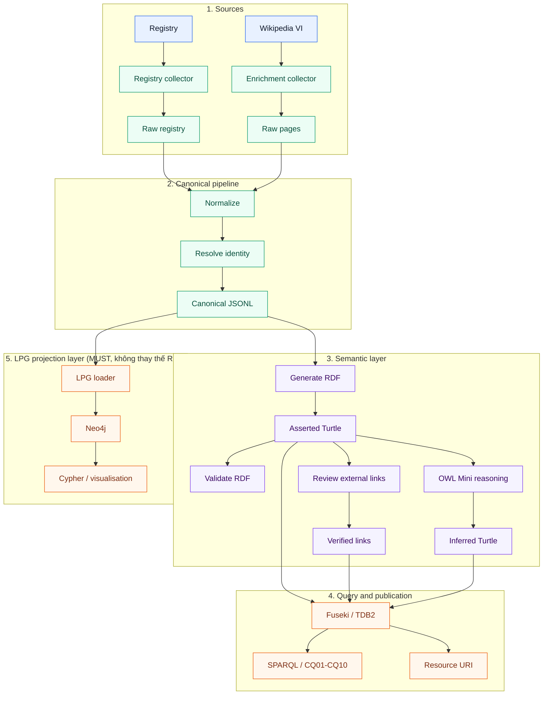

## 6.1 Hai projection từ cùng một canonical dataset

```text
canonical.jsonl
   ├── projection 1: RDF/Turtle  → Fuseki  → SPARQL, OWL reasoning, Linked Data, 5-Star LOD
   └── projection 2: LPG         → Neo4j   → Cypher, graph traversal, visualization
```

RDF/Fuseki là lớp authoritative cho semantics, reasoning và publication. Neo4j là lớp property-graph phục vụ truy vấn Cypher và trình diễn đồ thị. Neo4j MUST NOT là nguồn dữ liệu gốc và MUST NOT thay thế SPARQL endpoint trong các Acceptance Criteria về LOD.

## 6.2 Luồng dữ liệu authoritative

```text
Competency Questions
        ↓
Ontology
        ↓
Data Requirements
        ↓
RDF
        ↓
External Links
        ↓
SPARQL
        ↓
Interface / Demo
```

Không được đảo thứ tự thiết kế này để thu thập dữ liệu trước rồi mới tạo ontology.

## 6.3 Graph names

| Graph | URI |
|---|---|
| Ontology | `http://localhost:3030/vietheritage/graph/ontology` |
| Data | `http://localhost:3030/vietheritage/graph/data` |
| External links | `http://localhost:3030/vietheritage/graph/external-links` |
| Inferred | `http://localhost:3030/vietheritage/graph/inferred` |
| Dataset metadata | `http://localhost:3030/vietheritage/graph/metadata` |

Default graph MUST là union của các named graph, được cấu hình bằng `tdb2:unionDefaultGraph true` trong `deployment/fuseki/config.ttl`. CQ chạy trên default graph và không cần `GRAPH` clause. Loader MUST NOT copy triple vào default graph.

---

# 7. Component Specification

## COMP-000 — Official Heritage Registry Collector

| Field | Contract |
|---|---|
| Responsibility | Xác định coverage universe và thu thập mọi registry entity hợp lệ |
| Input | `config/registry_sources.yaml`, `VH_REGISTRY_BASE_URL` |
| Authority | Cục Di sản văn hóa, `https://dsvh.gov.vn/` |
| Baseline categories | Di sản thế giới; di tích quốc gia đặc biệt; di tích quốc gia; di sản phi vật thể đại diện, cần bảo vệ khẩn cấp và cấp quốc gia; nghệ nhân; bảo vật; di vật/cổ vật; các nhóm bảo tàng; di sản tư liệu |
| Output | `data/raw/registry_records.jsonl`, `data/raw/registry_failures.jsonl`, `reports/<run_id>/coverage.json` |
| Retrieval | Gọi các HTML/index/detail page được khai báo; selector và pagination nằm trong `config/registry_sources.yaml`; không tự thêm category |
| Identity | Giữ official ID nếu có; nếu không có thì tạo hash deterministic từ canonical source URL + registry category + normalized label |
| Required fields | `registry_id`, `registry_category`, `label_vi`, `registry_url`, `retrieved_at` |
| Completeness | Mọi item hợp lệ phải có normalized table/list record hoặc detail record; retrieval/parse failure làm full mode FAIL |
| Deduplication | Deduplicate theo `registry_id`; label/source conflict là collision blocking |
| Tests | `TEST-076`–`TEST-081` |
| Acceptance | `AC-024`, `AC-025`, `AC-026` |

`config/registry_sources.yaml` MUST contain these official category URLs:

```yaml
base_url: https://dsvh.gov.vn/
categories:
  - key: world_heritage
    url: https://dsvh.gov.vn/di-san-van-hoa-va-thien-nhien-the-gioi-1754
  - key: national_special_monuments
    url: https://dsvh.gov.vn/danh-muc-di-tich-quoc-gia-dac-biet-1752
  - key: national_monuments
    url: https://dsvh.gov.vn/danh-muc-di-tich-quoc-gia-1753
  - key: intangible_representative
    url: https://dsvh.gov.vn/di-san-van-hoa-phi-vat-the-dai-dien-cua-nhan-loai-1755
  - key: intangible_urgent
    url: https://dsvh.gov.vn/di-san-van-hoa-phi-vat-the-can-bao-ve-khan-cap-1756
  - key: national_intangible
    url: https://dsvh.gov.vn/danh-muc-di-san-van-hoa-phi-vat-the-quoc-gia-1789
  - key: artisans
    url: https://dsvh.gov.vn/danh-sach-nghe-nhan-1777
  - key: national_treasures
    url: https://dsvh.gov.vn/bao-vat-quoc-gia-1758
  - key: artifacts_antiquities
    url: https://dsvh.gov.vn/di-vat-co-vat
  - key: national_artisans
    url: https://dsvh.gov.vn/nghe-nhan-nhan-dan-1764
  - key: meritorious_artisans
    url: https://dsvh.gov.vn/nghe-nhan-uu-tu-1762
  - key: national_museums
    url: https://dsvh.gov.vn/bao-tang-quoc-gia-1784
  - key: ministry_museums
    url: https://dsvh.gov.vn/bao-tang-chuyen-nganh-thuoc-bo-nganh-to-chuc-chinh-tri-xa-hoi-trung-uong-1783
  - key: central_organization_museums
    url: https://dsvh.gov.vn/bao-tang-chuyen-nganh-thuoc-cac-don-vi-truc-thuoc-bo-nganh-to-chuc-chinh-tri-xa-hoi-trung-uong-1782
  - key: provincial_museums
    url: https://dsvh.gov.vn/bao-tang-cap-tinh-1779
  - key: private_museums
    url: https://dsvh.gov.vn/bao-tang-ngoai-cong-lap
  - key: documentary_heritage
    url: https://dsvh.gov.vn/di-san-tu-lieu-2862
```

Registry extraction contract:

- Baseline page là HTML page chứa list hoặc table. Adapter MUST parse item link và/hoặc table row theo cấu hình; MUST NOT suy luận record từ news article.
- Với table page, adapter MUST giữ ordinal, name, decision/recognition text, location và source page URL. Footer row như `Tổng số` chỉ là metadata, không phải entity.
- Một list/table row hợp lệ là registry record hoàn chỉnh; chỉ yêu cầu detail page khi `config/registry_sources.yaml` khai báo detail-link selector cho category đó.
- Pagination MUST đi theo next-page link đã cấu hình cho tới khi không còn item URL/row hash mới. Adapter MUST dừng nếu page fingerprint lặp lại để tránh loop.
- HTML parsing lỗi, selector thay đổi hoặc thiếu column bắt buộc MUST tạo lỗi blocking `REGISTRY_PARSE_ERROR` kèm category URL và snapshot ID.

Mỗi lần registry thay đổi phải tạo `coverage_snapshot` mới gồm timestamp, source URL, count theo category, checksum và failure manifest.

## COMP-001 — Wikipedia Enrichment Collector

| Field | Contract |
|---|---|
| Responsibility | Bổ sung mô tả và structured field cho registry entity đã tồn tại |
| Input | Registry labels/aliases, `config/collector.yaml`, `VH_WIKIPEDIA_API_URL` |
| Output | `data/raw/pages.jsonl`, `data/raw/enrichment_failures.jsonl` |
| API | `https://vi.wikipedia.org/w/api.php` |
| Request contract | Dùng `action=query`, `format=json`, `formatversion=2`; page lookup dùng `prop=pageprops\|revisions\|coordinates\|categories\|extracts\|links`, `rvprop=ids\|timestamp\|content`, `rvslots=main`, `exintro=1`, `explaintext=1`, `cllimit=max`, `pllimit=max` |
| Infobox rule | Lấy infobox template đầu tiên từ revision content, chuyển thành raw key/value đã normalize; giữ unknown key và không suy luận ontology class từ một key đơn lẻ |
| HTTP | GET; timeout 30 seconds; 3 retries with 2/4/8 second backoff |
| Fields | `page_id`, `title`, `source_url`, `retrieved_at`, `wikidata_id`, `coordinates`, `infobox`, `categories`, `abstract`, `links`, `revision_id` |
| Matching | Exact normalized title/alias trước; QID là bước xác nhận thứ hai; không tìm được match thì giữ `registry_only` |
| Deduplication | Deduplicate theo `page_id`; một page có thể enrich nhiều registry entity nhưng không tạo duplicate page record |
| Failure | Missing/HTTP failure không được làm mất registry record; ghi `ENRICHMENT_MISSING` hoặc failure manifest |
| Tests | `TEST-001`–`TEST-004` |
| Acceptance | `AC-001`, `AC-002`, `AC-026` |

Wikipedia category discovery MAY được dùng để tìm enrichment candidate, nhưng MUST NOT thêm entity ngoài official registry vào full canonical dataset.

## COMP-002 — Normalizer

| Trường | Contract |
|---|---|
| Input | `data/raw/registry_records.jsonl` + `data/raw/pages.jsonl` |
| Output | `data/processed/normalized.jsonl`, `data/processed/skipped_records.jsonl` |
| Processing | Unicode NFC, whitespace, label, entity type, year, coordinate, category, URL, missing field, source status |
| Core required | `registry_id`, `registry_category`, `label_vi`, `registry_url`, `source_status`, `coverage_snapshot`, `retrieved_at` |
| Optional enrichment | `page_id`, `title`, `source_url`, `wikidata_id`, `coordinates`, `infobox`, `categories`, `abstract` |
| Failure | Record thiếu core field bị skip; pipeline tiếp tục |
| Test | `TEST-005` đến `TEST-011` |

## COMP-003 — Entity Resolver

| Trường | Contract |
|---|---|
| Input | `normalized.jsonl` |
| Output | `data/processed/entities.jsonl`, `identity_map.jsonl`, `collision_report.json` |
| Algorithm | DEC-006, mục 13 |
| Fuzzy matching | MUST NOT dùng trong core identity |
| Failure | Collision không giải quyết được làm stage FAIL |
| Test | `TEST-012` đến `TEST-016` |

## COMP-004 — Canonical Mapper

| Trường | Contract |
|---|---|
| Input | Entities + `config/mapping.yaml` |
| Output | `data/processed/canonical.jsonl` |
| Processing | Map field nguồn vào canonical entity type |
| Config | Mapping phải nằm trong YAML, không hard-code trong collector |
| Failure | Mapping thiếu field required của entity làm record skip |
| Test | `TEST-017` đến `TEST-020` |

## COMP-005 — RDF Generator

| Trường | Contract |
|---|---|
| Input | `canonical.jsonl`, ontology, URI config |
| Output | `data/rdf/vietheritage.ttl`, `data/rdf/dataset-metadata.ttl` |
| Library | RDFLib 7.1.3 |
| Serialization | Turtle UTF-8 |
| Sorting | Sort triple theo subject, predicate, object trước serialization deterministic |
| Failure | Invalid URI/literal hoặc parse round-trip fail làm stage FAIL |
| Test | `TEST-021` đến `TEST-027` |

## COMP-006 — RDF/Semantic Validator

| Trường | Contract |
|---|---|
| Input | Ontology + generated RDF + fixtures |
| Output | `reports/<run_id>/rdf_validation.json` |
| Checks | Parse, namespace, required label, datatype, provenance, URI, no invalid literal subject; AX-008 disjoint-union consistency; AX-009 closed-world cardinality |
| Failure | Blocking error làm `make validate` exit 1 |
| Test | `TEST-028` đến `TEST-033`, `TEST-084`, `TEST-085` |

## COMP-007 — External Linker

| Trường | Contract |
|---|---|
| Input | Canonical identity + local candidates + Silk config |
| Output | `data/linking/wikidata_links.csv`, `dbpedia_candidates.csv`, `link_review.csv`, `data/rdf/external-links.ttl` |
| Wikidata | QID deterministic |
| DBpedia | Candidate + exact score/tolerance ở mục 22 |
| Acceptance | Chỉ status `verified` được sinh `owl:sameAs` |
| Failure | Remote failure tạo warning và cache; không xóa internal RDF |
| Test | `TEST-034` đến `TEST-040` |

## COMP-008 — Reasoner

| Trường | Contract |
|---|---|
| Input | Ontology + final data + reasoning fixture |
| Output | `data/rdf/inferred.ttl`, `reports/<run_id>/reasoning.json` |
| Engine | Apache Jena OWL Mini reasoner (`http://jena.hpl.hp.com/2003/OWLMiniFBRuleReasoner`) cho AX-001…AX-007; CLI orchestration nhận kết quả semantic validation cho AX-008/AX-009; HermiT chỉ dùng SHOULD cho review Protégé |
| Checks | Aggregate AX-001…AX-009: OWL inference/consistency cho AX-001…AX-007 và validation result cho AX-008/AX-009 |
| Failure | Missing expected inference, inconsistency hoặc AX-008/AX-009 validation failure làm aggregate stage FAIL |
| Test | `TEST-041` đến `TEST-045`, `TEST-082`, `TEST-083`; aggregate thêm `TEST-084`, `TEST-085` |

## COMP-009 — Fuseki Loader

| Trường | Contract |
|---|---|
| Input | Ontology/data/external/inferred Turtle |
| Output | TDB2 persistent volume trong Docker |
| Dataset | `vietheritage` |
| Port | `3030` |
| Failure | Health check/load fail làm stage FAIL |
| Test | `TEST-046` đến `TEST-050` |

## COMP-010 — CQ Runner

| Trường | Contract |
|---|---|
| Input | Fuseki endpoint + `sparql/CQ01-sites-by-location.rq` … `CQ10-english-label-from-snapshot.rq` |
| Output | `reports/<run_id>/cq_results.json` và TSV/JSON từng query |
| PASS | Expected columns và expected fixture bindings khớp |
| Failure | Bất kỳ CQ MUST fail làm `make cq-test` exit 1 |
| Test | `TEST-051` đến `TEST-060` |

---

# 8. Technology Stack

| Layer | Technology | Version/constraint | Mandatory |
|---|---|---|---|
| Language | Python | >=3.12,<3.14 | MUST |
| RDF library | RDFLib | 7.1.3 | MUST |
| HTTP | requests | 2.32.3 | MUST |
| Config | PyYAML | 6.0.2 | MUST |
| Schema validation | jsonschema | 4.23.0 | MUST |
| Test | pytest | 8.3.4 | MUST |
| Java runtime | Eclipse Temurin | `21-jre` (LTS), khớp `deployment/fuseki/Dockerfile` | MUST for Fuseki |
| Triple store | Apache Jena Fuseki | 4.10.0, TDB2 | MUST |
| LPG store | Neo4j Community | `neo4j:5.26` (LTS) | MUST |
| LPG query language | Cypher | Neo4j 5 syntax | MUST |
| RDF-to-LPG plugin | neosemantics (`n10s`) | Optional demo only | MAY |
| Fuseki image | Built locally từ `jena-fuseki-server` jar | `deployment/fuseki/Dockerfile`, `JENA_VERSION=4.10.0` | MUST |
| Link discovery | Silk | 2.7.5, XML linkage rule là policy source; executor thực tế là Python scorer deterministic (Section 22.3) nên không ràng buộc Java runtime | MUST for DBpedia candidates |
| Ontology editor | Protégé | 5.6.4 | SHOULD, authoring/review only |
| Query language | SPARQL | 1.1 | MUST |
| RDF format | Turtle | UTF-8 | MUST |
| Task runner | GNU Make | 4.x | MUST |
| Version control | Git | repository history required | MUST |
| Frontend | None in baseline | Fuseki endpoint is interface | MUST for scope control |

Không dùng framework thay thế trong baseline.

---

# 9. Repository Structure

```text
vietheritage-lod/
├── PROJECT_SPEC.md
├── README.md
├── Makefile
├── docker-compose.yml
├── requirements.txt
├── .env.example
├── .gitignore
├── config/
│   ├── registry_sources.yaml
│   ├── collector.yaml
│   ├── mapping.yaml
│   ├── uri.yaml
│   ├── thresholds.yaml
│   └── requirements.yaml
├── ontology/
│   └── vietheritage.ttl
├── schema/
│   ├── raw-page.schema.json
│   ├── canonical-record.schema.json
│   ├── run-report.schema.json
│   ├── coverage.schema.json
│   └── link-review.schema.json
├── data/
│   ├── raw/
│   ├── processed/
│   ├── rdf/
│   ├── fixtures/
│   │   ├── raw_pages.jsonl
│   │   ├── canonical.jsonl
│   │   ├── external_snapshot.ttl
│   │   └── expected/
│   └── linking/
├── src/
│   └── vietheritage/
│       ├── registry/              # Official registry collector + coverage validator
│       ├── collector/             # Wikipedia enrichment collector
│       ├── normalization/
│       ├── identity/
│       ├── mapping/
│       ├── rdf/
│       ├── lpg/
│       ├── linking/
│       ├── reasoning/
│       ├── validation/
│       ├── reporting/
│       └── cli.py
├── sparql/
│   ├── CQ01-sites-by-location.rq
│   ├── CQ02-unesco-before-year.rq
│   ├── CQ03-sites-by-type.rq
│   ├── CQ04-sites-by-person.rq
│   ├── CQ05-sites-by-event-or-period.rq
│   ├── CQ06-top-areas.rq
│   ├── CQ07-persons-with-many-sites.rq
│   ├── CQ08-sites-in-complex.rq
│   ├── CQ09-external-links.rq
│   └── CQ10-english-label-from-snapshot.rq
│   # optional, không thuộc 10 file blocking của make cq-test:
│   # CQ10-federated-demo.rq
├── cypher/
│   ├── CQ01-sites-by-location.cypher
│   └── ... CQ02 … CQ10
├── silk/
│   └── linkage-rules.xml
├── tests/
│   ├── unit/
│   ├── integration/
│   ├── semantic/
│   ├── contract/
│   └── e2e/
├── deployment/
│   ├── fuseki/
│   │   ├── Dockerfile
│   │   └── config.ttl
│   └── linked-data/
├── logs/
├── reports/
└── docs/
    ├── ontology-diagram.md
    ├── data-sources.md
    ├── report/
    ├── slides/
    └── video/
```

## 9.1 Directory contract

| Directory | Purpose | Input | Output | Generated | Git tracked |
|---|---|---|---|---|---|
| `config/` | Configuration | YAML/env | Runtime config | No | Yes |
| `ontology/` | Ontology source | Manual Turtle | Ontology | No | Yes |
| `schema/` | JSON Schema | Manual JSON | Validation rules | No | Yes |
| `data/raw/` | Raw source snapshot | API | JSONL | Yes | Sample only |
| `data/processed/` | Normalized/canonical | Raw JSONL | JSONL | Yes | Sample only |
| `data/rdf/` | RDF artifacts | Canonical | Turtle | Yes | Sample + metadata |
| `data/fixtures/` | Golden test data | Fixed | Test artifacts | No | Yes |
| `src/` | Implementation | Config/data | Stage outputs | No | Yes |
| `sparql/` | CQ queries | Ontology contract | Query results | No | Yes |
| `silk/` | Linkage rules | Rule XML | Candidate links | No | Yes |
| `reports/` | Run reports | Stage counters | JSON/JSONL | Yes | No |
| `logs/` | Logs | Runtime | JSONL | Yes | No |

Raw full dataset MUST NOT be committed. Golden sample MUST be committed.

---

# 10. Configuration Contract

## 10.1 `.env.example`

```dotenv
VH_BASE_URI=http://localhost:3030/vietheritage
VH_REGISTRY_BASE_URL=https://dsvh.gov.vn/
VH_REGISTRY_SNAPSHOT=latest
VH_WIKIPEDIA_API_URL=https://vi.wikipedia.org/w/api.php
VH_WIKIDATA_SPARQL_URL=https://query.wikidata.org/sparql
VH_DBPEDIA_SPARQL_URL=https://dbpedia.org/sparql
FUSEKI_URL=http://localhost:3031
FUSEKI_DATASET=vietheritage
FUSEKI_LOAD_DATASET=vietheritage-admin
FUSEKI_PORT=3031
JENA_VERSION=4.10.0
HTTP_TIMEOUT_SECONDS=30
HTTP_MAX_RETRIES=3
HTTP_BACKOFF_SECONDS=2
DBPEDIA_AUTO_ACCEPT_SCORE=0.90
DBPEDIA_REVIEW_SCORE=0.70
DBPEDIA_AUTO_ACCEPT_DISTANCE_KM=5
DBPEDIA_REVIEW_DISTANCE_KM=20
NEO4J_URI=bolt://localhost:7687
NEO4J_USER=neo4j
NEO4J_PASSWORD=change-me-local-only
NEO4J_DATABASE=neo4j
RUN_MODE=sample
```

## 10.2 Biến môi trường

| Biến | Type | Required | Default | Validation | Secret |
|---|---|---:|---|---|---:|
| `VH_BASE_URI` | URI | No | `http://localhost:3030/vietheritage` | No trailing `/` | No |
| `VH_REGISTRY_BASE_URL` | URI | Yes in full mode | `https://dsvh.gov.vn/` | HTTPS official registry | No |
| `VH_REGISTRY_SNAPSHOT` | string | No | `latest` | snapshot ID or `latest` | No |
| `VH_WIKIPEDIA_API_URL` | URI | No | API tiếng Việt | HTTPS hoặc localhost | No |
| `VH_WIKIDATA_SPARQL_URL` | URI | No | Wikidata endpoint | URI hợp lệ | No |
| `VH_DBPEDIA_SPARQL_URL` | URI | No | DBpedia endpoint | URI hợp lệ | No |
| `FUSEKI_URL` | URI | No | `http://localhost:3030` | URI hợp lệ | No |
| `FUSEKI_DATASET` | string | No | `vietheritage` | `[a-z0-9_-]+` | No |
| `FUSEKI_PORT` | integer | No | `3030` | `1024–65535` | No |
| `JENA_VERSION` | string | No | `4.10.0` | semver của Apache Jena | No |
| `HTTP_TIMEOUT_SECONDS` | integer | No | `30` | `1–120` | No |
| `HTTP_MAX_RETRIES` | integer | No | `3` | `0–5` | No |
| `HTTP_BACKOFF_SECONDS` | integer | No | `2` | `1–30` | No |
| `DBPEDIA_AUTO_ACCEPT_SCORE` | decimal | No | `0.90` | `0–1` | No |
| `DBPEDIA_REVIEW_SCORE` | decimal | No | `0.70` | `0–1`, nhỏ hơn auto | No |
| `DBPEDIA_AUTO_ACCEPT_DISTANCE_KM` | decimal | No | `5` | `0–100` | No |
| `DBPEDIA_REVIEW_DISTANCE_KM` | decimal | No | `20` | lớn hơn auto | No |
| `RUN_MODE` | enum | No | `sample` | `sample` hoặc `full` | No |
| `NEO4J_URI` | URI | Yes khi chạy LPG stage | `bolt://localhost:7687` | bolt/neo4j scheme, loopback trong baseline | No |
| `NEO4J_USER` | string | Yes khi chạy LPG stage | `neo4j` | `[a-z0-9_-]+` | No |
| `NEO4J_PASSWORD` | string | Yes khi chạy LPG stage | không có default | độ dài ≥ 8; MUST NOT commit giá trị thật | **Yes** |
| `NEO4J_DATABASE` | string | No | `neo4j` | `[a-z0-9_-]+` | No |

Nếu env không hợp lệ, chương trình MUST kết thúc với `CONFIG_INVALID` trước khi gọi network.

Baseline không có authentication. Vì vậy Fuseki MUST chỉ bind loopback (`127.0.0.1:${FUSEKI_PORT}:3030`) và MUST NOT expose ra network công cộng. Nếu cần demo ngoài máy local, phải bổ sung reverse proxy có access control và cập nhật specification trước.

## 10.3 `config/thresholds.yaml`

```yaml
linking:
  auto_accept_score: 0.90
  review_score: 0.70
  auto_accept_distance_km: 5.0
  review_distance_km: 20.0
  coordinate_required_for_auto_accept: true
  minimum_type_compatibility: true
```

---

# 11. RAW DATA CONTRACT

File `schema/raw-page.schema.json` MUST be JSON Schema Draft 2020-12. Each line of `registry_records.jsonl` and `pages.jsonl` after merge is a valid JSON object.

## 11.1 Schema field table

| Field | Type | Required | Nullable | Source | Meaning |
|---|---|---:|---:|---|---|
| `registry_id` | string | Yes for registry records | No | Official registry or deterministic fallback | Coverage identity |
| `registry_category` | string | Yes for registry records | No | `config/registry_sources.yaml` | Baseline category |
| `registry_url` | URI string | Yes for registry records | No | Official registry detail/index | Official record URL |
| `label_vi` | string | Yes | No | Registry row or Wikipedia title | Vietnamese label |
| `source_status` | enum | Yes | No | Collector | `registry_only`, `registry+wikipedia`, `registry+enriched` |
| `coverage_snapshot` | string | Yes | No | Registry collector | Snapshot identifier |
| `page_id` | integer | No | Yes | MediaWiki `pageid` | Enrichment page ID |
| `title` | string | No | Yes | Wikipedia `title` | Enrichment page title |
| `source_url` | URI string | No | Yes | Wikipedia page URL | Enrichment source URL |
| `retrieved_at` | RFC3339 string | Yes | No | Collector clock UTC | Thời điểm lấy |
| `wikidata_id` | string pattern `^Q[0-9]+$` | No | Yes | Wikibase property | QID |
| `coordinates` | object | No | Yes | API coordinates | Lat/long |
| `coordinates.lat` | number | Conditional | No | API | Latitude [-90,90] |
| `coordinates.lon` | number | Conditional | No | API | Longitude [-180,180] |
| `infobox` | object | No | No | Parsed wikitext | Field nguyên bản |
| `abstract` | string | No | Yes | Extracted text | Mô tả ngắn |
| `categories` | array string | No | No | API | Categories |
| `links` | array URI string | No | No | API | Outgoing page links |
| `revision_id` | integer | No | Yes | API | Revision snapshot |

## 11.2 JSON example

```json
{
  "registry_id": "dsvh-national-monument-000001",
  "registry_category": "national_monuments",
  "label_vi": "Văn Miếu – Quốc Tử Giám",
  "registry_url": "https://dsvh.gov.vn/...",
  "source_status": "registry+wikipedia",
  "coverage_snapshot": "2026-09-12T03:00:00Z",
  "page_id": 100001,
  "title": "Văn Miếu – Quốc Tử Giám",
  "source_url": "https://vi.wikipedia.org/wiki/V%C4%83n_Mi%E1%BA%BFu_%E2%80%93_Qu%E1%BB%91c_T%E1%BB%AD_Gi%C3%A1m",
  "retrieved_at": "2026-09-12T03:00:00Z",
  "wikidata_id": "Q900000001",
  "coordinates": {"lat": 21.0278, "lon": 105.8357},
  "infobox": {
    "loai": "di tích lịch sử",
    "dia_diem": "Hà Nội",
    "nam_xay_dung": "1070"
  },
  "abstract": "Văn Miếu – Quốc Tử Giám là một quần thể di tích tại Hà Nội.",
  "categories": ["Di tích lịch sử Việt Nam"],
  "links": [],
  "revision_id": 123456789
}
```

## 11.3 Raw rules

- Collector MUST preserve raw values trong `infobox`; normalization xảy ra ở stage sau.
- Collector MUST không suy luận class từ một field đơn lẻ.
- Collector MUST không ghi `owl:sameAs` vào raw data.
- `retrieved_at` MUST dùng UTC với hậu tố `Z`.
- Registry record thiếu `registry_id`, `registry_category`, `label_vi` hoặc `registry_url` MUST vào quarantine.
- Enrichment record thiếu `page_id` hoặc `title` MUST vào enrichment quarantine; this does not remove its registry entity.

---

# 12. CANONICAL DATA CONTRACT

Canonical record có envelope chung:

```json
{
  "entity_id": "registry-dsvh-national-monument-000001",
  "entity_type": "HeritageSite",
  "label_vi": "Văn Miếu – Quốc Tử Giám",
  "registry_id": "dsvh-national-monument-000001",
  "registry_category": "national_monuments",
  "registry_url": "https://dsvh.gov.vn/...",
  "source_status": "registry+wikipedia",
  "coverage_snapshot": "2026-09-12T03:00:00Z",
  "source_page_id": 100001,
  "source_title": "Văn Miếu – Quốc Tử Giám",
  "source_url": "https://vi.wikipedia.org/wiki/...",
  "retrieved_at": "2026-09-12T03:00:00Z",
  "aliases_vi": [],
  "description_vi": "...",
  "coordinates": {"lat": 21.0278, "lon": 105.8357},
  "external_ids": {"wikidata": "Q900000001"},
  "relations": {},
  "provenance": {"source": "https://vi.wikipedia.org/wiki/...", "method": "registry-plus-mediawiki-enrichment", "license": "CC BY-SA 4.0"}
}
```

## 12.1 Common fields

| Field | Type | Required | Nullable | Meaning |
|---|---|---:|---:|---|
| `registry_id` | string | Yes for registry-derived | No | Official coverage identity |
| `registry_category` | string | Yes for registry-derived | No | Baseline category |
| `registry_url` | URI | Yes for registry-derived | No | Official source URL |
| `source_status` | enum | Yes | No | Enrichment completeness state |
| `coverage_snapshot` | string | Yes | No | Registry snapshot ID |
| `entity_id` | string | Yes | No | Stable internal ID |
| `entity_type` | enum | Yes | No | One of 14 canonical entity types |
| `label_vi` | string | Yes | No | Nhãn chuẩn tiếng Việt |
| `source_page_id` | integer | Conditional: successful Wikipedia enrichment | Yes only when not required | MediaWiki page ID |
| `source_title` | string | Conditional: successful Wikipedia enrichment | Yes only when not required | MediaWiki page title |
| `source_url` | URI | Yes | No | Nguồn chính |
| `retrieved_at` | RFC3339 | Yes | No | Retrieval time |
| `aliases_vi` | array string | No | No | Tên thay thế |
| `description_vi` | string | No | Yes | Mô tả |
| `coordinates` | object | No | Yes | Lat/lon |
| `external_ids` | object | No | No | QID và ID ngoài |
| `relations` | object | No | No | Entity IDs liên quan |
| `provenance` | object | Yes | No | Source/method/license |

## 12.2 Entity types and required fields

Canonical entity types MUST include all registry categories:

```text
HeritageSite, AdministrativeArea, HistoricalPerson, HistoricalEvent,
HistoricalPeriod, HeritageComplex, Organization, ArchitecturalStyle,
Museum, IntangibleHeritage, NationalTreasure, DocumentaryHeritage,
Artisan, CulturalObject
```

`source_status=registry_only` là trạng thái hợp lệ và MUST NOT bị lọc bỏ chỉ vì thiếu Wikipedia enrichment. `source_page_id` và `source_title` chỉ MUST có khi entity đã enrichment Wikipedia thành công (`source_status=registry+wikipedia` hoặc `source_status=registry+enriched`); chúng MAY vắng mặt hoặc `null` với `registry_only`.

### `HeritageSite`

Required: `entity_id`, `entity_type`, `label_vi`, `source_url`, `retrieved_at`, `provenance`.

Conditional: `source_page_id`, `source_title` khi Wikipedia enrichment thành công. Hai field này không bắt buộc với `source_status=registry_only`.

Optional: `aliases_vi`, `description_vi`, `construction_year`, `recognition_year`, `address`, `coordinates`, `site_types`, `located_in`, `associated_persons`, `associated_events`, `periods`, `built_by`, `recognized_by`, `architectural_styles`, `part_of`.

### `AdministrativeArea`

Required: `entity_id`, `entity_type`, `label_vi`, `provenance`.

Optional: `level`, `country_code`, `parent_area`, `coordinates`, `external_ids`.

### `HistoricalPerson`

Required: `entity_id`, `entity_type`, `label_vi`, `provenance`.

Optional: `description_vi`, `birth_year`, `death_year`, `aliases_vi`, `external_ids`.

### `HistoricalEvent`

Required: `entity_id`, `entity_type`, `label_vi`, `provenance`.

Optional: `start_year`, `end_year`, `description_vi`, `location`, `external_ids`.

### `HistoricalPeriod`

Required: `entity_id`, `entity_type`, `label_vi`, `provenance`.

Optional: `start_year`, `end_year`, `description_vi`, `external_ids`.

### `HeritageComplex`

Required: `entity_id`, `entity_type`, `label_vi`, `provenance`.

Optional: `description_vi`, `located_in`, `member_sites`, `external_ids`.

### `Organization`

Required: `entity_id`, `entity_type`, `label_vi`, `provenance`.

Optional: `description_vi`, `organization_type`, `address`, `external_ids`.

### `ArchitecturalStyle`

Required: `entity_id`, `entity_type`, `label_vi`, `provenance`.

Optional: `description_vi`, `external_ids`.

### `Museum`

Required: `entity_id`, `entity_type`, `label_vi`, `registry_id`, `registry_url`, `provenance`.

Optional: `description_vi`, `address`, `located_in`, `museum_type`, `external_ids`.

### `IntangibleHeritage`

Required: `entity_id`, `entity_type`, `label_vi`, `registry_id`, `registry_category`, `registry_url`, `provenance`.

Optional: `description_vi`, `community`, `location`, `recognition_year`, `external_ids`.

### `NationalTreasure`

Required: `entity_id`, `entity_type`, `label_vi`, `registry_id`, `registry_url`, `provenance`.

Optional: `description_vi`, `current_holder`, `location`, `recognition_year`, `external_ids`.

### `DocumentaryHeritage`

Required: `entity_id`, `entity_type`, `label_vi`, `registry_id`, `registry_url`, `provenance`.

Optional: `description_vi`, `custodian`, `recognition_year`, `external_ids`.

### `Artisan`

Required: `entity_id`, `entity_type`, `label_vi`, `registry_id`, `registry_url`, `provenance`.

Optional: `description_vi`, `artisan_title`, `associated_intangible_heritage`, `external_ids`.

### `CulturalObject`

Required: `entity_id`, `entity_type`, `label_vi`, `registry_id`, `registry_url`, `provenance`.

Optional: `description_vi`, `object_type`, `custodian`, `location`, `external_ids`.

## 12.3 Canonical JSON example

```json
{
  "entity_id": "registry-dsvh-national-monument-000001",
  "entity_type": "HeritageSite",
  "label_vi": "Văn Miếu – Quốc Tử Giám",
  "registry_id": "dsvh-national-monument-000001",
  "registry_category": "national_monuments",
  "registry_url": "https://dsvh.gov.vn/...",
  "source_status": "registry+wikipedia",
  "coverage_snapshot": "2026-09-12T03:00:00Z",
  "source_page_id": 100001,
  "source_title": "Văn Miếu – Quốc Tử Giám",
  "source_url": "https://vi.wikipedia.org/wiki/V%C4%83n_Mi%E1%BA%BFu_%E2%80%93_Qu%E1%BB%91c_T%E1%BB%AD_Gi%C3%A1m",
  "retrieved_at": "2026-09-12T03:00:00Z",
  "aliases_vi": ["Văn Miếu Quốc Tử Giám"],
  "description_vi": "Một quần thể di tích lịch sử tại Hà Nội.",
  "coordinates": {"lat": 21.0278, "lon": 105.8357},
  "external_ids": {"wikidata": "Q900000001"},
  "relations": {
    "located_in": ["area-hanoi"],
    "associated_persons": ["person-ly-thuong-kiet"],
    "part_of": ["complex-thang-long"],
    "recognized_by": ["organization-unesco"]
  },
  "construction_year": 1070,
  "recognition_year": null,
  "address": "Hà Nội",
  "provenance": {
    "source": "https://vi.wikipedia.org/wiki/V%C4%83n_Mi%E1%BA%BFu_%E2%80%93_Qu%E1%BB%91c_T%E1%BB%AD_Gi%C3%A1m",
    "method": "registry-plus-mediawiki-enrichment",
    "license": "CC BY-SA 4.0"
  }
}
```

---

## 12.4 Coverage and Multi-Source Contract

### 12.4.1 Authority order

```text
Official Cục Di sản văn hóa registry → membership and registry category
Wikipedia tiếng Việt                  → description/infobox/coordinates/QID enrichment
Wikidata                              → external identity and enrichment
DBpedia                               → candidate links and reviewed external identity
```

Registry chính thức là authority quyết định entity có thuộc full-domain dataset hay không. Thiếu Wikipedia page, QID hoặc DBpedia match MUST NOT làm loại registry entity hợp lệ.

### 12.4.2 Coverage invariants

Với mỗi full run, các invariant sau MUST đúng:

```text
registry_valid_records == canonical_registry_derived_entities
registry_failures == 0
coverage_percent == 100.0
```

Phạm vi áp dụng theo `RUN_MODE` (bắt buộc, để tránh hiểu sai khi chạy sample):

| Mode | Nguồn | Coverage invariant | AC liên quan |
|---|---|---|---|
| `sample` | Golden fixture trong `data/fixtures/` (Section 35) | Tính **trên fixture**: mọi record hợp lệ trong fixture MUST vào canonical, `registry_failures == 0`. `claim` MUST là `SKIPPED_SAMPLE_MODE` | `AC-026` chạy; `AC-024`/`AC-025` ghi `SKIPPED_SAMPLE_MODE` |
| `full` | Registry chính thức qua network | Tính trên toàn bộ snapshot 17 category; `claim` mới được là `100% of selected official registry snapshot` | `AC-024`, `AC-025`, `AC-026` đều blocking |

Sample mode MUST NOT ghi `claim = 100% of selected official registry snapshot`, vì fixture không phải snapshot registry thật.

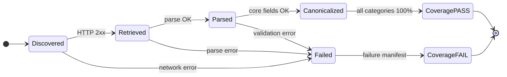

Nếu registry detail page không thể retrieve hoặc parse, run MUST FAIL thay vì claim full coverage. Failure report MUST có `registry_category`, `registry_url`, `registry_id` nếu biết, HTTP status/error và retry count.

### 12.4.3 Coverage report

`reports/<run_id>/coverage.json` MUST có:

- `snapshot_id`, `retrieved_at`, `source_urls`, `source_checksums`.
- Counter theo từng category: `discovered`, `valid`, `invalid`, `retrieved`, `failed`, `canonicalized`, `coverage_percent`.
- Counter toàn cục: `registry_total`, `canonical_total`, `registry_only`, `wikipedia_matched`, `wikidata_linked`, `dbpedia_verified`.
- `unresolved_registry_ids` và `failure_manifest`.
- `claim` chỉ được ghi chính xác là `100% of selected official registry snapshot` khi mọi blocking invariant PASS.

Wikipedia category discovery và seed page chỉ là enrichment input. Chúng MUST NOT làm tăng `registry_total` hoặc bypass registry membership.

# 13. Entity Identity Contract

## 13.1 Stable ID

- Registry-derived entity MUST dùng `registry-{slug(registry_id)}`. `registry_category` được lưu riêng và không lặp lại trong ID.
- Nếu official registry không có ID, dùng `registry-{sha256(canonical_source_url + registry_category + normalized_label)[:12]}`.
- Wikipedia page chỉ là enrichment source và MUST NOT tạo full-domain entity mới ngoài registry baseline.
- Person, area, event, period, complex, organization và style được tham chiếu bởi registry entity chỉ được tạo khi xuất hiện rõ trong canonical relation; identity dùng QID, page ID hoặc type-prefixed hash deterministic.
- Person có QID dùng `person-wikidata-{lowercase(QID)}`; không có QID dùng `person-name-{sha256(normalized_name)[:12]}`.
- Area có QID dùng `area-wikidata-{lowercase(QID)}`; không có QID dùng `area-name-{sha256(normalized_name)[:12]}`.
- Event dùng `event-{sha256(normalized_name + start_year)[:12]}`.
- Period dùng `period-{sha256(normalized_name + start_year + end_year)[:12]}`.
- Complex, organization và style dùng type prefix cùng canonical-name hash deterministic nếu không có official/QID identity.

Hash MUST là SHA-256 trên chuỗi canonical normalized UTF-8, lấy 12 ký tự hexadecimal lowercase đầu tiên. `entity_id` MUST dùng lowercase ASCII; QID chỉ giữ chữ `Q` hoa trong `external_ids.wikidata` và external Wikidata URI.

## 13.2 Thứ tự identity resolution

```text
1. Official registry_id for registry-derived entities
2. Valid QID for explicitly represented derived entities
3. Wikipedia page_id for explicitly represented derived entities
4. Canonical normalized identity = entity_type + label + normalized area
5. Deterministic SHA-256 key
```

Identity có nguồn từ registry MUST NOT bị thay bằng Wikipedia page ID hoặc fuzzy match. Fuzzy matching không được phép trong core identity.

## 13.3 Duplicate

Hai registry record là duplicate khi có cùng `registry_id` hoặc cùng deterministic fallback identity. Enrichment record là duplicate khi có cùng `page_id` hoặc QID.

Duplicate record MUST được merge theo quy tắc:

1. Giữ registry identity làm primary identity cho registry-derived entity.
2. Union alias và category.
3. Chọn giá trị non-null từ source revision mới hơn.
4. Ghi merge vào `identity_map.jsonl`.

## 13.4 Collision

Nếu một identity key ánh xạ tới hai entity type khác nhau, pipeline MUST tạo `IDENTITY_COLLISION` và FAIL stage. Không tự merge.

## 13.5 Title change

Title Wikipedia chỉ là label. Title đổi không làm đổi URI hoặc entity ID nếu `page_id` giữ nguyên.

---

# 14. URI Specification

## 14.1 Base URI

Base URI mặc định duy nhất:

```text
http://localhost:3030/vietheritage
```

`VH_BASE_URI` cho phép thay đổi deployment host, nhưng mọi test local dùng default trên. URI MUST không có trailing slash.

## 14.2 Templates

```text
{BASE}/ontology/{Class}
{BASE}/ontology/{property}
{BASE}/resource/{entity_id}
{BASE}/dataset/vietheritage
{BASE}/graph/ontology
{BASE}/graph/data
{BASE}/graph/external-links
{BASE}/graph/inferred
{BASE}/graph/metadata
```

`entity_id` dùng `registry-` cho entity có nguồn từ registry và type-prefix cho entity derived được biểu diễn rõ ràng (`person-`, `area-`, `event-`, `period-`, `complex-`, `organization-`, `style-`). Resource URI không thêm một segment type khác. Ví dụ:

```text
http://localhost:3030/vietheritage/resource/registry-dsvh-national-monument-000001
http://localhost:3030/vietheritage/resource/person-ly-thuong-kiet
http://localhost:3030/vietheritage/resource/area-hanoi
```

### 14.2.1 Prefix `site-` dành riêng cho fixture

Golden dataset (Section 35) và các ví dụ trong tài liệu này dùng prefix `site-` (`site-unesco-1`, `site-van-mieu`, `site-a`…) cho **entity tổng hợp phục vụ test**, không phải record registry thật. Prefix này được khai báo chính thức để validator không reject fixture, kèm hai ràng buộc bắt buộc:

- `site-` MUST chỉ xuất hiện trong `data/fixtures/` và trong ví dụ của specification.
- Trong `RUN_MODE=full`, validator MUST FAIL với mã `FIXTURE_ID_IN_PRODUCTION` nếu bất kỳ `entity_id` bắt đầu bằng `site-` xuất hiện trong `data/processed/canonical.jsonl` hoặc `data/rdf/vietheritage.ttl`. Entity registry thật MUST luôn dùng `registry-`.

Danh sách prefix hợp lệ đầy đủ vì vậy là: `registry-`, `person-`, `area-`, `event-`, `period-`, `complex-`, `organization-`, `style-`, và `site-` (fixture-only).

## 14.3 Encoding

- URI path segment chỉ chứa ASCII `[A-Za-z0-9._~-]`.
- Entity ID đã hash hoặc page ID không cần percent encoding.
- Label không được dùng làm path segment.
- Dấu tiếng Việt chỉ nằm trong literal.
- URI full dùng `http://localhost:3030/...` cho dev.
- External URI giữ nguyên URI gốc, không rewrite.

---

# 15. Ontology Contract

Namespace:

```turtle
@prefix vh:     <http://localhost:3030/vietheritage/ontology/> .
@prefix vhr:    <http://localhost:3030/vietheritage/resource/> .
@prefix rdf:    <http://www.w3.org/1999/02/22-rdf-syntax-ns#> .
@prefix rdfs:   <http://www.w3.org/2000/01/rdf-schema#> .
@prefix owl:    <http://www.w3.org/2002/07/owl#> .
@prefix xsd:    <http://www.w3.org/2001/XMLSchema#> .
@prefix dcterms:<http://purl.org/dc/terms/> .
@prefix prov:   <http://www.w3.org/ns/prov#> .
@prefix dcat:   <http://www.w3.org/ns/dcat#> .
@prefix geo:    <http://www.w3.org/2003/01/geo/wgs84_pos#> .
@prefix foaf:   <http://xmlns.com/foaf/0.1/> .
@prefix schema: <https://schema.org/> .
```

## 15.0.0 Ontology metadata header (chuẩn W3C)

Theo quy chuẩn W3C OWL 2 và methodology ontology engineering (course reference Section 10.1, 13.5), mọi ontology file MUST bắt đầu bằng một `owl:Ontology` declaration mô tả chính ontology đó — giống cách DBpedia, FOAF và Schema.org tự mô tả namespace của mình. `ontology/vietheritage.ttl` MUST chứa:

```turtle
<http://localhost:3030/vietheritage/ontology/>
    a owl:Ontology ;
    dcterms:title "VietHeritageLOD Ontology"@en ;
    dcterms:title "Ontology VietHeritageLOD"@vi ;
    dcterms:description "Ontology cho Knowledge Graph di sản văn hóa Việt Nam"@vi ;
    dcterms:creator "VietHeritageLOD Team" ;
    dcterms:license <https://creativecommons.org/licenses/by-sa/4.0/> ;
    owl:versionInfo "1.6.2" ;
    dcterms:created "2026-09-12"^^xsd:date ;
    dcterms:modified "2026-09-22"^^xsd:date .
```

`owl:versionInfo` MUST khớp `Specification Version` ở Section 0 tại mỗi lần freeze ontology. Thiếu ontology header là lỗi blocking của `TEST-033` (namespace inventory).

## 15.0 Thiết kế Ontology, RDF/RDFS/OWL và LOD nhìn thấy được

### 15.0.1 Ontology hierarchy đầy đủ

Ontology của VietHeritageLOD có 23 class project-owned. `vh:CulturalHeritageEntity` là root của các entity di sản; các entity ngữ cảnh như người, sự kiện, thời kỳ, khu vực và tổ chức vẫn là `owl:Thing` độc lập để tránh suy luận rằng mọi đối tượng liên quan đều là di sản.

```mermaid
classDiagram
    direction TB
    class Thing
    class CulturalHeritageEntity
    class HeritageSite
    class UNESCOHeritageSite
    class HistoricalSite
    class ReligiousSite
    class ArchaeologicalSite
    class ArchitecturalSite
    class HeritageComplex
    class Museum
    class IntangibleHeritage
    class RepresentativeIntangibleHeritage
    class UrgentSafeguardingIntangibleHeritage
    class NationalIntangibleHeritage
    class NationalTreasure
    class DocumentaryHeritage
    class CulturalObject
    class HistoricalPerson
    class HistoricalEvent
    class HistoricalPeriod
    class ArchitecturalStyle
    class AdministrativeArea
    class Organization
    class Artisan

    CulturalHeritageEntity <|-- HeritageSite
    HeritageSite <|-- UNESCOHeritageSite
    HeritageSite <|-- HistoricalSite
    HeritageSite <|-- ReligiousSite
    HeritageSite <|-- ArchaeologicalSite
    HeritageSite <|-- ArchitecturalSite
    CulturalHeritageEntity <|-- HeritageComplex
    CulturalHeritageEntity <|-- Museum
    CulturalHeritageEntity <|-- IntangibleHeritage
    IntangibleHeritage <|-- RepresentativeIntangibleHeritage
    IntangibleHeritage <|-- UrgentSafeguardingIntangibleHeritage
    IntangibleHeritage <|-- NationalIntangibleHeritage
    CulturalHeritageEntity <|-- NationalTreasure
    CulturalHeritageEntity <|-- DocumentaryHeritage
    CulturalHeritageEntity <|-- CulturalObject
    Thing <|-- HistoricalPerson
    Thing <|-- HistoricalEvent
    Thing <|-- HistoricalPeriod
    Thing <|-- ArchitecturalStyle
    Thing <|-- AdministrativeArea
    Thing <|-- Organization
    Thing <|-- Artisan
```

Quy ước quan trọng:

- Hình trên chủ đích CHỈ vẽ quan hệ `is-a` (`rdfs:subClassOf`) của toàn bộ 23 class; 12 object property được tách sang hình riêng ở Section 15.1.1 để tránh một diagram vừa dày vừa khó đọc (thực hành chuẩn khi vẽ UML/ontology diagram cho ontology có nhiều class). Hai hình MUST được đọc cùng nhau để có bức tranh T-Box đầy đủ.
- `rdfs:subClassOf` thể hiện hierarchy; một resource có thể thuộc nhiều subclass site cùng lúc.
- `rdfs:domain` và `rdfs:range` mô tả semantics và hỗ trợ inference; chúng không thay thế validation. Validator MUST kiểm tra domain/range và required fields trước khi load RDF.
- `owl:inverseOf`, `owl:TransitiveProperty`, `owl:disjointWith` và `owl:equivalentClass` là OWL semantics, không phải thuộc tính LPG.
- `vh:partOf`/`vh:hasPart` là cặp inverse và `vh:partOf` là transitive; `vh:locatedIn` không transitive.

### 15.0.2 RDF → RDFS → OWL → SPARQL

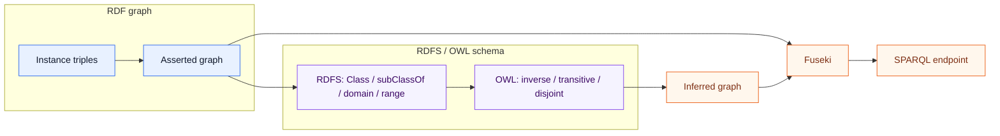

Một RDF graph tối thiểu MUST thể hiện đồng thời ba lớp sau. Trong Turtle, ký hiệu rút gọn `a` trong các ví dụ dưới đây chính là predicate chuẩn `rdf:type`.

| Lớp | Nội dung bắt buộc | Ví dụ nhìn thấy trong Turtle |
|---|---|---|
| RDF instance | Entity và quan hệ thực tế | `vhr:site-1 vh:locatedIn vhr:area-hanoi` |
| RDFS schema | Class/property hierarchy và domain/range | `vh:HeritageSite rdfs:subClassOf vh:CulturalHeritageEntity` |
| OWL semantics | Axiom tạo inference hoặc consistency check | `vh:partOf owl:inverseOf vh:hasPart` |

Turtle normative tối thiểu:

```turtle
@prefix vh:   <http://localhost:3030/vietheritage/ontology/> .
@prefix vhr:  <http://localhost:3030/vietheritage/resource/> .
@prefix rdf:  <http://www.w3.org/1999/02/22-rdf-syntax-ns#> .
@prefix rdfs: <http://www.w3.org/2000/01/rdf-schema#> .
@prefix owl:  <http://www.w3.org/2002/07/owl#> .
@prefix xsd:  <http://www.w3.org/2001/XMLSchema#> .

vh:CulturalHeritageEntity
    a owl:Class ;
    rdfs:subClassOf owl:Thing ;
    rdfs:label "Thực thể di sản văn hóa"@vi .

vh:HeritageSite
    a owl:Class ;
    rdfs:subClassOf vh:CulturalHeritageEntity ;
    rdfs:label "Địa điểm di sản"@vi .

vh:locatedIn
    a owl:ObjectProperty, rdf:Property ;
    rdfs:domain vh:CulturalHeritageEntity ;
    rdfs:range vh:AdministrativeArea ;
    rdfs:label "nằm tại"@vi .

vh:constructionYear
    a owl:DatatypeProperty, rdf:Property ;
    rdfs:domain vh:HeritageSite ;
    rdfs:range xsd:gYear ;
    rdfs:label "năm xây dựng"@vi .

vh:partOf owl:inverseOf vh:hasPart ;
    a owl:TransitiveProperty .

vhr:site-van-mieu
    a vh:HeritageSite ;
    rdfs:label "Văn Miếu – Quốc Tử Giám"@vi ;
    vh:locatedIn vhr:area-hanoi ;
    vh:constructionYear "1070"^^xsd:gYear .
```

Inference bắt buộc phải nhìn thấy được từ fixture:

```text
vhr:site-van-mieu a vh:HeritageSite
  ⇒ vhr:site-van-mieu a vh:CulturalHeritageEntity       (RDFS subClassOf)

vhr:site-van-mieu vh:partOf vhr:complex-thang-long
  ⇒ vhr:complex-thang-long vh:hasPart vhr:site-van-mieu (OWL inverseOf)
```

Các axiom còn lại được freeze tại AX-001…AX-009 ở Section 16 và phải được kiểm tra trước/sau reasoning; không được chỉ trình bày ontology như một bảng class không có inference thực tế.

### 15.0.3 Từ canonical data đến 4-Star rồi 5-Star LOD

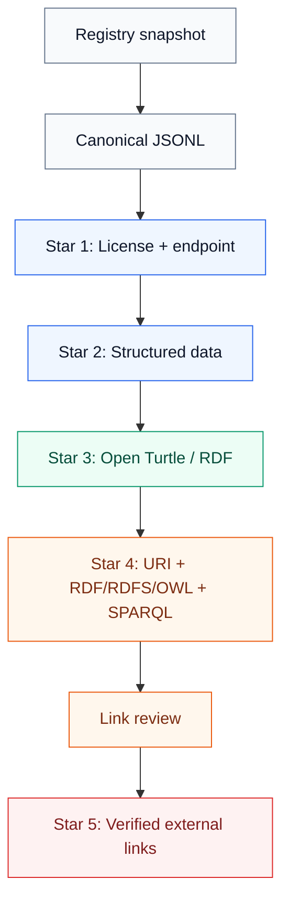

| Gate | Điều project MUST chứng minh | Artifact/query | Mapping |
|---|---|---|---|
| 1-Star | License, metadata và endpoint được công bố | `dataset-metadata.ttl`, README, Fuseki URL | `TEST-061`, `AC-019` |
| 2-Star | Dữ liệu có cấu trúc machine-readable | Raw/canonical JSONL và RDF graph | `TEST-062` |
| 3-Star | Dùng format mở, không độc quyền | Turtle `.ttl`, JSONL `.jsonl` | `TEST-063`, `AC-005` |
| 4-Star | URI HTTP ổn định, RDF/RDFS/OWL hợp lệ và truy vấn được bằng SPARQL | ontology/data Turtle, resource URI, `/sparql` | `TEST-064`, `AC-006`, `AC-010`, `AC-011` |
| 5-Star | Chỉ link external có status `verified` mới xuất hiện trong final RDF | `link_review.csv`, `external-links.ttl` | `TEST-065`, `AC-012`, `AC-020` |

Không được tính việc có Neo4j/Cypher là bằng chứng cho Star 4 hoặc Star 5. Star 4/5 chỉ được đánh giá trên RDF, URI, Fuseki/SPARQL, provenance và external links verified.

### 15.0.4 SPARQL endpoint và terminal interface

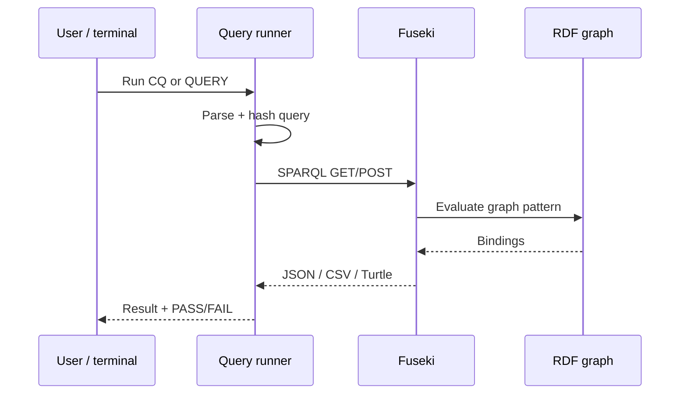

Interface tối thiểu phải sử dụng được từ terminal, không cần frontend:

```bash
curl --get "http://localhost:3031/vietheritage/sparql" \
  --data-urlencode 'query=SELECT ?site ?label WHERE { ?site a <http://localhost:3030/vietheritage/ontology/HeritageSite> ; <http://www.w3.org/2000/01/rdf-schema#label> ?label . FILTER(LANG(?label) = "vi") } LIMIT 10' \
  -H 'Accept: application/sparql-results+json'
```

Query runner MUST:

1. Đọc `sparql/CQ01...CQ10` hoặc nhận `QUERY` từ terminal.
2. Parse query trước khi gửi tới Fuseki.
3. Ghi query hash, endpoint, HTTP status, thời gian và expected columns.
4. So sánh bindings với golden expected result.
5. Trả machine-readable `PASS`/`FAIL`; `make cq-test` MUST fail nếu bất kỳ CQ blocking nào fail.

Các yêu cầu tối thiểu của đề bài được trace như sau:

| Yêu cầu đề bài | Section/Artifact trong spec | Acceptance |
|---|---|---|
| Define ontology | Section 15.0, 15.1–15.3, `ontology/vietheritage.ttl` | `AC-014`, `TEST-033`, `TEST-041`–`TEST-045`, `TEST-082`–`TEST-084` |
| Collect relevant data | COMP-000/001, Sections 10–12, registry coverage report | `AC-002`, `AC-024`–`AC-026` |
| Transform to 4-Star | Sections 19–21, 27–29, RDF/URI/provenance/Fuseki | `AC-005`, `AC-006`, `AC-011`, `AC-019` |
| Link to reach 5-Star | Sections 22–23, link review, verified `owl:sameAs` | `AC-012`, `AC-020` |
| SPARQL endpoint/terminal | Sections 24–25, 27.4–28, `make query`, `make cq-test` | `AC-010`, `AC-011` |

## 15.1 Classes - 23 primary classes

| URI | Parent | Label VI | Label EN | Description |
|---|---|---|---|---|
| `vh:CulturalHeritageEntity` | `owl:Thing` | Thực thể di sản văn hóa | Cultural heritage entity | Root class cho di sản |
| `vh:HeritageSite` | `vh:CulturalHeritageEntity` | Địa điểm di sản | Heritage site | Địa điểm có giá trị văn hóa/lịch sử |
| `vh:UNESCOHeritageSite` | `vh:HeritageSite` | Di sản UNESCO | UNESCO heritage site | Site được UNESCO công nhận |
| `vh:HistoricalSite` | `vh:HeritageSite` | Di tích lịch sử | Historical site | Site gắn với lịch sử |
| `vh:ReligiousSite` | `vh:HeritageSite` | Di tích tôn giáo | Religious site | Site có chức năng/giá trị tôn giáo |
| `vh:ArchaeologicalSite` | `vh:HeritageSite` | Di chỉ khảo cổ | Archaeological site | Site khảo cổ |
| `vh:ArchitecturalSite` | `vh:HeritageSite` | Công trình kiến trúc | Architectural site | Site có giá trị kiến trúc |
| `vh:HeritageComplex` | `vh:CulturalHeritageEntity` | Quần thể di sản | Heritage complex | Nhóm các site |
| `vh:Museum` | `vh:CulturalHeritageEntity` | Bảo tàng | Museum | Bảo tàng có ý nghĩa văn hóa |
| `vh:HistoricalPerson` | `owl:Thing` | Nhân vật lịch sử | Historical person | Người liên quan lịch sử |
| `vh:HistoricalEvent` | `owl:Thing` | Sự kiện lịch sử | Historical event | Sự kiện lịch sử |
| `vh:HistoricalPeriod` | `owl:Thing` | Thời kỳ lịch sử | Historical period | Khoảng/thời kỳ lịch sử |
| `vh:ArchitecturalStyle` | `owl:Thing` | Phong cách kiến trúc | Architectural style | Style kiến trúc |
| `vh:AdministrativeArea` | `owl:Thing` | Đơn vị hành chính | Administrative area | Thành phố/tỉnh/quốc gia |
| `vh:Organization` | `owl:Thing` | Tổ chức | Organization | Tổ chức xây dựng/công nhận |

| `vh:IntangibleHeritage` | `vh:CulturalHeritageEntity` | Di sản văn hóa phi vật thể | Intangible heritage | Thực hành, truyền thống hoặc tri thức trong registry di sản phi vật thể |
| `vh:RepresentativeIntangibleHeritage` | `vh:IntangibleHeritage` | Di sản phi vật thể đại diện | Representative intangible heritage | Item thuộc danh sách đại diện của UNESCO |
| `vh:UrgentSafeguardingIntangibleHeritage` | `vh:IntangibleHeritage` | Di sản phi vật thể cần bảo vệ khẩn cấp | Urgent safeguarding intangible heritage | Item thuộc danh sách cần bảo vệ khẩn cấp của UNESCO |
| `vh:NationalIntangibleHeritage` | `vh:IntangibleHeritage` | Di sản phi vật thể quốc gia | National intangible heritage | Item thuộc danh mục quốc gia |
| `vh:NationalTreasure` | `vh:CulturalHeritageEntity` | Bảo vật quốc gia | National treasure | Item thuộc danh mục bảo vật quốc gia |
| `vh:DocumentaryHeritage` | `vh:CulturalHeritageEntity` | Di sản tư liệu | Documentary heritage | Item thuộc registry di sản tư liệu |
| `vh:Artisan` | `owl:Thing` | Nghệ nhân | Artisan | Người thuộc danh sách nghệ nhân chính thức |
| `vh:CulturalObject` | `vh:CulturalHeritageEntity` | Di vật/cổ vật | Cultural object | Di vật hoặc cổ vật thuộc danh mục chính thức |

### 15.1.1 Multilingual labeling (bắt buộc, không chỉ là documentation)

Cột "Label VI"/"Label EN" ở bảng trên KHÔNG chỉ là mô tả trong tài liệu; `ontology/vietheritage.ttl` MUST assert cả hai literal cho **mọi** class và property, đúng chuẩn quốc tế về đa ngôn ngữ hóa T-Box (course reference Section 4.4, 10.3):

```turtle
vh:HeritageSite
    a owl:Class ;
    rdfs:subClassOf vh:CulturalHeritageEntity ;
    rdfs:label "Địa điểm di sản"@vi ;
    rdfs:label "Heritage site"@en ;
    rdfs:comment "Địa điểm có giá trị văn hóa hoặc lịch sử."@vi .
```

`TEST-033` (namespace inventory) MUST reject ontology nếu bất kỳ class hoặc property project-owned thiếu `rdfs:label@en` hoặc `rdfs:label@vi`. Đây là điều kiện tối thiểu để dataset dùng được cho người dùng không nói tiếng Việt và để CQ10/Star-5 (label song ngữ qua `owl:sameAs`) có cơ sở nhất quán ngay từ T-Box, không chỉ ở A-Box.

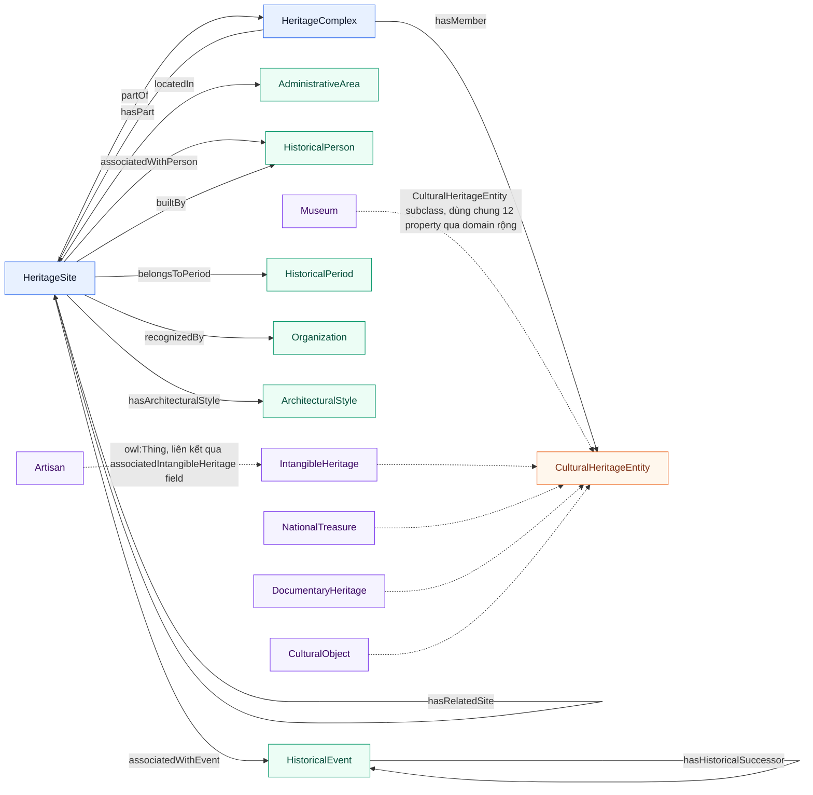

Ghi chú đọc hình: 12 object property project-owned áp dụng theo domain khai trong bảng Section 15.2. Các class `Museum`, `IntangibleHeritage`, `NationalTreasure`, `DocumentaryHeritage` và `CulturalObject` có thể dùng `vh:locatedIn` nhờ domain rộng `vh:CulturalHeritageEntity`; `vh:Artisan` là `owl:Thing` và liên kết qua field `associated_intangible_heritage`. `vh:recognizedBy` giữ domain hẹp `vh:HeritageSite` và MUST NOT dùng cho các nhánh không phải `HeritageSite`. Các field JSON riêng như `custodian` hoặc `current_holder` không tạo thêm object property ngoài 12 property đã freeze.

## 15.2 Object properties — 12 property project-owned

| URI | Domain | Range | Inverse | Characteristic |
|---|---|---|---|---|
| `vh:locatedIn` | `vh:CulturalHeritageEntity` or `vh:AdministrativeArea` | `vh:AdministrativeArea` | none | không transitive |
| `vh:partOf` | `vh:CulturalHeritageEntity` | `vh:HeritageComplex` | `vh:hasPart` | transitive |
| `vh:hasPart` | `vh:HeritageComplex` | `vh:CulturalHeritageEntity` | `vh:partOf` | inverse |
| `vh:associatedWithPerson` | `vh:HeritageSite` | `vh:HistoricalPerson` | none | none |
| `vh:associatedWithEvent` | `vh:HeritageSite` | `vh:HistoricalEvent` | none | none |
| `vh:belongsToPeriod` | `vh:HeritageSite` | `vh:HistoricalPeriod` | none | none |
| `vh:builtBy` | `vh:HeritageSite` | `vh:HistoricalPerson` | none | `rdfs:subPropertyOf vh:associatedWithPerson` |
| `vh:recognizedBy` | `vh:HeritageSite` | `vh:Organization` | none | none |
| `vh:hasArchitecturalStyle` | `vh:HeritageSite` | `vh:ArchitecturalStyle` | none | none |
| `vh:hasMember` | `vh:HeritageComplex` | `vh:CulturalHeritageEntity` | none | `rdfs:subPropertyOf vh:hasPart` |
| `vh:hasRelatedSite` | `vh:HeritageSite` | `vh:HeritageSite` | none | `owl:SymmetricProperty` |
| `vh:hasHistoricalSuccessor` | `vh:HistoricalEvent` | `vh:HistoricalEvent` | none | none |

### 15.2.1 Domain của `vh:locatedIn` phải bao gồm `vh:AdministrativeArea`

CQ01 (blocking) yêu cầu tìm mọi di sản nằm trong Hà Nội **hoặc đơn vị hành chính con của Hà Nội**, dùng property path `vh:locatedIn+`. Để path này duyệt được chuỗi `site → phường → quận → Hà Nội`, ontology MUST cho phép chính `vh:AdministrativeArea` làm subject của `vh:locatedIn`:

```turtle
vh:locatedIn rdfs:domain [
    a owl:Class ;
    owl:unionOf (vh:CulturalHeritageEntity vh:AdministrativeArea)
] ;
    rdfs:range vh:AdministrativeArea .
```

Nếu domain chỉ là `vh:CulturalHeritageEntity`, triple `vhr:area-ba-dinh vh:locatedIn vhr:area-hanoi` sẽ khiến RDFS domain inference suy ra `vhr:area-ba-dinh a vh:CulturalHeritageEntity` — sai ngữ nghĩa (một quận không phải thực thể di sản) — và CQ01 không thể trả về site thuộc đơn vị hành chính con. `vh:locatedIn` vẫn MUST NOT là `owl:TransitiveProperty` (DEC-011): traversal do SPARQL property path `+` đảm nhiệm, không do reasoner.

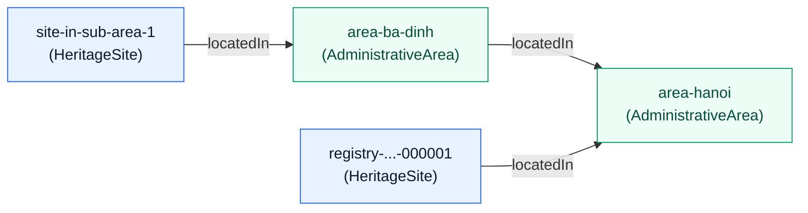

CQ01 với pattern `?site vh:locatedIn+ ?area` và `?area rdfs:label "Hà Nội"@vi` MUST trả về **cả hai** site trong hình: `registry-...-000001` (một cạnh) và `site-in-sub-area-1` (hai cạnh). `TEST-086` kiểm chứng chính xác điều này.

### 15.2.2 Phân biệt `vh:hasPart` và `vh:hasMember`

Hai property này có cùng domain và range nên MUST được phân biệt tường minh, tránh trở thành hai tên gọi cho một quan hệ:

```turtle
vh:hasMember rdfs:subPropertyOf vh:hasPart .
```

- `vh:hasPart` là quan hệ cấu thành tổng quát, là inverse của `vh:partOf` và hưởng lợi từ tính transitive của `vh:partOf`.
- `vh:hasMember` là danh sách thành viên được registry liệt kê tường minh (`member_sites` ở Section 12.2). Mọi member đều là part, nhưng không phải part nào cũng được registry liệt kê thành member.

`vh:builtBy` chỉ dùng cho một `vh:HistoricalPerson`:

```turtle
vh:builtBy rdfs:range vh:HistoricalPerson .
```

Generator MUST chỉ sinh triple `vh:builtBy` khi target đã được xác định là `vh:HistoricalPerson`; target `vh:Organization` MUST bị bỏ qua. `vh:recognizedBy` chỉ được sinh từ quan hệ công nhận độc lập, không được dùng để thay nghĩa "tổ chức xây dựng". Ràng buộc này bảo toàn AX-007 và ngăn RDFS suy sai `vh:Organization` thành `vh:HistoricalPerson`.

## 15.3 Datatype properties — 10 property project-owned

| URI | Domain | Range | Cardinality | Meaning |
|---|---|---|---|---|
| `vh:constructionYear` | `vh:HeritageSite` | `xsd:gYear` | `0..1` | Năm xây dựng |
| `vh:recognitionYear` | `vh:HeritageSite` | `xsd:gYear` | `0..1` | Năm công nhận |
| `vh:address` | `vh:CulturalHeritageEntity` | `xsd:string` | `0..1` | Địa chỉ |
| `vh:sourcePageId` | `owl:Thing` | `xsd:integer` | `0..1` | Page ID nguồn |
| `vh:sourceTitle` | `owl:Thing` | `xsd:string` | `0..1` | Title nguồn |
| `vh:shortDescription` | `owl:Thing` | `xsd:string` | `0..*` | Mô tả ngắn |
| `vh:alternativeName` | `owl:Thing` | `xsd:string` | `0..*` | Tên thay thế |
| `vh:birthYear` | `vh:HistoricalPerson` | `xsd:gYear` | `0..1` | Năm sinh |
| `vh:deathYear` | `vh:HistoricalPerson` | `xsd:gYear` | `0..1` | Năm mất |
| `vh:areaLevel` | `vh:AdministrativeArea` | `xsd:string` | `0..1` | Cấp hành chính |

### 15.3.1 Vocabulary reuse (tránh trùng ngữ nghĩa với property có sẵn)

Theo nguyên tắc ontology engineering "không tạo property mới nếu vocabulary phổ biến đã có nghĩa tương đương" (course reference Section 10.8), `vh:sourcePageId` và `vh:sourceTitle` là project-specific shorthand cho định danh/tiêu đề của trang Wikipedia nguồn — về ngữ nghĩa chúng là sub-property của `dcterms:identifier`/`dcterms:title`. Ontology MUST khai báo tường minh quan hệ này để một reasoner hoặc SPARQL client chỉ biết `dcterms` vẫn suy ra được fact tương ứng. Provenance của source URI dùng riêng `dcterms:source` và `prov:wasDerivedFrom` theo Section 21.1:

```turtle
vh:sourcePageId rdfs:subPropertyOf dcterms:identifier .
vh:sourceTitle   rdfs:subPropertyOf dcterms:title .
```

Không tạo `rdfs:subPropertyOf` cho `vh:shortDescription`/`vh:alternativeName` vì hai property này có phạm vi hẹp hơn `rdfs:comment`/`rdfs:label` (không phải mọi `alternativeName` nên được coi là `rdfs:label` bổ sung — xem NOR-015 và Section 13 identity contract).

Vocabulary chuẩn MUST được dùng cho:

- `rdfs:label`, `rdfs:comment`.
- `geo:lat`, `geo:long`.
- `dcterms:source`, `dcterms:license`, `dcterms:created`, `dcterms:modified`, `dcterms:identifier`, `dcterms:title`.
- `prov:wasDerivedFrom`, `prov:wasGeneratedBy`.
- `owl:sameAs`.

---

# 16. OWL Semantics Contract

File ontology MUST chứa các axiom sau.

### 16.0 Tổng quan 9 axiom (AX-001 → AX-009)

```mermaid
flowchart TB
    classDef subclass fill:#E8F1FF,stroke:#2563EB,color:#0F172A
    classDef property fill:#ECFDF5,stroke:#059669,color:#064E3B
    classDef disjoint fill:#FEF2F2,stroke:#DC2626,color:#7F1D1D
    classDef equivalent fill:#F5F3FF,stroke:#7C3AED,color:#3B0764

    AX1["AX-001: UNESCOHeritageSite\nrdfs:subClassOf HeritageSite"]
    AX2["AX-002: partOf\nowl:inverseOf hasPart"]
    AX3["AX-003: partOf\nowl:TransitiveProperty"]
    AX4["AX-004: HistoricalPerson/HeritageSite/AdministrativeArea\nowl:disjointWith (pairwise)"]
    AX5["AX-005: UNESCOHeritageSite\nowl:equivalentClass hasValue(recognizedBy, UNESCO)"]
    AX6["AX-006: hasRelatedSite\nowl:SymmetricProperty"]
    AX7["AX-007: builtBy\nrdfs:subPropertyOf associatedWithPerson"]
    AX8["AX-008: IntangibleHeritage\nowl:disjointUnionOf 3 subclass"]
    AX9["AX-009: 8 datatype property 0..1\nowl:FunctionalProperty"]

    AX1 --> RESULT1["Inferred rdf:type"]
    AX2 --> RESULT2["Inferred inverse triple"]
    AX3 --> RESULT3["Inferred transitive closure"]
    AX4 --> RESULT4["ONTOLOGY_INCONSISTENT nếu vi phạm"]
    AX5 --> RESULT1
    AX6 --> RESULT2
    AX7 --> RESULT5["Inferred super-property triple"]
    AX8 --> RESULT4
    AX9 --> RESULT6["CARDINALITY_VIOLATION khi có 2 giá trị"]

    class AX1,AX5 equivalent
    class AX2,AX3,AX6,AX7 property
    class AX4,AX8,AX9 disjoint
```

## AX-001 — UNESCO subclass

```turtle
vh:UNESCOHeritageSite rdfs:subClassOf vh:HeritageSite .
```

Input fixture: `vhr:site-unesco a vh:UNESCOHeritageSite`.

Expected inference: `vhr:site-unesco a vh:HeritageSite`.

## AX-002 — Inverse part relation

```turtle
vh:partOf owl:inverseOf vh:hasPart .
```

Expected: `site vh:partOf complex` ⇒ `complex vh:hasPart site`.

## AX-003 — Transitive part relation

```turtle
vh:partOf a owl:TransitiveProperty .
```

Expected: `site1 partOf complex1` và `complex1 partOf complex2` ⇒ `site1 partOf complex2`.

`vh:locatedIn` MUST NOT là transitive property. CQ01 dùng `vh:locatedIn+` khi cần traversal.

## AX-004 — Disjoint classes

```turtle
vh:HistoricalPerson owl:disjointWith vh:HeritageSite, vh:AdministrativeArea .
vh:Artisan          owl:disjointWith vh:HeritageSite, vh:AdministrativeArea .
vh:HeritageSite     owl:disjointWith vh:AdministrativeArea .
```

Ngoài ra, các nhánh chính trực tiếp dưới `vh:CulturalHeritageEntity` MUST disjoint đôi một, vì `entity_type` trong canonical schema là enum đơn trị (Section 12.2) — một entity không thể vừa là bảo tàng vừa là bảo vật:

```turtle
[] a owl:AllDisjointClasses ;
   owl:members (
       vh:HeritageSite
       vh:HeritageComplex
       vh:Museum
       vh:IntangibleHeritage
       vh:NationalTreasure
       vh:DocumentaryHeritage
       vh:CulturalObject
   ) .
```

Nếu reasoner không hỗ trợ `owl:AllDisjointClasses`, validator MUST expand thành các cặp `owl:disjointWith` tương đương (cùng cơ chế như AX-008, xem Section 26.1.1).

Các subclass `vh:ReligiousSite`, `vh:HistoricalSite`, `vh:ArchaeologicalSite`, `vh:ArchitecturalSite` MUST NOT disjoint nhau vì một site được phép có nhiều loại. Đây là khác biệt có chủ đích: mutually-exclusive áp ở tầng **nhánh chính** (tương ứng `entity_type`), còn **site subtype** (tương ứng `site_types`, một mảng) được phép đồng thời.

`vh:Artisan` MUST được đưa vào disjointness axiom cùng `vh:HistoricalPerson`. Nếu thiếu, một record lỗi vừa được gán `vh:Artisan` vừa `vh:HeritageSite` sẽ không bị reasoner phát hiện, làm consistency test mất hiệu lực với 1 trong 2 class biểu diễn con người.

`vh:HistoricalPerson` và `vh:Artisan` MUST cùng khai `rdfs:subClassOf foaf:Person` để tái sử dụng vocabulary phổ biến thay vì tạo hai nhánh người rời rạc:

```turtle
vh:HistoricalPerson rdfs:subClassOf foaf:Person .
vh:Artisan          rdfs:subClassOf foaf:Person .
```

Nhờ đó một client chỉ biết FOAF vẫn truy vấn được toàn bộ con người trong dataset bằng `?p a foaf:Person`, và `@prefix foaf:` khai báo ở Section 15 không còn là prefix gần như không dùng. Hai class vẫn giữ nguyên vị trí trực tiếp dưới `owl:Thing` trong bảng Section 15.1 vì `foaf:Person` là external class, không tính vào 23 class project-owned.

## AX-005 — UNESCO equivalent restriction

`vhr:organization-unesco` là named individual và là value chính của `vh:recognizedBy`:

```turtle
vhr:organization-unesco a vh:Organization ;
    rdfs:label "UNESCO"@en ;
    rdfs:label "UNESCO"@vi .
```

Ontology dùng individual này trong restriction:

```turtle
vh:UNESCOHeritageSite owl:equivalentClass [
    a owl:Class ;
    owl:intersectionOf (
        vh:HeritageSite
        [
            a owl:Restriction ;
            owl:onProperty vh:recognizedBy ;
            owl:hasValue vhr:organization-unesco
        ]
    )
] .
```

Input:

```turtle
vhr:site-unesco a vh:HeritageSite ;
    vh:recognizedBy vhr:organization-unesco .
```

Expected inference: `vhr:site-unesco a vh:UNESCOHeritageSite`.

## AX-006 — Symmetric related-site property

```turtle
vh:hasRelatedSite a owl:SymmetricProperty .
```

Input fixture: `vhr:site-a vh:hasRelatedSite vhr:site-b`.

Expected inference: `vhr:site-b vh:hasRelatedSite vhr:site-a`.

`vh:hasRelatedSite` KHÔNG được declare `owl:FunctionalProperty` hoặc `owl:InverseFunctionalProperty` vì một site có thể liên quan tới nhiều site khác và không có bằng chứng identity duy nhất.

## AX-007 — Property hierarchy (`rdfs:subPropertyOf`)

`vh:builtBy` có target bắt buộc là `vh:HistoricalPerson`; mọi quan hệ này đồng thời là một trường hợp cụ thể của `vh:associatedWithPerson`. Ontology khai báo:

```turtle
vh:builtBy rdfs:subPropertyOf vh:associatedWithPerson .
```

Input fixture: `vhr:site-a vh:builtBy vhr:person-kien-truc-su`.

Expected inference: `vhr:site-a vh:associatedWithPerson vhr:person-kien-truc-su`.

Đây là minh họa trực tiếp RDFS property hierarchy (Section 4.2 course reference): mọi fact dùng sub-property tự động suy ra fact dùng super-property, không cần thêm object property mới ngoài 12 property đã freeze ở Section 15.2.

**Cảnh báo semantics quan trọng.** `rdfs:subPropertyOf` áp dụng vô điều kiện. Vì vậy RDF generator và validator MUST từ chối `vh:builtBy` có target `vh:Organization`; không được giả định inference chỉ áp dụng có điều kiện theo type. Quan hệ công nhận bởi một organization dùng `vh:recognizedBy` chỉ khi source thực sự mô tả hành vi công nhận.

Input fixture: `vhr:site-a vh:builtBy vhr:person-kien-truc-su` với `vhr:person-kien-truc-su a vh:HistoricalPerson`.

Expected inference: `vhr:site-a vh:associatedWithPerson vhr:person-kien-truc-su`.

Test bắt buộc bổ sung: fixture `vhr:site-b vh:builtBy vhr:organization-x` MUST bị RDF generator từ chối sinh triple `vh:builtBy`; generator MUST NOT tự chuyển assertion này thành `vh:recognizedBy`. Validator MUST khẳng định không tồn tại resource nào vừa `a vh:Organization` vừa `a vh:HistoricalPerson` trong graph đã reasoning — xem `TEST-087`.

## AX-008 — Disjoint union cho danh mục di sản phi vật thể

Một di sản phi vật thể tại một thời điểm chỉ thuộc **một** trong ba danh mục: đại diện UNESCO, cần bảo vệ khẩn cấp UNESCO, hoặc danh mục quốc gia. Đây là use case chuẩn của `owl:disjointUnionOf` (OWL 2 — course reference Section 5.10), mạnh hơn việc chỉ khai `subClassOf` rời rạc vì nó khẳng định cả tính đầy đủ (mọi `IntangibleHeritage` phải thuộc một trong ba) và tính loại trừ (không thuộc hai danh mục cùng lúc).

```turtle
vh:IntangibleHeritage owl:disjointUnionOf (
    vh:RepresentativeIntangibleHeritage
    vh:UrgentSafeguardingIntangibleHeritage
    vh:NationalIntangibleHeritage
) .
```

Input fixture: `vhr:heritage-a a vh:RepresentativeIntangibleHeritage, vh:UrgentSafeguardingIntangibleHeritage`.

Expected: semantic validator MUST report `ONTOLOGY_INCONSISTENT` vì hai subclass bị disjoint theo `owl:disjointUnionOf`. Validator MAY expand axiom thành ba cặp `owl:disjointWith` tương đương như một cơ chế nội bộ và MUST ghi kết quả AX-008 vào validation report; `make reason` đưa kết quả đó vào aggregate AX-001…AX-009 report. Jena OWL Mini không chịu trách nhiệm đánh giá AX-008.

## AX-009 — Functional datatype properties (`0..1` phải là axiom, không chỉ là bảng)

Bảng Section 15.3 khai cardinality `0..1` cho 8 datatype property. Nếu chỉ ghi trong bảng, ràng buộc này không tồn tại trong ontology và reasoner không phát hiện được dữ liệu khai hai giá trị xung đột. Ontology MUST assert:

```turtle
vh:constructionYear a owl:FunctionalProperty .
vh:recognitionYear  a owl:FunctionalProperty .
vh:address          a owl:FunctionalProperty .
vh:sourcePageId     a owl:FunctionalProperty .
vh:sourceTitle      a owl:FunctionalProperty .
vh:birthYear        a owl:FunctionalProperty .
vh:deathYear        a owl:FunctionalProperty .
vh:areaLevel        a owl:FunctionalProperty .
```

`vh:shortDescription` và `vh:alternativeName` MUST NOT là functional vì cardinality của chúng là `0..*`.

Input fixture: `vhr:site-a vh:constructionYear "1070"^^xsd:gYear, "1080"^^xsd:gYear`.

Expected: semantic validator MUST báo `CARDINALITY_VIOLATION`. Do OWA/NUNA (Section 1.4), Jena OWL Mini không được dùng làm cơ chế closed-world cardinality và không chịu trách nhiệm đánh giá AX-009; `make reason` chỉ tổng hợp kết quả AX-009 từ semantic validation.

---

# 17. Normalization Rules

Tất cả rule dưới đây MUST được implement trong `src/vietheritage/normalization/` và test bằng before/after fixture.

| ID | Field | Before | After |
|---|---|---|---|
| NOR-001 | Text | `"  Văn   Miếu  "` | `"Văn Miếu"` |
| NOR-002 | Unicode | NFD Vietnamese sequence | NFC |
| NOR-003 | Newline | `"Hà Nội\n"` | `"Hà Nội"` |
| NOR-004 | Title dash | hyphen/en dash/em dash lẫn lộn | Display literal giữ nguyên ký tự gốc sau trim; identity key MUST chuẩn hóa mọi `-`/`–`/`—`/`‒` thành một ký tự `-` (U+002D) |
| NOR-005 | Year | `"1070"`, `"năm 1070"` | integer `1070` rồi serialize `"1070"^^xsd:gYear` |
| NOR-006 | Year range | `"1070–1075"` | `start_year=1070`, `end_year=1075` |
| NOR-007 | Unknown | `"N/A"`, `"?"`, `"chưa rõ"` | `null` |
| NOR-008 | Latitude | string `"21.0278"` | decimal `21.0278` |
| NOR-009 | Longitude | comma decimal `"105,8357"` | decimal `105.8357` |
| NOR-010 | Coordinate invalid | latitude ngoài [-90,90] | null + `INVALID_COORDINATE` |
| NOR-011 | Category | `"Category:Di tích"` | `"Di tích"` |
| NOR-012 | URL | URL có fragment | URL không fragment |
| NOR-013 | QID | `" q123 "` | `"Q123"` |
| NOR-014 | QID invalid | `"Q-1"` | null + `INVALID_QID` |
| NOR-015 | Alias | aliases trùng label | unique, stable order |

Identity normalization key MUST là:

```text
NFC(lowercase(canonical_dash(trim(collapse_whitespace(label_vi)))))
```

trong đó `canonical_dash` thay mọi ký tự dash Unicode (`-` U+002D, `‒` U+2012, `–` U+2013, `—` U+2014) bằng `-` U+002D. Nhờ đó hai record chỉ khác loại dash (ví dụ `Văn Miếu – Quốc Tử Giám` và `Văn Miếu - Quốc Tử Giám`) được coi là **cùng identity** và merge theo Section 13.3, thay vì tạo hai entity trùng.

Không bỏ dấu tiếng Việt trong identity key. Không dùng fuzzy matching.

---

# 18. Entity Resolution

## 18.1 Algorithm

**Tiền điều kiện bắt buộc:** pseudo-code dưới đây chỉ áp dụng cho **derived/enrichment entity** (person, area, event, period, complex, organization, style). Registry-derived entity đã có identity từ collector theo Section 13.1 (`registry-{slug(registry_id)}`) và MUST NOT đi qua nhánh QID/page_id này — đó là bậc 1 trong thứ tự resolution ở Section 13.2 và không được hạ cấp.

```text
resolve(record):
  assert record is not registry-derived   # registry ID đã được gán ở COMP-000

  if valid wikidata_id exists:
      key = "wikidata:" + wikidata_id
  else if page_id exists:
      key = "viwiki:" + decimal(page_id)
  else:
      key = entity_type + ":" + normalized_label + ":" + normalized_area

  if key exists in identity index:
      merge according to duplicate policy
  else:
      create deterministic entity_id from key

  if key maps to incompatible entity types:
      emit IDENTITY_COLLISION and fail stage
```

## 18.2 External linking không thay đổi identity

`owl:sameAs` chỉ là external link. Nó không thay thế `entity_id` nội bộ và không được dùng để merge hai nội bộ trong cùng một run nếu chưa qua link review.

---

# 19. Ontology Mapping

VietHeritageLOD tích hợp bốn nguồn có cả ba loại heterogeneity kinh điển của data integration:

| Loại heterogeneity | Biểu hiện trong project | Cách xử lý |
|---|---|---|
| Syntactic | Registry là HTML table; Wikipedia trả JSON qua MediaWiki API; Wikidata/DBpedia là RDF/SPARQL | COMP-000/COMP-001 parse riêng từng syntax về `raw-page.schema.json` chung (Section 11) |
| Semantic | `"Di tích quốc gia đặc biệt"` (registry) và infobox `loai=di tích lịch sử` (Wikipedia) mô tả cùng khái niệm heritage site bằng thuật ngữ khác nhau | `config/mapping.yaml` (bảng dưới) là mapping table tường minh, ánh xạ mọi thuật ngữ nguồn về một `entity_type`/class ontology duy nhất |
| Access | Registry cần HTML scraping có retry; Wikipedia dùng REST API; Wikidata/DBpedia dùng SPARQL endpoint liên bang | Mỗi COMP có adapter riêng (Section 7) nhưng cùng đổ về `canonical.jsonl`; không có access pattern nào được phép bypass coverage authority (Section 12.4.1) |

Project KHÔNG dùng Virtual Knowledge Graph (không map trực tiếp từ database sống); mọi nguồn được materialize thành `canonical.jsonl` trước khi sinh RDF, vì coverage claim (Section 12.4.2) cần một snapshot cố định để invariant `registry_valid_records == canonical_registry_derived_entities` có thể kiểm chứng lại được — Virtual KG với live query sẽ làm invariant này không ổn định giữa hai lần chạy.

File `config/mapping.yaml` là nguồn mapping authoritative.

| Source field | Condition | RDF class/property | Transform | Missing behavior |
|---|---|---|---|---|
| `entity_type=HeritageSite` | luôn | `vh:HeritageSite` | class URI | record skip nếu thiếu type |
| `site_types` contains `lịch sử` | exact normalized token | `vh:HistoricalSite` | token map | bỏ qua type |
| `site_types` contains `tôn giáo` | exact normalized token | `vh:ReligiousSite` | token map | bỏ qua type |
| `site_types` contains `khảo cổ` | exact normalized token | `vh:ArchaeologicalSite` | token map | bỏ qua type |
| `site_types` contains `kiến trúc` | exact normalized token | `vh:ArchitecturalSite` | token map | bỏ qua type |
| `label_vi` | non-empty | `rdfs:label` | literal `@vi` | record invalid |
| `description_vi` | non-null | `rdfs:comment` | literal `@vi` | omit |
| `construction_year` | integer 4 digit | `vh:constructionYear` | `xsd:gYear` | omit |
| `recognition_year` | integer 4 digit | `vh:recognitionYear` | `xsd:gYear` | omit |
| `coordinates.lat` | valid | `geo:lat` | `xsd:decimal` | omit pair |
| `coordinates.lon` | valid | `geo:long` | `xsd:decimal` | omit pair |
| `located_in` | area ID exists | `vh:locatedIn` | URI | omit relation |
| `parent_area` | parent area ID exists | `vh:locatedIn` | URI | omit relation |
| `associated_persons` | person ID exists | `vh:associatedWithPerson` | URI | omit relation |
| `associated_events` | event ID exists | `vh:associatedWithEvent` | URI | omit relation |
| `periods` | period ID exists | `vh:belongsToPeriod` | URI | omit relation |
| `part_of` | complex ID exists | `vh:partOf` | URI | omit relation |
| `member_sites` | member site IDs exist | `vh:hasMember` | one URI triple per member | omit relation |
| `recognized_by` | subject là `HeritageSite`, organization ID exists | `vh:recognizedBy` | URI | omit relation |
| `built_by` | HistoricalPerson ID exists | `vh:builtBy` | URI | omit relation; Organization target MUST NOT emit |
| `source_page_id` | successful Wikipedia enrichment | `vh:sourcePageId` | `xsd:integer` | omit for `registry_only` |
| `source_title` | successful Wikipedia enrichment | `vh:sourceTitle` | `xsd:string` | omit for `registry_only` |
| `architectural_styles` | style ID exists | `vh:hasArchitecturalStyle` | URI | omit relation |
| `source_url` | valid URI | `dcterms:source`, `prov:wasDerivedFrom` | URI | record invalid |
| `wikidata_id` | QID valid | `owl:sameAs` | Wikidata URI | omit |

## 19.1 Mapping `registry_category` sang ontology subclass

`entity_type` chỉ có `IntangibleHeritage` (một trong 14 canonical type), nhưng AX-008 khai `owl:disjointUnionOf` trên ba subclass. Vì vậy generator MUST gán subclass dựa trên `registry_category`, nếu không ba subclass sẽ không bao giờ có instance và AX-008 trở thành axiom không có tác dụng:

| `registry_category` | `entity_type` | Ontology class sinh ra |
|---|---|---|
| `intangible_representative` | `IntangibleHeritage` | `vh:IntangibleHeritage`, `vh:RepresentativeIntangibleHeritage` |
| `intangible_urgent` | `IntangibleHeritage` | `vh:IntangibleHeritage`, `vh:UrgentSafeguardingIntangibleHeritage` |
| `national_intangible` | `IntangibleHeritage` | `vh:IntangibleHeritage`, `vh:NationalIntangibleHeritage` |
| `world_heritage` | `HeritageSite` | `vh:HeritageSite` + `vh:recognizedBy vhr:organization-unesco` (AX-005 suy ra `vh:UNESCOHeritageSite`) |
| `national_museums`, `ministry_museums`, `central_organization_museums`, `provincial_museums`, `private_museums` | `Museum` | `vh:Museum` |
| `national_treasures` | `NationalTreasure` | `vh:NationalTreasure` |
| `documentary_heritage` | `DocumentaryHeritage` | `vh:DocumentaryHeritage` |
| `artifacts_antiquities` | `CulturalObject` | `vh:CulturalObject` |
| `artisans`, `national_artisans`, `meritorious_artisans` | `Artisan` | `vh:Artisan` |
| `national_monuments`, `national_special_monuments` | `HeritageSite` | `vh:HeritageSite` + site subtype từ `site_types` nếu có |

Bảng này MUST được biểu diễn trong `config/mapping.yaml` dưới key `registry_category_subclass` (Phụ lục D.3). Một registry entity thuộc đúng một `registry_category`, nên nó nhận đúng một subclass trong nhóm intangible — thỏa điều kiện exclusivity của AX-008.

`config/mapping.yaml` là **nguồn authoritative duy nhất** cho mapping category → subclass. Key `ontology_subclass` trong `config/registry_sources.yaml` (D.1) chỉ là thông tin thuận tiện cho collector; nếu hai file khác nhau thì `mapping.yaml` thắng, và `TEST-090` MUST FAIL để buộc sửa cho khớp thay vì để hai nguồn lệch âm thầm.

Ba category `artisans`, `national_artisans`, `meritorious_artisans` đều map về `vh:Artisan`; khác biệt danh hiệu được giữ ở field `artisan_title` (Section 12.2), KHÔNG tạo subclass riêng vì ontology chỉ freeze 23 class.

---

# 20. RDF Generation Contract

## 20.1 General rules

- Input là canonical JSONL đã validate.
- Output là Turtle UTF-8.
- Mọi entity MUST có `rdf:type` và ít nhất một `rdfs:label` `@vi`.
- Mọi source-derived entity, kể cả `registry_only`, MUST có official-registry `dcterms:source` và `prov:wasDerivedFrom`.
- `vh:sourcePageId` và `vh:sourceTitle` chỉ MUST có cho entity đã enrichment Wikipedia thành công; `registry_only` hợp lệ khi không có hai triple này.
- Literal numeric/date MUST có XSD datatype.
- Không sinh triple có object `null`.
- Không sinh duplicate triple.
- Output được sort deterministic.

## 20.2 Example 1 — Heritage Site

```turtle
@prefix vh: <http://localhost:3030/vietheritage/ontology/> .
@prefix vhr: <http://localhost:3030/vietheritage/resource/> .
@prefix rdfs: <http://www.w3.org/2000/01/rdf-schema#> .
@prefix dcterms: <http://purl.org/dc/terms/> .
@prefix prov: <http://www.w3.org/ns/prov#> .
@prefix geo: <http://www.w3.org/2003/01/geo/wgs84_pos#> .
@prefix xsd: <http://www.w3.org/2001/XMLSchema#> .

vhr:registry-dsvh-national-monument-000001
    a vh:HeritageSite, vh:HistoricalSite ;
    rdfs:label "Văn Miếu – Quốc Tử Giám"@vi ;
    rdfs:label "Temple of Literature"@en ;
    geo:lat "21.0278"^^xsd:decimal ;
    geo:long "105.8357"^^xsd:decimal ;
    vh:constructionYear "1070"^^xsd:gYear ;
    vh:locatedIn vhr:area-hanoi ;
    vh:sourcePageId "100001"^^xsd:integer ;
    vh:sourceTitle "Văn Miếu – Quốc Tử Giám" ;
    dcterms:source <https://vi.wikipedia.org/wiki/V%C4%83n_Mi%E1%BA%BFu> ;
    prov:wasDerivedFrom <https://vi.wikipedia.org/wiki/V%C4%83n_Mi%E1%BA%BFu> .
```

## 20.3 Example 2 — UNESCO Site

```turtle
vhr:registry-dsvh-national-monument-000002
    a vh:HeritageSite ;
    rdfs:label "Vịnh Hạ Long"@vi ;
    vh:recognizedBy vhr:organization-unesco ;
    vh:locatedIn vhr:area-quang-ninh .
```

Reasoner MUST infer `a vh:UNESCOHeritageSite`.

## 20.4 Example 3 — Person/event/complex

```turtle
vhr:registry-dsvh-national-monument-000001 vh:associatedWithPerson vhr:person-ly-thuong-kiet .
vhr:person-ly-thuong-kiet
    a vh:HistoricalPerson ;
    rdfs:label "Lý Thường Kiệt"@vi .

vhr:registry-dsvh-national-monument-000001 vh:associatedWithEvent vhr:event-example .
vhr:event-example
    a vh:HistoricalEvent ;
    rdfs:label "Sự kiện mẫu"@vi .

vhr:registry-dsvh-national-monument-000001 vh:partOf vhr:complex-thang-long .
vhr:complex-thang-long
    a vh:HeritageComplex ;
    rdfs:label "Quần thể mẫu"@vi .
```

## 20.5 Example 4 — Provenance

```turtle
vhr:registry-dsvh-national-monument-000001
    dcterms:license <https://creativecommons.org/licenses/by-sa/4.0/> ;
    dcterms:modified "2026-09-12"^^xsd:date ;
    prov:wasGeneratedBy vhr:activity-run-20260912T030000Z .

vhr:activity-run-20260912T030000Z
    a prov:Activity ;
    prov:used <https://vi.wikipedia.org/w/api.php> ;
    prov:startedAtTime "2026-09-12T03:00:00Z"^^xsd:dateTime .
```

## 20.6 Example 5 — External links

```turtle
@prefix vhr: <http://localhost:3030/vietheritage/resource/> .
@prefix owl: <http://www.w3.org/2002/07/owl#> .

vhr:registry-dsvh-national-monument-000001
    owl:sameAs <https://www.wikidata.org/entity/Q900000001> ;
    owl:sameAs <http://dbpedia.org/resource/Example_Site> .
```

Chỉ URI đã verified được xuất hiện trong file này.

---

# 21. Provenance Contract

## 21.1 Resource-level

Mỗi source-derived entity MUST có:

```turtle
entity dcterms:source sourceURI .
entity prov:wasDerivedFrom sourceURI .
entity dcterms:modified retrievalDate .
entity prov:wasGeneratedBy runActivity .
```

Với entity có nguồn registry, `sourceURI` MUST bao gồm official registry URI ngay cả khi Wikipedia enrichment không tồn tại. Nếu enrichment Wikipedia thành công, entity MAY có thêm provenance tới Wikipedia và MUST có `vh:sourcePageId`/`vh:sourceTitle`; hai property này không thay thế `dcterms:source` hoặc `prov:wasDerivedFrom`.

## 21.2 Dataset-level

Canonical dataset URI duy nhất là `{BASE}/dataset/vietheritage`. Với development base URI, resource này MUST là `<http://localhost:3030/vietheritage/dataset/vietheritage>`:

```turtle
<http://localhost:3030/vietheritage/dataset/vietheritage>
    a dcat:Dataset ;
    dcterms:title "VietHeritageLOD"@en ;
    dcterms:description "Knowledge Graph về di sản văn hóa Việt Nam"@vi ;
    dcterms:creator "VietHeritageLOD Team" ;
    dcterms:license <https://creativecommons.org/licenses/by-sa/4.0/> ;
    dcterms:created "2026-09-12"^^xsd:date ;
    dcterms:modified "2026-09-12"^^xsd:date ;
    dcat:accessURL <http://localhost:3031/vietheritage/sparql> ;
    dcat:downloadURL <http://localhost:3031/vietheritage/data> .
```

Hai dạng project-owned cũ `vh:dataset-vietheritage` và `vhr:dataset-vietheritage` là obsolete examples và MUST NOT được sinh hoặc dùng làm dataset identity.

License mặc định của artifact do project tạo là CC BY-SA 4.0; source license của Wikipedia MUST được ghi trong docs và metadata.

---

# 22. External Linking Contract

## 22.1 Wikidata deterministic

Nếu canonical record có `wikidata_id` match `^Q[0-9]+$`, sinh candidate:

```text
source_uri = internal URI
external_uri = https://www.wikidata.org/entity/{QID}
method = wikidata-qid
status = verified
confidence = 1.0
```

Wikidata QID không được tự suy ra từ label. QID thiếu thì không tạo link.

## 22.2 DBpedia candidate

DBpedia candidate generation MUST dùng nguồn URI đã có trong English Wikipedia mapping hoặc candidate snapshot. Candidate scoring gồm:

```text
label_similarity = 1 - normalized_levenshtein_distance(label_vi_or_en, candidate_label)
coordinate_distance_km = haversine(source_coord, candidate_coord)
type_compatible = true/false
```

Quy tắc:

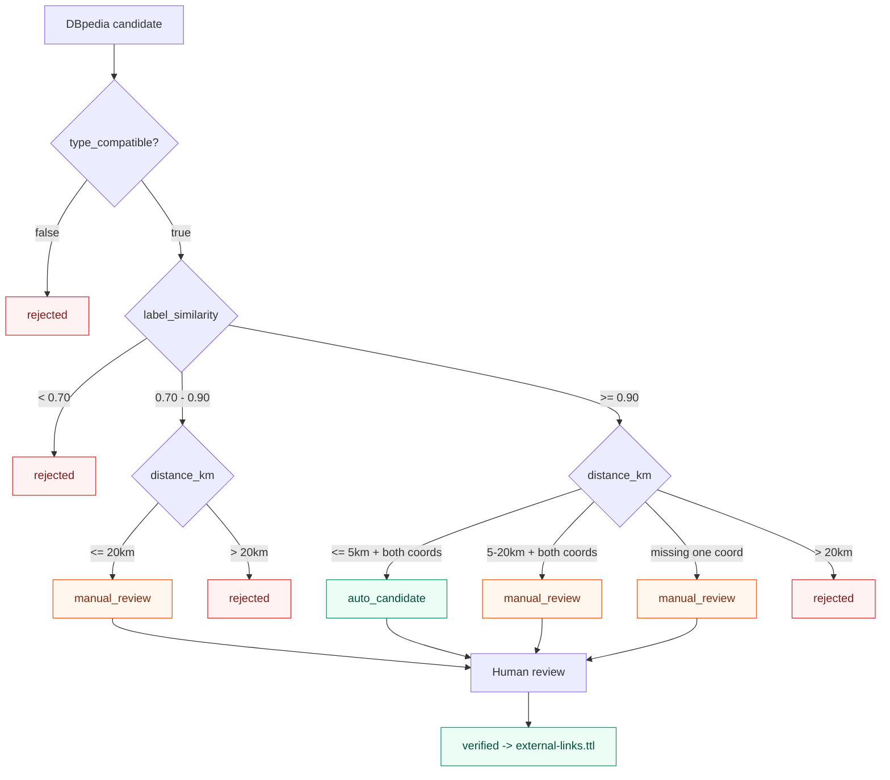

| Điều kiện | Status |
|---|---|
| `type_compatible=false` | `rejected` |
| score `< 0.70` | `rejected` |
| score `>= 0.70` và `< 0.90`, distance `<=20km` | `manual_review` |
| score `>=0.90`, distance `<=5km`, có tọa độ cả hai, type compatible | `auto_candidate` |
| score `>=0.90`, distance `>5km` và `<=20km`, có tọa độ cả hai | `manual_review` |
| score `>=0.90` nhưng thiếu một tọa độ | `manual_review` |
| distance `>20km` | `rejected` |
| status `auto_candidate` | Chưa được đưa vào final cho tới khi verified |
| status `verified` | Đưa vào `external-links.ttl` |

Bảng trên MUST bao phủ mọi tổ hợp `(score, distance, có/thiếu tọa độ, type_compatible)`. Nếu implementation gặp một tổ hợp không khớp dòng nào, đó là lỗi spec và stage MUST FAIL thay vì tự chọn status.

## 22.3 Silk rule

`silk/linkage-rules.xml` MUST chứa rule được freeze dưới đây:

```xml
<?xml version="1.0" encoding="UTF-8"?>
<Silk>
  <Prefixes>
    <Prefix id="vh" namespace="http://localhost:3030/vietheritage/ontology/" />
    <Prefix id="rdfs" namespace="http://www.w3.org/2000/01/rdf-schema#" />
    <Prefix id="geo" namespace="http://www.w3.org/2003/01/geo/wgs84_pos#" />
    <Prefix id="owl" namespace="http://www.w3.org/2002/07/owl#" />
  </Prefixes>
  <Interlinks>
    <Interlink id="vietheritage-dbpedia">
      <LinkType>owl:sameAs</LinkType>
      <SourceDataset dataSource="vietheritage" />
      <TargetDataset dataSource="dbpedia" />
      <LinkageRule>
        <Aggregate type="and">
          <Compare metric="levenshteinDistance" required="true">
            <Input path="&lt;http://www.w3.org/2000/01/rdf-schema#label&gt;" />
            <Input path="&lt;http://www.w3.org/2000/01/rdf-schema#label&gt;" />
            <Param name="threshold" value="0.90" />
          </Compare>
          <Compare metric="geographicDistance" required="true">
            <Input path="&lt;http://www.w3.org/2003/01/geo/wgs84_pos#lat&gt;" />
            <Input path="&lt;http://www.w3.org/2003/01/geo/wgs84_pos#long&gt;" />
            <Param name="maxDistanceKm" value="5" />
          </Compare>
        </Aggregate>
      </LinkageRule>
    </Interlink>
  </Interlinks>
</Silk>
```

Nếu Silk binary không hỗ trợ một metric trực tiếp, stage MUST vẫn dùng file rule này làm policy source và Python scorer deterministic làm execution adapter. Không được thay threshold.

## 22.4 Review manifest

`data/linking/dbpedia_candidates.csv` dùng `status` gồm `auto_candidate`, `manual_review`, `rejected`. Khi candidate được chuyển sang `data/linking/link_review.csv`, trạng thái `auto_candidate` MUST được chuyển thành `manual_review`; chỉ reviewer hoặc fixture verification mới chuyển thành `verified`.

`data/linking/link_review.csv` có schema:

```text
source_uri,target_uri,target_dataset,method,score,distance_km,type_compatible,status,reviewer,reviewed_at,reason
```

`link_review.status` chỉ nhận `verified`, `rejected`, `manual_review`. `verified` là trạng thái duy nhất cho phép sinh `owl:sameAs`.

---

# 23. `owl:sameAs` Policy

`owl:sameAs` được phép khi và chỉ khi:

1. Wikidata QID tồn tại trên source record; hoặc
2. DBpedia candidate có status `verified`; và
3. Target URI là URI entity, không phải homepage, dataset page hoặc organization container không cùng identity.

Không dùng `owl:sameAs` cho:

- Site và thành phố chứa site.
- Site và website chính thức.
- Class và instance.
- Hai entity chỉ có cùng label.

Thay thế bằng:

- `rdfs:seeAlso` cho related resource.
- `foaf:homepage` cho website.
- `vh:locatedIn` cho location.
- `dcterms:source` cho source document.

Test bắt buộc: một fixture sai `sameAs` bị validator reject.

---

# 24. Competency Questions

Tất cả CQ dùng namespace `vh: <http://localhost:3030/vietheritage/ontology/>` và `vhr: <http://localhost:3030/vietheritage/resource/>`.

## CQ-01 — Site theo vị trí

**Question:** Những di sản nào nằm trong Hà Nội hoặc đơn vị hành chính con của Hà Nội?

**Input:** `area_label = "Hà Nội"@vi`.

**Query file:** `sparql/CQ01-sites-by-location.rq`.

```sparql
PREFIX vh: <http://localhost:3030/vietheritage/ontology/>
PREFIX rdfs: <http://www.w3.org/2000/01/rdf-schema#>
SELECT DISTINCT ?site ?label
WHERE {
  ?site a vh:HeritageSite ; rdfs:label ?label ; vh:locatedIn+ ?area .
  ?area rdfs:label "Hà Nội"@vi .
  FILTER(LANG(?label) = "vi")
}
ORDER BY ?label
```

Expected columns: `site`, `label`. Fixture MUST return `vhr:registry-dsvh-national-monument-000001` (trực tiếp trong `area-hanoi`) và `vhr:site-in-sub-area-1` (trong `area-ba-dinh`, là đơn vị hành chính con của `area-hanoi`). Kết quả thứ hai chứng minh `vh:locatedIn+` traverse được area hierarchy; nếu thiếu, xem Section 15.2.1.

## CQ-02 — UNESCO trước năm

**Question:** Những di sản UNESCO được công nhận trước năm 2000?

```sparql
PREFIX vh: <http://localhost:3030/vietheritage/ontology/>
PREFIX xsd: <http://www.w3.org/2001/XMLSchema#>
PREFIX rdfs: <http://www.w3.org/2000/01/rdf-schema#>
SELECT ?site ?label ?year
WHERE {
  ?site a vh:UNESCOHeritageSite ; rdfs:label ?label ; vh:recognitionYear ?year .
  FILTER(?year < "2000"^^xsd:gYear)
  FILTER(LANG(?label) = "vi")
}
ORDER BY ?year
```

Expected columns: `site`, `label`, `year`; fixture có ít nhất một result.

## CQ-03 — Site theo loại

```sparql
PREFIX vh: <http://localhost:3030/vietheritage/ontology/>
PREFIX rdfs: <http://www.w3.org/2000/01/rdf-schema#>
SELECT DISTINCT ?site ?label
WHERE {
  ?site a vh:ArchaeologicalSite ; rdfs:label ?label .
  FILTER(LANG(?label) = "vi")
}
ORDER BY ?label
```

Expected fixture: site `vhr:site-archaeological-1`.

## CQ-04 — Site theo nhân vật

```sparql
PREFIX vh: <http://localhost:3030/vietheritage/ontology/>
PREFIX vhr: <http://localhost:3030/vietheritage/resource/>
PREFIX rdfs: <http://www.w3.org/2000/01/rdf-schema#>
SELECT DISTINCT ?site ?siteLabel
WHERE {
  ?site a vh:HeritageSite ;
        rdfs:label ?siteLabel ;
        vh:associatedWithPerson vhr:person-ly-thuong-kiet .
  FILTER(LANG(?siteLabel) = "vi")
}
ORDER BY ?siteLabel
```

Expected fixture: ba site `vhr:registry-dsvh-national-monument-000001`, `vhr:site-religious-1` và `vhr:site-person-linked-2` (3 bindings).

## CQ-05 — Site theo sự kiện/thời kỳ

```sparql
PREFIX vh: <http://localhost:3030/vietheritage/ontology/>
PREFIX vhr: <http://localhost:3030/vietheritage/resource/>
PREFIX rdfs: <http://www.w3.org/2000/01/rdf-schema#>
SELECT DISTINCT ?site ?label
WHERE {
  { ?site a vh:HeritageSite ; rdfs:label ?label ; vh:associatedWithEvent vhr:event-example . }
  UNION
  { ?site a vh:HeritageSite ; rdfs:label ?label ; vh:belongsToPeriod vhr:period-example . }
  FILTER(LANG(?label) = "vi")
}
ORDER BY ?label
```

Expected fixture: ít nhất một site.

## CQ-06 — Top administrative areas

```sparql
PREFIX vh: <http://localhost:3030/vietheritage/ontology/>
PREFIX rdfs: <http://www.w3.org/2000/01/rdf-schema#>
SELECT ?area ?areaLabel (COUNT(DISTINCT ?site) AS ?siteCount)
WHERE {
  ?site a vh:HeritageSite ; vh:locatedIn ?area .
  ?area rdfs:label ?areaLabel .
  FILTER(LANG(?areaLabel) = "vi")
}
GROUP BY ?area ?areaLabel
ORDER BY DESC(?siteCount) ?areaLabel
LIMIT 10
```

Expected columns: `area`, `areaLabel`, `siteCount`; counts MUST be integer.

## CQ-07 — Person liên quan nhiều site

```sparql
PREFIX vh: <http://localhost:3030/vietheritage/ontology/>
PREFIX rdfs: <http://www.w3.org/2000/01/rdf-schema#>
SELECT ?person ?name (COUNT(DISTINCT ?site) AS ?siteCount)
WHERE {
  ?site a vh:HeritageSite ; vh:associatedWithPerson ?person .
  ?person rdfs:label ?name .
  FILTER(LANG(?name) = "vi")
}
GROUP BY ?person ?name
HAVING(COUNT(DISTINCT ?site) > 1)
ORDER BY DESC(?siteCount) ?name
```

Expected fixture: `vhr:person-ly-thuong-kiet`.

## CQ-08 — Site trong quần thể

```sparql
PREFIX vh: <http://localhost:3030/vietheritage/ontology/>
PREFIX vhr: <http://localhost:3030/vietheritage/resource/>
PREFIX rdfs: <http://www.w3.org/2000/01/rdf-schema#>
SELECT DISTINCT ?site ?label
WHERE {
  ?site a vh:HeritageSite ; rdfs:label ?label ; vh:partOf+ vhr:complex-thang-long .
  FILTER(LANG(?label) = "vi")
}
ORDER BY ?label
```

Expected fixture: `vhr:registry-dsvh-national-monument-000001`.

## CQ-09 — External identity links

```sparql
PREFIX vh: <http://localhost:3030/vietheritage/ontology/>
PREFIX owl: <http://www.w3.org/2002/07/owl#>
PREFIX rdfs: <http://www.w3.org/2000/01/rdf-schema#>
SELECT ?site ?label ?externalResource
WHERE {
  ?site a vh:HeritageSite ; rdfs:label ?label ; owl:sameAs ?externalResource .
  FILTER(LANG(?label) = "vi")
}
ORDER BY ?site ?externalResource
LIMIT 50
```

Expected fixture: Wikidata link của `registry-dsvh-national-monument-000001`.

## CQ-10 — Nhãn tiếng Anh từ external snapshot

CQ10 blocking chạy offline trên `data/fixtures/external_snapshot.ttl`; không phụ thuộc endpoint ngoài.

```sparql
PREFIX vh: <http://localhost:3030/vietheritage/ontology/>
PREFIX owl: <http://www.w3.org/2002/07/owl#>
PREFIX rdfs: <http://www.w3.org/2000/01/rdf-schema#>
SELECT ?site ?viLabel ?externalResource ?enLabel
WHERE {
  ?site a vh:HeritageSite ; rdfs:label ?viLabel ; owl:sameAs ?externalResource .
  ?externalResource rdfs:label ?enLabel .
  FILTER(LANG(?viLabel) = "vi")
  FILTER(LANG(?enLabel) = "en")
}
ORDER BY ?site
```

`sparql/CQ10-federated-demo.rq` là file **optional** (`MAY`), được phép dùng `SERVICE <https://dbpedia.org/sparql>` để demo federation. File này KHÔNG thuộc 10 file blocking của `make cq-test`: runner MUST chỉ nạp đúng 10 file `CQ01-*.rq` … `CQ10-english-label-from-snapshot.rq` liệt kê ở Section 25 và MUST bỏ qua mọi file `*-demo.rq`. Nếu file demo tồn tại, query online phải trả cùng các biến và bindings với query offline trong các dòng dữ liệu tương ứng, nhưng sai lệch do endpoint ngoài MUST NOT làm `make cq-test` hoặc `make verify` FAIL.

---

# 25. SPARQL Specification

| File | CQ | Parameters | Expected columns | Blocking |
|---|---|---|---|---:|
| `CQ01-sites-by-location.rq` | CQ-01 | label area | site, label | Yes |
| `CQ02-unesco-before-year.rq` | CQ-02 | year=2000 | site, label, year | Yes |
| `CQ03-sites-by-type.rq` | CQ-03 | ArchaeologicalSite | site, label | Yes |
| `CQ04-sites-by-person.rq` | CQ-04 | person URI | site, siteLabel | Yes |
| `CQ05-sites-by-event-or-period.rq` | CQ-05 | event/period URI | site, label | Yes |
| `CQ06-top-areas.rq` | CQ-06 | limit=10 | area, areaLabel, siteCount | Yes |
| `CQ07-persons-with-many-sites.rq` | CQ-07 | count > 1 | person, name, siteCount | Yes |
| `CQ08-sites-in-complex.rq` | CQ-08 | complex URI | site, label | Yes |
| `CQ09-external-links.rq` | CQ-09 | limit=50 | site, label, externalResource | Yes |
| `CQ10-english-label-from-snapshot.rq` | CQ-10 | local snapshot | site, viLabel, externalResource, enLabel | Yes |

Query runner MUST:

- Parse query trước khi gửi.
- Ghi query hash SHA-256.
- Ghi endpoint, start/end time, HTTP status.
- So sánh bindings theo biến expected, không so sánh thứ tự trừ query đã có `ORDER BY`.
- Ghi `PASS` hoặc `FAIL` machine-readable.

---

# 26. Reasoning Specification

## 26.1 Engine

Baseline reasoner là Apache Jena OWL Mini reasoner (`http://jena.hpl.hp.com/2003/OWLMiniFBRuleReasoner`) chạy trong `src/vietheritage/reasoning/`. Protégé 5.6.4 + HermiT 1.4.3.456 là SHOULD cho kiểm tra thủ công, không phải dependency của CLI.

OWL Mini được chọn vì tài liệu Jena xác nhận reasoner này hỗ trợ `owl:hasValue`, `owl:disjointWith`, `owl:inverseOf`, `owl:TransitiveProperty` và `owl:equivalentClass`. OWL Micro MUST NOT dùng vì không hỗ trợ `owl:disjointWith`, sẽ làm AX-004 và consistency test không phát hiện được mâu thuẫn.

### 26.1.1 Engine thực thi cho từng axiom

Bảng dưới đây là contract bắt buộc: mỗi axiom được kiểm bằng engine nào và test tương ứng chạy ở stage nào. Coding Agent MUST NOT giả định reasoner tự xử lý mọi axiom.

| Axiom | Construct | Engine thực thi | Stage / Test |
|---|---|---|---|
| AX-001 | `rdfs:subClassOf` | Jena OWL Mini (RDFS closure) | `make reason` / `TEST-041` |
| AX-002 | `owl:inverseOf` | Jena OWL Mini | `make reason` / `TEST-042` |
| AX-003 | `owl:TransitiveProperty` | Jena OWL Mini | `make reason` / `TEST-043` |
| AX-004 | `owl:disjointWith` | Jena OWL Mini (consistency) | `make reason` / `TEST-044` |
| AX-005 | `owl:equivalentClass` + `owl:hasValue` | Jena OWL Mini | `make reason` / `TEST-045` |
| AX-006 | `owl:SymmetricProperty` | Jena OWL Mini (thuộc RDFS/OWL rule set của Mini) | `make reason` / `TEST-082` |
| AX-007 | `rdfs:subPropertyOf` | Jena OWL Mini (RDFS closure) | `make reason` / `TEST-083` |
| AX-008 | `owl:disjointUnionOf` | Semantic validator kiểm disjoint-union consistency, có thể expand thành các cặp `owl:disjointWith` nội bộ | `make validate`; aggregate bởi `make reason` / `TEST-084` |
| AX-009 | `owl:FunctionalProperty` | Semantic validator kiểm closed-world cardinality (`CARDINALITY_VIOLATION`) | `make validate`; aggregate bởi `make reason` / `TEST-085` |

`make reason` MUST orchestrate hoặc tiêu thụ kết quả của cả hai cơ chế: chạy Jena OWL Mini cho AX-001…AX-007 và semantic validation cho AX-008/AX-009, sau đó ghi một aggregate result AX-001…AX-009 vào `reports/<run_id>/reasoning.json`. Bất kỳ axiom nào FAIL đều làm `make reason` exit khác `0`, đúng AC-007. Jena OWL Mini MUST NOT bị yêu cầu thực thi closed-world cardinality của AX-009.

Nếu khi triển khai phát hiện Jena OWL Mini `4.10.0` không sinh được inference cho AX-006 hoặc AX-007, stage MUST NOT hạ yêu cầu: chuyển axiom đó sang cột validator giống AX-008/AX-009, ghi lý do vào `reports/<run_id>/reasoning.json` và cập nhật bảng này cùng Decision Register trong cùng một commit.

## 26.2 Before/after fixture

Input:

```turtle
@prefix vh: <http://localhost:3030/vietheritage/ontology/> .
@prefix vhr: <http://localhost:3030/vietheritage/resource/> .

vhr:site-a a vh:HeritageSite ;
    vh:recognizedBy vhr:organization-unesco ;
    vh:hasRelatedSite vhr:site-c ;
    vh:builtBy vhr:person-kien-truc-su .

vhr:site-b vh:partOf vhr:complex-1 .
vhr:complex-1 vh:partOf vhr:complex-2 .
vhr:person-kien-truc-su a vh:HistoricalPerson .
```

Expected inferred:

```turtle
vhr:site-a a vh:UNESCOHeritageSite .
vhr:site-b vh:partOf vhr:complex-2 .
vhr:complex-1 vh:hasPart vhr:site-b .
vhr:complex-2 vh:hasPart vhr:complex-1, vhr:site-b .
vhr:site-c vh:hasRelatedSite vhr:site-a .
vhr:site-a vh:associatedWithPerson vhr:person-kien-truc-su .
```

Reasoner MUST produce at least these exact inferred triples; extra standard closure triples are allowed only when they do not violate AX-004. Ba dòng cuối minh họa AX-006 (`owl:SymmetricProperty`) và AX-007 (`rdfs:subPropertyOf`).

## 26.3 Consistency

Fixture chứa:

```turtle
vhr:bad-entity a vh:HistoricalPerson, vh:HeritageSite .
```

MUST bị report là inconsistent theo AX-004. Test không được sửa ontology để che lỗi.

---

# 27. Fuseki Specification

## 27.1 Image build

Baseline MUST build image cục bộ từ artifact chính thức `jena-fuseki-server` trên Maven Central. Không dùng image third-party vì tag không được đảm bảo tồn tại.

`deployment/fuseki/Dockerfile`:

```dockerfile
FROM eclipse-temurin:21-jre
ARG JENA_VERSION=4.10.0
ENV FUSEKI_HOME=/fuseki
WORKDIR ${FUSEKI_HOME}
RUN apt-get update \
 && apt-get install -y --no-install-recommends curl \
 && rm -rf /var/lib/apt/lists/* \
 && curl -fsSL -o ${FUSEKI_HOME}/fuseki-server.jar \
    "https://repo1.maven.org/maven2/org/apache/jena/jena-fuseki-server/${JENA_VERSION}/jena-fuseki-server-${JENA_VERSION}.jar" \
 && mkdir -p ${FUSEKI_HOME}/databases
COPY config.ttl ${FUSEKI_HOME}/config.ttl
EXPOSE 3030
ENTRYPOINT ["java", "-Xmx1g", "-jar", "/fuseki/fuseki-server.jar", "--conf=/fuseki/config.ttl"]
```

## 27.2 Dataset configuration

`deployment/fuseki/config.ttl` MUST định nghĩa dataset TDB2 tên `vietheritage`:

```turtle
PREFIX fuseki: <http://jena.apache.org/fuseki#>
PREFIX rdf:    <http://www.w3.org/1999/02/22-rdf-syntax-ns#>
PREFIX tdb2:   <http://jena.apache.org/2016/tdb#>
PREFIX ja:     <http://jena.hpl.hp.com/2005/11/Assembler#>

<#service> rdf:type fuseki:Service ;
    fuseki:name "vietheritage" ;
    fuseki:endpoint [ fuseki:operation fuseki:query ] ;
    fuseki:endpoint [ fuseki:operation fuseki:query  ; fuseki:name "sparql" ] ;
    fuseki:endpoint [ fuseki:operation fuseki:update ; fuseki:name "update" ] ;
    fuseki:endpoint [ fuseki:operation fuseki:gsp_r  ; fuseki:name "get" ] ;
    fuseki:endpoint [ fuseki:operation fuseki:gsp_rw ; fuseki:name "data" ] ;
    fuseki:dataset <#dataset> .

<#dataset> rdf:type tdb2:DatasetTDB2 ;
    tdb2:location "/fuseki/databases/vietheritage" ;
    tdb2:unionDefaultGraph true .
```

`tdb2:unionDefaultGraph true` là cơ chế chính thức để default graph là union của mọi named graph. Loader MUST NOT nhân bản triple vào default graph.

## 27.3 Docker Compose

`docker-compose.yml` là **một file duy nhất** chứa cả hai service. Đây là nội dung normative hợp nhất; không được tách thành hai file rời hoặc để coding agent tự merge:

```yaml
services:
  fuseki:
    build:
      context: ./deployment/fuseki
      args:
        JENA_VERSION: "4.10.0"
    image: vietheritage/fuseki:4.10.0
    container_name: vietheritage-fuseki
    ports:
      - "127.0.0.1:3031:3030"
    volumes:
      - fuseki-data:/fuseki/databases
    healthcheck:
      test: ["CMD-SHELL", "curl -fsS 'http://localhost:3031/vietheritage/sparql?query=ASK%20WHERE%7B%7D' | grep -q true"]
      interval: 10s
      timeout: 5s
      retries: 12
      start_period: 20s
    restart: "no"

  neo4j:
    image: neo4j:5.26
    container_name: vietheritage-neo4j
    ports:
      - "127.0.0.1:7474:7474"
      - "127.0.0.1:7687:7687"
    environment:
      NEO4J_AUTH: "${NEO4J_USER:-neo4j}/${NEO4J_PASSWORD:?NEO4J_PASSWORD is required}"
      NEO4J_server_memory_heap_max__size: "1G"
    volumes:
      - neo4j-data:/data
    healthcheck:
      test: ["CMD-SHELL", "cypher-shell -u $${NEO4J_USER:-neo4j} -p $${NEO4J_PASSWORD} 'RETURN 1' || exit 1"]
      interval: 10s
      timeout: 10s
      retries: 12
      start_period: 30s
    restart: "no"

volumes:
  fuseki-data:
  neo4j-data:
```

Healthcheck của Fuseki MUST dùng tên dataset literal `vietheritage`. `NEO4J_AUTH` MUST dùng interpolation từ `.env` (`${NEO4J_PASSWORD:?...}`) để compose fail sớm khi biến chưa được set, thay vì hardcode mật khẩu trong file được commit. Trong healthcheck của Neo4j, `$$` là cú pháp escape của Docker Compose để biến được giải bởi shell **trong container**, không phải bởi compose.

## 27.4 Endpoints

```text
SPARQL query:      http://localhost:3031/vietheritage/sparql
SPARQL query (alt): http://localhost:3031/vietheritage
SPARQL update:     private admin only at http://localhost:3031/vietheritage-admin/update
Graph Store (ro):  http://localhost:3031/vietheritage/data
Graph Store (rw):  private admin only at http://localhost:3031/vietheritage-admin/data
```

Baseline dùng Fuseki Main nên không có web UI và không có admin endpoint. Health check MUST dựa trên SPARQL `ASK WHERE {}`, không dựa trên `/$/ping`.

## 27.5 Load / reset

Loader MUST dùng Graph Store Protocol với named graph tương ứng:

```bash
curl -X PUT -H 'Content-Type: text/turtle' \
  --data-binary @ontology/vietheritage.ttl \
  'http://localhost:3031/vietheritage-admin/data?graph=http://localhost:3030/vietheritage/graph/ontology'

curl -X PUT -H 'Content-Type: text/turtle' \
  --data-binary @data/rdf/vietheritage.ttl \
  'http://localhost:3031/vietheritage-admin/data?graph=http://localhost:3030/vietheritage/graph/data'

curl -X PUT -H 'Content-Type: text/turtle' \
  --data-binary @data/rdf/external-links.ttl \
  'http://localhost:3031/vietheritage-admin/data?graph=http://localhost:3030/vietheritage/graph/external-links'

curl -X PUT -H 'Content-Type: text/turtle' \
  --data-binary @data/rdf/inferred.ttl \
  'http://localhost:3031/vietheritage-admin/data?graph=http://localhost:3030/vietheritage/graph/inferred'

curl -X PUT -H 'Content-Type: text/turtle' \
  --data-binary @data/rdf/dataset-metadata.ttl \
  'http://localhost:3031/vietheritage-admin/data?graph=http://localhost:3030/vietheritage/graph/metadata'
```

`PUT` MUST được dùng để load idempotent, thay thế nội dung graph cũ.

- `make fuseki-up`: `docker compose up -d --build` và chờ healthcheck healthy.
- `make fuseki-load`: chạy đúng năm lệnh `PUT` trên theo thứ tự ontology → data → external-links → inferred → metadata.
- `make fuseki-reset`: `docker compose down -v`; destructive, chỉ dùng development.
- `make fuseki-down`: `docker compose down`, giữ volume.

### 27.6 Dereferenceable resource

Resource URI:

```text
http://localhost:3030/vietheritage/resource/registry-dsvh-national-monument-000001
```

The canonical URI is served by the read-only Explorer gateway on host port `3030`, while public Fuseki SPARQL is on host port `3031` and private loader writes use the `vietheritage-admin` service. The gateway MUST support:

- `GET /vietheritage/resource/{entity_id}` with HTML, Turtle and JSON-LD content negotiation.
- `Vary: Accept` and a canonical `Link` header.
- `GET /vietheritage/ontology/` for the ontology namespace.
- `404` for an unknown resource and `406` for an unsupported media type.
- JSON-LD identity consistent with the canonical URI.

`make linked-data-test` MUST call the canonical URI directly, not a separate internal port or legacy alias.
- Không dùng Pubby trong baseline.

---

# 28. Linked Data Publication

- Fuseki Graph Store API và adapter `deployment/linked-data/resource_query.py` là giải pháp publication duy nhất trong baseline.
- Pubby không phải dependency.
- Resource response MUST có `Content-Type: text/turtle` khi client gửi `Accept: text/turtle`.
- Resource response MUST chứa URI resource, `rdf:type`, label, source và relations hiện có.
- Response không được chứa credential.
- `make linked-data-test` kiểm tra site fixture bằng HTTP.

---

# 29. Five-Star LOD Contract

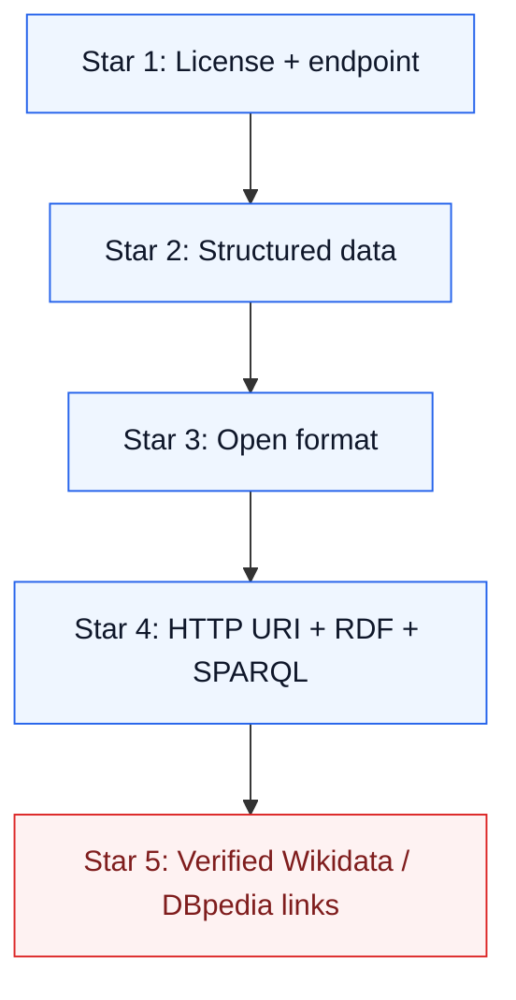

| Star | Requirement | Evidence | Test |
|---|---|---|---|
| 1 | Dataset có license và download/endpoint | `dataset-metadata.ttl`, README | `TEST-061` |
| 2 | Dữ liệu machine-readable có cấu trúc | JSONL + RDF | `TEST-062` |
| 3 | Format không độc quyền: Turtle/JSONL | `.ttl`, `.jsonl` | `TEST-063` |
| 4 | URI + RDF/RDFS/OWL + SPARQL | Ontology + endpoint | `TEST-064` |
| 5 | Links tới Wikidata/DBpedia đã verified | `external-links.ttl`, link report | `TEST-065` |

Chỉ claim `5-Star PASS` khi cả 5 test PASS. Link candidate chưa verified không được tính vào Star 5.

---

# 30. CLI Contract

Makefile là task runner duy nhất. Các target sau MUST tồn tại:

| Command | Input | Output | Exit 0 |
|---|---|---|---:|
| `make setup` | Python/Docker | venv, dependencies | setup thành công |
| `make test` | source + fixtures | test reports | toàn bộ blocking unit/contract pass |
| `make collect-sample` | registry + enrichment fixtures | raw fixture + coverage report | raw/coverage schema pass |
| `make collect` | Official registry + Wikipedia enrichment | full raw + coverage report | 100% registry coverage |
| `make normalize` | raw | normalized JSONL | normalization pass |
| `make resolve` | normalized | entities/identity map | no collision |
| `make map` | entities + mapping | canonical JSONL | schema pass |
| `make generate-rdf` | canonical + ontology | Turtle | RDF parse pass |
| `make link` | RDF + candidates | links/review | link policy pass |
| `make validate` | RDF + ontology | validation report | no blocking issue |
| `make reason` | ontology + RDF | inferred Turtle | expected inference pass |
| `make fuseki-up` | Docker | running Fuseki | health 200 |
| `make fuseki-down` | running Fuseki | stopped Fuseki | stop success |
| `make fuseki-reset` | Fuseki volume | empty dataset | reset success |
| `make fuseki-load` | RDF artifacts | loaded dataset | load success |
| `make linked-data-test` | running Fuseki + site URI | HTTP RDF response | response 200 |
| `make neo4j-up` | Docker | running Neo4j | health check pass |
| `make neo4j-down` | running Neo4j | stopped Neo4j | stop success |
| `make neo4j-reset` | Neo4j volume | empty database | reset success |
| `make neo4j-load` | `canonical.jsonl` | LPG nodes/relationships | load counts match |
| `make cypher-test` | 10 `.cypher` files | Cypher report | 10/10 pass |
| `make traceability-check` | `config/requirements.yaml` + tests | traceability report | no missing MUST link |
| `make query` | `QUERY=...` | query output | query valid |
| `make cq-test` | 10 `.rq` | CQ report | 10/10 pass |
| `make pipeline-sample` | all sample inputs | all sample artifacts | all stages pass |
| `make pipeline` | full source | full artifacts | all blocking stages pass |
| `make verify` | repository + services | final report | FINAL STATUS PASS |

## 30.1 Command examples

```bash
cp .env.example .env
make setup
make test
make pipeline-sample
make fuseki-up
make fuseki-load
make cq-test
make neo4j-up
make neo4j-load
make cypher-test
make verify
```

Không yêu cầu hidden manual step. Nếu Docker chưa chạy, command MUST báo `DOCKER_UNAVAILABLE` và exit 1.

---

# 31. End-to-End Pipeline Contract

```text
make pipeline-sample
  1. setup validation
  2. collect-sample
  3. normalize
  4. resolve
  5. map
  6. generate-rdf
  7. validate
  8. link using fixture candidates
  9. reason
 10. fuseki-up
 11. fuseki-load
 12. cq-test
 13. report
```

Stage MUST fail-fast với lỗi blocking. Record-level invalid MUST quarantine và tăng counter `skipped`; record hợp lệ tiếp tục.

## 31.1 Artifact handoff

| Stage | Input | Artifact | Next gate |
|---|---|---|---|
| Collection | API/config | raw JSONL | raw schema |
| Normalize | raw JSONL | normalized JSONL | canonical fields |
| Resolve | normalized | identity map | collision=0 |
| Map | entities/config | canonical JSONL | canonical schema |
| RDF | canonical/ontology | Turtle | parse PASS |
| Link | Turtle/candidates | links + review | policy PASS |
| Reason | ontology/RDF | inferred Turtle | inference PASS |
| Load | Turtle | Fuseki dataset | health PASS |
| CQ | Fuseki/query | CQ report | 10/10 PASS |

---

# 32. Error Handling Contract

## 32.1 Taxonomy

| Severity | Meaning | Behavior |
|---|---|---|
| `FATAL` | Không thể tạo artifact hợp lệ | Dừng stage/run, exit 1 |
| `RECOVERABLE` | Lỗi network/record được xử lý qua retry hoặc quarantine | Retry hoặc quarantine, pipeline tiếp tục |
| `WARNING` | Không blocking | Ghi log/report |
| `SKIPPED_RECORD` | Record thiếu optional/invalid non-core | Ghi quarantine, tăng counter |

## 32.2 Error codes

| Case | Code | Severity | Behavior |
|---|---|---|---|
| HTTP timeout | `HTTP_TIMEOUT` | RECOVERABLE | Retry 3 lần |
| HTTP 429 | `HTTP_RATE_LIMIT` | RECOVERABLE | Retry 2/4/8s |
| HTTP 5xx | `HTTP_SERVER_ERROR` | RECOVERABLE | Retry 2/4/8s |
| HTTP 4xx khác | `HTTP_CLIENT_ERROR` | FATAL cho stage config | Ghi URL và dừng stage |
| Malformed JSON | `RAW_INVALID_JSON` | SKIPPED_RECORD | Quarantine |
| Missing core field | `RAW_MISSING_CORE` | SKIPPED_RECORD | Quarantine |
| Invalid coordinate | `INVALID_COORDINATE` | WARNING | Bỏ coordinate pair |
| QID sai format | `INVALID_QID` | WARNING | Set `null`, không tạo link (NOR-014) |
| Docker không chạy | `DOCKER_UNAVAILABLE` | FATAL | Dừng command cần container, exit 1 |
| Duplicate | `DUPLICATE_ENTITY` | WARNING | Merge deterministic |
| Identity collision | `IDENTITY_COLLISION` | FATAL | Dừng resolve |
| Invalid Turtle | `RDF_PARSE_ERROR` | FATAL | Dừng validation |
| Ontology inconsistency | `ONTOLOGY_INCONSISTENT` | FATAL | Dừng reasoning |
| Functional property có nhiều giá trị | `CARDINALITY_VIOLATION` | FATAL | Dừng validation |
| Fixture ID xuất hiện trong full run | `FIXTURE_ID_IN_PRODUCTION` | FATAL | Dừng validation (Section 14.2.1) |
| MUST requirement thiếu test hoặc AC | `TRACEABILITY_GAP` | FATAL | Dừng `make traceability-check` |
| Cypher entity set lệch SPARQL | `LPG_RDF_MISMATCH` | FATAL | Dừng `make cypher-test` |
| Relationship trỏ tới entityId không tồn tại | `LPG_DANGLING_REF` | SKIPPED_RECORD | Skip edge, ghi report |
| Registry parse lỗi/selector đổi | `REGISTRY_PARSE_ERROR` | FATAL | Dừng stage collect |
| Registry ID collision | `REGISTRY_ID_COLLISION` | FATAL | Dừng stage collect |
| Enrichment không tìm được page | `ENRICHMENT_MISSING` | WARNING | Giữ `registry_only` |
| Wikidata down | `WIKIDATA_UNAVAILABLE` | WARNING | Giữ raw/internal, report warning |
| DBpedia down | `DBPEDIA_UNAVAILABLE` | WARNING | Dùng cache, không tạo unverified link |
| Fuseki down | `FUSEKI_UNAVAILABLE` | FATAL cho load/CQ | Dừng verify |
| Invalid query | `SPARQL_INVALID` | FATAL cho CQ | Dừng cq-test |
| Federated timeout | `FEDERATED_TIMEOUT` | WARNING | CQ10 offline vẫn chạy |
| Invalid config | `CONFIG_INVALID` | FATAL | Dừng trước network |

---

# 33. Logging Contract

Log file:

```text
logs/<run_id>/<stage>.jsonl
```

Mỗi dòng MUST có:

```json
{
  "timestamp": "2026-09-12T03:00:00.000Z",
  "run_id": "20260912T030000Z-abc123",
  "stage": "normalize",
  "severity": "WARNING",
  "code": "INVALID_COORDINATE",
  "entity_id": "registry-dsvh-national-monument-000001",
  "message": "Latitude ngoài miền hợp lệ",
  "details": {"lat": 121.0}
}
```

Mật khẩu, token và header authorization MUST không xuất hiện trong log.

---

# 34. Pipeline Run Report

File `schema/run-report.schema.json` MUST validate report sau:

```json
{
  "run_id": "20260912T030000Z-abc123",
  "mode": "sample",
  "started_at": "2026-09-12T03:00:00Z",
  "finished_at": "2026-09-12T03:01:00Z",
  "status": "PASS",
  "counts": {
    "collected": 30,
    "normalized": 30,
    "resolved_entities": 35,
    "skipped": 0,
    "rdf_triples": 620,
    "wikidata_links": 25,
    "dbpedia_candidates": 15,
    "dbpedia_verified": 10,
    "cq_passed": 10,
    "cq_failed": 0
  },
  "stages": [
    {"name": "collect", "status": "PASS", "duration_seconds": 4.2},
    {"name": "normalize", "status": "PASS", "duration_seconds": 0.4}
  ],
  "warnings": [],
  "errors": [],
  "artifacts": [
    "data/rdf/vietheritage.ttl",
    "data/rdf/external-links.ttl"
  ]
}
```

`status` chỉ nhận `PASS` hoặc `FAIL`. `FAIL` nếu bất kỳ blocking stage/test fail.

`counts` trong schema B.4 khai `additionalProperties: integer` để cho phép mở rộng, nhưng các key sau là **bắt buộc phải có** trong mọi run report; thiếu một key là `FAIL`:

```text
collected, normalized, resolved_entities, skipped,
rdf_triples, wikidata_links, dbpedia_candidates, dbpedia_verified,
cq_passed, cq_failed,
registry_total, canonical_total, registry_only,
lpg_nodes, lpg_relationships, cypher_passed, cypher_failed
```

Trong `RUN_MODE=sample`, các counter liên quan full dataset vẫn MUST xuất hiện với giá trị thực tế trên golden dataset, không được bỏ key.

---

# 35. Golden Dataset

`data/fixtures/` MUST chứa tối thiểu các entity sau:

| ID | Type | Bắt buộc kiểm thử |
|---|---|---|
| `registry-dsvh-national-monument-000001` | HeritageSite, HistoricalSite | Hà Nội, person, event-example, period-example, complex, Wikidata, CQ05/CQ10 |
| `site-unesco-1` | HeritageSite, recognizedBy UNESCO, `recognitionYear=1994` | OWL UNESCO inference, CQ02 |
| `site-archaeological-1` | ArchaeologicalSite | CQ03 |
| `site-religious-1` | ReligiousSite, HistoricalSite | Multi-type, không disjoint, associatedWithPerson `person-ly-thuong-kiet` |
| `site-person-linked-2` | HeritageSite, HistoricalSite | Site thứ hai của `person-ly-thuong-kiet` cho CQ04/CQ07 |
| `site-duplicate-1` | duplicate source page | Dedup |
| `complex-thang-long` | HeritageComplex | CQ08, partOf |
| `area-hanoi` | AdministrativeArea | CQ01/CQ06 |
| `area-ba-dinh` | AdministrativeArea, `vh:locatedIn area-hanoi` | CQ01 nested traversal, TEST-086 |
| `site-in-sub-area-1` | HeritageSite, `vh:locatedIn area-ba-dinh` | CQ01 MUST trả về site này qua `vh:locatedIn+` |
| `area-quang-ninh` | AdministrativeArea | Location |
| `person-ly-thuong-kiet` | HistoricalPerson | CQ04/CQ07 |
| `person-2` | HistoricalPerson | Additional person fixture |
| `event-example` | HistoricalEvent | CQ05 |
| `period-example` | HistoricalPeriod | CQ05 |
| `organization-unesco` | Organization | AX-005 |
| `style-example` | ArchitecturalStyle | Mapping |

```turtle
vhr:site-unesco-1 a vh:HeritageSite ;
    vh:recognizedBy vhr:organization-unesco ;
    vh:recognitionYear "1994"^^xsd:gYear .

vhr:registry-dsvh-national-monument-000001
    vh:associatedWithPerson vhr:person-ly-thuong-kiet ;
    vh:associatedWithEvent vhr:event-example ;
    vh:belongsToPeriod vhr:period-example ;
    vh:partOf vhr:complex-thang-long ;
    owl:sameAs <https://www.wikidata.org/entity/Q900000001> .

vhr:site-person-linked-2
    a vh:HeritageSite ;
    vh:associatedWithPerson vhr:person-ly-thuong-kiet .
```

Bảng trên là danh sách entity có tên bắt buộc. Golden dataset MUST có tổng 20–30 canonical records; các record còn lại dùng để kiểm tra duplicate, missing field, type mapping, provenance và external snapshot.

Golden dataset MUST có:
- Ít nhất 30 resources RDF.
- Ít nhất một missing optional field.
- Ít nhất một duplicate case.
- Ít nhất một invalid sameAs candidate.
- Wikidata fixture URI format hợp lệ.
- DBpedia snapshot label tiếng Anh cho CQ10.
- Expected Turtle hoặc expected graph subset.
- Expected result cho CQ01–CQ10.

## 35.1 Format bắt buộc của expected results

`data/fixtures/expected/` MUST theo đúng quy ước tên file và format dưới đây để CQ runner so sánh deterministic (không được để coding agent tự chọn format):

| File | Nội dung | Format |
|---|---|---|
| `expected/CQ01.json` … `expected/CQ10.json` | Bindings kỳ vọng của từng CQ | SPARQL 1.1 Results JSON (`{"head":{"vars":[...]},"results":{"bindings":[...]}}`) |
| `expected/inferred.ttl` | Tập triple suy diễn tối thiểu phải xuất hiện sau reasoning | Turtle |
| `expected/cypher_CQ01.json` … `expected/cypher_CQ10.json` | Tập `entityId` kỳ vọng của từng Cypher query | JSON array of string |

Quy tắc so sánh:

1. Runner MUST so sánh theo **tập** binding trên các biến khai ở Section 25, không so thứ tự — trừ query có `ORDER BY` thì thứ tự MUST khớp.
2. `expected/inferred.ttl` là **subset** bắt buộc: reasoner được phép sinh thêm triple closure hợp lệ, nhưng thiếu bất kỳ triple nào trong file là FAIL.
3. So sánh Cypher dùng tập `entityId`, không so property, để đối chiếu được với kết quả SPARQL (Section C.6).

---

# 36. Testing Strategy

## 36.1 Unit tests

Kiểm tra hàm nhỏ:

- Unicode normalization.
- Year parser.
- Coordinate parser.
- URL normalization.
- QID validation.
- SHA-256 ID.
- Haversine distance.
- Levenshtein score.
- URI generation.

## 36.2 Integration tests

Kiểm tra stage nối tiếp:

- Raw → normalized.
- Normalized → canonical.
- Canonical → RDF.
- RDF → Fuseki.
- Fuseki → CQ runner.

## 36.3 Semantic tests

- AX-001 đến AX-009.
- Disjoint inconsistency.
- Inverse/transitive inference.
- `owl:sameAs` policy.

## 36.4 Contract tests

- JSON Schema raw.
- JSON Schema canonical.
- JSON Schema run report.
- Link review schema.
- Environment validation.
- Make target existence.
- File/artifact existence.

## 36.5 End-to-end tests

Một clean environment MUST chạy:

```text
make setup
make test
make pipeline-sample
make fuseki-up
make fuseki-load
make cq-test
make neo4j-up
make neo4j-load
make cypher-test
make verify
```

---

# 37. Test Specification

| Test ID | Requirement | Fixture | Action | Expected | Blocking |
|---|---|---|---|---|---:|
| TEST-001 | FR-001 | API mock page | collect | raw record | Yes |
| TEST-002 | FR-001 | API pagination | collect | all pages, no duplicate | Yes |
| TEST-003 | NFR-007 | timeout mock | collect | retry 3 lần | Yes |
| TEST-004 | FR-001 | HTTP 500 mock | collect | failed record/report | Yes |
| TEST-005 | FR-002 | invalid JSON | validate raw | quarantine | Yes |
| TEST-006 | NOR-001 | whitespace fixture | normalize | expected text | Yes |
| TEST-007 | NOR-002 | NFD fixture | normalize | NFC | Yes |
| TEST-008 | NOR-005 | year strings | normalize | gYear value | Yes |
| TEST-009 | NOR-008 | coordinate strings | normalize | decimal | Yes |
| TEST-010 | NOR-010 | invalid coordinate | normalize | null + warning | Yes |
| TEST-011 | NOR-013 | QID variants | normalize | valid QID/null | Yes |
| TEST-012 | FR-004 | same QID | resolve | same entity | Yes |
| TEST-013 | FR-004 | same page ID | resolve | same entity | Yes |
| TEST-014 | NFR-002 | same input twice | resolve | same ID | Yes |
| TEST-015 | FR-004 | duplicate | resolve | merged record | Yes |
| TEST-016 | FR-004 | collision | resolve | stage fail | Yes |
| TEST-017 | FR-005 | site mapping | map | canonical site | Yes |
| TEST-018 | FR-005 | person relation | map | relation IDs | Yes |
| TEST-019 | FR-005 | missing optional | map | valid record | Yes |
| TEST-020 | FR-005 | missing required | map | quarantine | Yes |
| TEST-021 | FR-006 | canonical fixture | RDF generate | Turtle exists | Yes |
| TEST-022 | FR-006 | Vietnamese label | RDF generate | `@vi` | Yes |
| TEST-023 | FR-006 | year | RDF generate | `xsd:gYear` | Yes |
| TEST-024 | FR-006 | coordinates | RDF generate | geo decimal | Yes |
| TEST-025 | FR-006 | enriched + `registry_only` provenance fixtures | RDF generate | official source/prov cho cả hai; page ID/title chỉ bắt buộc cho enriched entity | Yes |
| TEST-026 | NFR-002 | run twice | RDF generate | stable sorted output | Yes |
| TEST-027 | FR-006 | null field | RDF generate | no null triple | Yes |
| TEST-028 | FR-010 | valid Turtle | validate | PASS | Yes |
| TEST-029 | FR-010 | malformed Turtle | validate | FAIL | Yes |
| TEST-030 | FR-010 | missing label | validate | FAIL | Yes |
| TEST-031 | FR-010 | literal subject | validate | FAIL | Yes |
| TEST-032 | FR-010 | provenance missing | validate | FAIL | Yes |
| TEST-033 | FR-010 | namespace inventory | validate | exact prefixes | Yes |
| TEST-034 | FR-007 | valid QID | link | verified link | Yes |
| TEST-035 | FR-007 | invalid QID | link | reject | Yes |
| TEST-036 | FR-008 | score .95, 2km | linker | auto candidate | Yes |
| TEST-037 | FR-008 | score .80, 10km | linker | manual review | Yes |
| TEST-038 | FR-008 | score .60 | linker | reject | Yes |
| TEST-039 | FR-009 | unverified candidate | generate links | no sameAs | Yes |
| TEST-040 | FR-009 | verified candidate | generate links | sameAs | Yes |
| TEST-041 | AX-001 | subclass fixture | reason | inferred parent | Yes |
| TEST-042 | AX-002 | inverse fixture | reason | inverse triple | Yes |
| TEST-043 | AX-003 | chain fixture | reason | transitive triple | Yes |
| TEST-044 | AX-004 | contradictory fixture | reason | inconsistency | Yes |
| TEST-045 | AX-005 | UNESCO fixture | reason | UNESCO class | Yes |
| TEST-082 | AX-006 | symmetric relation fixture | reason | inferred inverse-direction triple | Yes |
| TEST-083 | AX-007 | builtBy person fixture | reason | inferred `vh:associatedWithPerson` triple | Yes |
| TEST-084 | AX-008 | dual-category intangible fixture | validate; aggregate result qua reason | `ONTOLOGY_INCONSISTENT` reported | Yes |
| TEST-085 | AX-009 | duplicate constructionYear fixture | validate | `CARDINALITY_VIOLATION` reported | Yes |
| TEST-086 | CQ-01 | nested area fixture (`site → ward → district → Hà Nội`) | cq-test | CQ01 trả về site thuộc đơn vị hành chính con | Yes |
| TEST-087 | AX-007 | `builtBy` trỏ tới `vh:Organization` | generate-rdf + validate | không sinh `vh:builtBy`; không resource nào vừa `Organization` vừa `HistoricalPerson` | Yes |
| TEST-088 | NFR-006 | log fixture của một stage | validate log | mỗi dòng là JSON hợp lệ, đủ `timestamp`/`run_id`/`stage`/`severity`/`code`/`message` | Yes |
| TEST-089 | NFR-015 | repository + log + report artifacts | verify | không có secret/token/password trong artifact được commit hoặc log | Yes |
| TEST-090 | FR-005 | `registry_sources.yaml` + `mapping.yaml` | contract test | mọi `registry_category` được map, và `ontology_subclass` khớp `registry_category_subclass` | Yes |
| TEST-046 | FR-012 | docker compose | fuseki-up | health 200 | Yes |
| TEST-047 | FR-012 | final TTL | fuseki-load | graph loaded | Yes |
| TEST-048 | FR-017 | site URI | linked-data-test | RDF 200 | Yes |
| TEST-049 | FR-012 | reset/load | fuseki-reset/load | clean graph | Yes |
| TEST-050 | FR-012 | SPARQL ASK | query | true | Yes |
| TEST-051 | FR-013 | CQ01 golden fixture | cq-test | CQ01 expected bindings | Yes |
| TEST-052 | FR-013 | CQ02 golden fixture | cq-test | CQ02 expected bindings | Yes |
| TEST-053 | FR-013 | CQ03 golden fixture | cq-test | CQ03 expected bindings | Yes |
| TEST-054 | FR-013 | CQ04 golden fixture | cq-test | CQ04 expected bindings | Yes |
| TEST-055 | FR-013 | CQ05 golden fixture | cq-test | CQ05 expected bindings | Yes |
| TEST-056 | FR-013 | CQ06 golden fixture | cq-test | CQ06 aggregation đúng | Yes |
| TEST-057 | FR-013 | CQ07 golden fixture | cq-test | CQ07 HAVING filter đúng | Yes |
| TEST-058 | FR-013 | CQ08 golden fixture | cq-test | CQ08 property path đúng | Yes |
| TEST-059 | FR-013 | CQ09 golden fixture | cq-test | CQ09 chỉ trả verified link | Yes |
| TEST-060 | FR-013 | CQ10 offline snapshot | cq-test | CQ10 trả label `@en` từ snapshot local | Yes |
| TEST-061 | Section 21/29 | `dataset-metadata.ttl` + README | verify | canonical dataset URI, license và endpoint PASS | Yes |
| TEST-062 | Section 29 | canonical JSONL + RDF | verify | Star 2 structured data PASS | Yes |
| TEST-063 | Section 29 | `.ttl`/`.jsonl` artifacts | verify | Star 3 open format PASS | Yes |
| TEST-064 | Section 29 | ontology + endpoint | verify | Star 4 URI/RDF/SPARQL PASS | Yes |
| TEST-065 | Section 29 | `external-links.ttl` + link report | verify | Star 5 verified links PASS | Yes |
| TEST-076 | FR-001 | official category index fixture | registry-collect | every configured category discovered | Yes |
| TEST-077 | FR-001 | registry detail fixture | registry-collect | required fields and registry_id | Yes |
| TEST-078 | FR-001 | paginated registry fixture | registry-collect | all pages, no duplicate registry_id | Yes |
| TEST-079 | FR-001 | missing detail fixture | registry-collect | failure manifest and full-mode FAIL | Yes |
| TEST-080 | FR-001 | registry-only fixture | merge | entity retained with source_status | Yes |
| TEST-081 | FR-001 | coverage report fixture | verify | 100% coverage invariant calculated correctly | Yes |

---

# 38. Acceptance Criteria

Mỗi AC là binary PASS/FAIL.

| ID | Given | When | Then |
|---|---|---|---|
| AC-001 | Clean checkout, Python >=3.12,<3.14, Docker running | `make setup` | exit 0, dependencies installed |
| AC-002 | Golden raw fixture | `make collect-sample` | raw JSONL validate, no schema error |
| AC-003 | Raw fixture | `make normalize` | canonical normalization tests PASS |
| AC-004 | Duplicate/collision fixtures | `make resolve` | duplicate merge; collision exits 1 |
| AC-005 | Canonical fixture | `make generate-rdf` | Turtle parse bằng RDFLib PASS |
| AC-006 | Generated RDF | `make validate` | RDF validation PASS, all site label `@vi` |
| AC-007 | Ontology + reasoning fixture | `make reason` | Aggregate AX-001…AX-009 PASS: Jena OWL Mini đánh giá AX-001…AX-007; semantic validation đánh giá AX-008/AX-009 |
| AC-008 | Docker available | `make fuseki-up` | Fuseki health HTTP 200 |
| AC-009 | Final artifact | `make fuseki-load` | dataset `vietheritage` chứa expected graph |
| AC-010 | Loaded dataset | `make cq-test` | CQ01–CQ10 = 10/10 PASS |
| AC-011 | Site fixture URI | `make linked-data-test` | URI trả HTTP 200 Turtle/RDF |
| AC-012 | Verified link manifest | `make link` | unverified link không xuất hiện trong final TTL |
| AC-013 | Full dataset | `make verify` | registry coverage=100%, heritage sites ≥100 when baseline is large enough, verified links ≥100 |
| AC-014 | Full dataset | `make verify` | classes=23, object properties=12, datatype properties=10 |
| AC-015 | Final repo | `make verify` | report schema valid, artifacts tồn tại |
| AC-016 | Final repo | `make verify` | `FINAL STATUS: PASS`, exit code 0 |
| AC-017 | Intentional failing fixture | `make verify FIXTURE=bad` | `FINAL STATUS: FAIL`, exit code khác 0 |
| AC-018 | Clean checkout không network cho sample | `make pipeline-sample` | sample pipeline PASS dùng fixture |
| AC-019 | Source/license metadata | `make validate` | dataset/resource provenance PASS |
| AC-020 | 5-Star artifacts | `make verify` | Star 1–5 = PASS |
| AC-024 | Full official registry snapshot | `make verify` | `registry_total == canonical_registry_derived_entities`, `coverage_percent=100.0`, no unresolved registry IDs |
| AC-025 | Multi-category snapshot | `make verify` | every configured registry category has discovered/valid/retrieved/canonicalized counters |
| AC-026 | Registry failure or registry-only fixture | `make collect-sample` | failure blocks full claim; registry-only entity is retained |

---


# 39. Requirement Traceability Matrix

| Requirement | Component/file | Test | AC |
|---|---|---|---|
| FR-001 Official registry collection | `src/vietheritage/registry/`, `config/registry_sources.yaml` | TEST-076…081 | AC-024/025/026 |
| FR-001A Wikipedia enrichment | `src/vietheritage/collector/`, `config/collector.yaml` | TEST-001…004 | AC-002/026 |
| FR-002 Raw validation | `schema/raw-page.schema.json` | TEST-005 | AC-002 |
| FR-003 Normalization | `src/vietheritage/normalization/` | TEST-006…011 | AC-003 |
| FR-004 Identity | `src/vietheritage/identity/` | TEST-012…016 | AC-004 |
| FR-005 Mapping | `config/mapping.yaml`, `src/vietheritage/mapping/` | TEST-017…020, TEST-090 | AC-003 |
| FR-006 RDF | `src/vietheritage/rdf/` | TEST-021…027 | AC-005 |
| FR-007 Wikidata | `src/vietheritage/linking/wikidata.py` | TEST-034/035 | AC-012 |
| FR-008 DBpedia | `silk/linkage-rules.xml`, linker | TEST-036…038 | AC-012 |
| FR-009 Review | `data/linking/link_review.csv` | TEST-039/040 | AC-012 |
| FR-010 Validation | `src/vietheritage/validation/` | TEST-028…033, TEST-084/085 | AC-006/007 |
| FR-011 Reasoning | `src/vietheritage/reasoning/` | TEST-041…045, TEST-082/083; aggregate TEST-084/085 | AC-007 |
| FR-012 Fuseki | `docker-compose.yml`, `deployment/fuseki/` | TEST-046…050 | AC-008/009 |
| FR-013 CQ | `sparql/`, CQ runner | TEST-051…060, TEST-086 | AC-010 |
| FR-014 Report | `schema/run-report.schema.json` | contract tests | AC-015 |
| FR-015 CLI | `Makefile` | command contract | AC-001/016 |
| FR-016 Test suite | `tests/unit`, `tests/integration`, `tests/semantic`, `tests/contract`, `tests/e2e` | toàn bộ TEST-001…089 | AC-016/017 |
| FR-017 Resource dereference | `deployment/linked-data/resource_query.py` | TEST-048 | AC-011 |
| FR-018 License/provenance | `src/vietheritage/rdf/`, `data/rdf/dataset-metadata.ttl` | TEST-025/032, TEST-061 | AC-019/020 |
| NFR-001 reproducibility | README + Makefile + fixtures | e2e | AC-018 |
| NFR-002 deterministic IDs | identity/RDF tests | TEST-014/026 | AC-004/005 |
| NFR-003 UTF-8 | all artifacts | TEST-006/022 | AC-005/006 |
| NFR-004 Vietnamese language | RDF generator + ontology labels | TEST-022, TEST-033 | AC-006/014 |
| NFR-005 Configuration | `config/*.yaml`, `.env.example`, Phụ lục D | contract tests (config validation) | AC-001 |
| NFR-006 logging | `src/vietheritage/reporting/` | TEST-088 | AC-015 |
| NFR-007 Retry | `src/vietheritage/registry/`, `src/vietheritage/collector/` | TEST-003 | AC-002 |
| NFR-008 Testability | fixtures theo từng stage | TEST-005…020 | AC-018 |
| NFR-009 Maintainability | module tách theo stage trong `src/vietheritage/` | contract tests (module/target existence) | AC-001 |
| NFR-011 External resilience | `src/vietheritage/linking/` | TEST-060 (CQ10 offline) | AC-012 |
| NFR-015 security | repo + logs + reports | TEST-089 | AC-015 |
| NFR-010 Docker | compose | TEST-046 | AC-008 |
| NFR-012 provenance | RDF generator | TEST-025/032 | AC-019 |
| Section 29 5-Star | metadata/link artifacts | TEST-061…065 | AC-020 |

`NFR-013`, `NFR-014`, `NFR-016` là mức `SHOULD` nên không bắt buộc có blocking test; mọi requirement mức `MUST` khác MUST xuất hiện trong bảng trên.

Mọi MUST trong file này MUST xuất hiện trong bảng traceability hoặc trong test inventory tương ứng. Requirement không có test/AC là lỗi specification.

---

# 40. Definition of Done

## 40.1 MVP DoD

- [ ] Official registry coverage = 100% of the selected snapshot.
- [ ] 100 heritage sites when the baseline snapshot contains enough sites.
- [ ] 23 classes, 12 object properties, 10 datatype properties.
- [ ] Turtle parse PASS.
- [ ] 9 OWL axioms tested (AX-001…AX-009).
- [ ] Fuseki endpoint hoạt động.
- [ ] 10/10 CQ PASS trên golden dataset.
- [ ] Ít nhất 100 verified external links trong full run.
- [ ] Provenance/license PASS.
- [ ] Neo4j LPG load PASS và Cypher CQ01–CQ10 = 10/10 PASS trên golden dataset.
- [ ] `make verify` PASS.

## 40.2 Final Project DoD

- [ ] Full pipeline chạy từ raw source tới Fuseki.
- [ ] Target 150–250 sites hoặc có report giải thích dataset nguồn không đạt target; MVP vẫn phải PASS.
- [ ] 5.000–15.000 triples hoặc report số thực tế.
- [ ] External linking report có precision sample.
- [ ] Reasoning before/after demo.
- [ ] Resource URI dereferenceable.
- [ ] 5-Star evidence đầy đủ.
- [ ] LPG↔RDF parity PASS: không có `LPG_RDF_MISMATCH` (Section C.6).
- [ ] Không có MUST untested.
- [ ] `make verify` trả exit 0 và `FINAL STATUS: PASS`.

## 40.3 Presentation DoD

- [ ] Demo một entity.
- [ ] Demo CQ02.
- [ ] Demo CQ06 aggregation.
- [ ] Demo CQ09 external link.
- [ ] Demo reasoning.
- [ ] Offline fallback sẵn sàng.
- [ ] Video 3–5 phút.
- [ ] Presentation khoảng 15 phút.
- [ ] Report tối đa 15 trang.

---

# 41. Reproducibility Contract

Người mới chỉ cần repository và `PROJECT_SPEC.md` để chạy:

```text
git clone <repository>
cd vietheritage-lod
cp .env.example .env
make setup
make test
make pipeline-sample
make fuseki-up
make fuseki-load
make cq-test
make neo4j-up
make neo4j-load
make cypher-test
make verify
```

Không có hidden manual step. Full collection cần network; sample pipeline không cần network ngoài Docker image đã pull. Golden dataset và expected results MUST được commit.

---

# 42. Development Plan — 7 tuần

## Tuần 1 — Requirements và ontology v0.1

**Goal:** Freeze CQ, scope, field schema, URI và ontology sketch.

**Tasks:**

- Tạo repository/Makefile.
- Tạo CQ01–CQ10.
- Tạo raw/canonical JSON Schema.
- Tạo ontology 23 classes.
- Tạo 20 fixture records.
- Chạy `make pipeline-sample` skeleton.

**Artifacts:** CQ files, schema, ontology v0.1, fixture.

**Gate:** `TEST-017`, contract tests.

**Exit:** CQ và field names không còn thay đổi tùy ý.

## Tuần 2 — RDF prototype end-to-end

**Goal:** MediaWiki fixture/API → JSONL → RDF/Turtle.

**Artifacts:** collector, normalizer, RDFLib generator, 500+ sample triples.

**Gate:** AC-002 đến AC-005.

## Tuần 3 — RDFS và data expansion

**Goal:** Ontology v1 frozen, 50–100 sites, CQ01–CQ05 PASS.

**Artifacts:** domain/range, labels/comments, mapping.

**Gate:** `make validate`, `make cq-test` partial.

## Tuần 4 — LOD và Fuseki

**Goal:** URI, provenance, license, Fuseki, dereference resource.

**Artifacts:** Docker Compose, loader, linked-data test.

**Gate:** AC-008, AC-009, AC-011.

## Tuần 5 — OWL và reasoning

**Goal:** AX-001…AX-009 và CQ01–CQ08 PASS.

**Artifacts:** inferred graph, before/after demo, inconsistency report.

**Gate:** AC-007, AC-010 partial.

## Tuần 6 — External links và final graph

**Goal:** Wikidata deterministic, DBpedia candidate/review, 100 verified links, CQ09/CQ10.

**Artifacts:** link manifest, Silk rule, external snapshot.

**Gate:** AC-012, AC-013.

## Tuần 7 — Evaluation và release

**Goal:** freeze code/data/schema, verify, report, slide, video.

**Artifacts:** final report, slides, video, run report.

**Gate:** AC-014…AC-020.

Ngày presentation chỉ dùng commit đã qua `make verify`.

---

# 43. AUTONOMOUS CODING IMPLEMENTATION PLAN

Coding Agent MUST đi qua các gate theo thứ tự và không chuyển gate khi blocking test fail.

## G0 — Repository Bootstrap

**Input:** `PROJECT_SPEC.md`.

**Implementation:** Tạo tree, `requirements.txt`, `.env.example`, Makefile, pytest config.

**Tests:** command existence, config validation.

**Exit:** `make setup`, `make test` chạy được.

## G1 — Data Contracts

**Implementation:** Raw/canonical/run-report/link-review JSON Schema và fixture.

**Tests:** schema valid/invalid cases.

**Exit:** contract tests PASS.

## G2 — Ontology

**Implementation:** `ontology/vietheritage.ttl` đủ 23 classes, 12 object properties, 10 datatype properties, AX-001…AX-009, ontology header (Section 15.0.0) và `rdfs:label` song ngữ (Section 15.1.1).

**Tests:** parse, inventory, consistency fixture.

**Exit:** ontology contract PASS.

## G3 — Collector

**Implementation:** MediaWiki API adapter, pagination, retry, raw JSONL.

**Tests:** API mock, timeout, 429, 5xx, category not found.

**Exit:** sample collector PASS.

## G4 — Normalization

**Implementation:** NOR-001…NOR-015.

**Tests:** before/after fixtures.

**Exit:** normalized schema PASS.

## G5 — Entity Resolution

**Implementation:** exact QID/page ID/canonical identity algorithm.

**Tests:** duplicate, stable ID, collision.

**Exit:** identity report collision=0 trên golden.

## G6 — RDF

**Implementation:** mapping, URI generation, Turtle serialization, provenance.

**Tests:** parse, datatypes, language tags, deterministic diff.

**Exit:** RDF validation PASS.

## G7 — External Linking

**Implementation:** Wikidata QID, Silk XML, DBpedia scoring/review manifest.

**Tests:** thresholds, sameAs policy, unverified exclusion.

**Exit:** link policy PASS.

## G8 — Fuseki

**Implementation:** Docker Compose, TDB2 load, health, Graph Store resource endpoint.

**Tests:** up/load/query/dereference/reset.

**Exit:** Fuseki integration PASS.

## G9 — SPARQL

**Implementation:** CQ01–CQ10 exact files, runner, expected result.

**Tests:** 10/10 golden PASS.

**Exit:** CQ gate PASS.

## G10 — Reasoning

**Implementation:** Jena OWL Mini reasoner, inferred artifact, consistency report.

**Tests:** AX-001…AX-009.

**Exit:** reasoning gate PASS.

## G11 — Full Validation

**Implementation:** `make verify`, metrics, report, traceability check, 5-Star check.

**Tests:** full sample and full run.

**Exit:** all blocking AC PASS.

## G12 — Release

**Implementation:** freeze commit, README, report, slides, video, offline demo.

**Tests:** clean checkout reproducibility.

**Exit:** `FINAL STATUS: PASS`.

---

# 44. AUTONOMOUS CODING RULES

Coding Agent MUST:

1. Đọc toàn bộ `PROJECT_SPEC.md` trước khi code.
2. Inspect repository trước khi tạo file.
3. Implement đúng contract, không tự đổi schema.
4. Viết test cùng implementation.
5. Giữ production code và fixture tách nhau.
6. Không sửa test để che bug.
7. Không fabricate result hoặc metric.
8. Không thay ontology tùy ý.
9. Không hard-code URL, threshold hoặc secret.
10. Không bỏ provenance.
11. Không bỏ error handling.
12. Không thêm công nghệ ngoài stack nếu không cập nhật spec.
13. Chạy test sau mỗi gate.
14. Sửa lỗi và chạy lại test trước khi sang gate tiếp theo.
15. Ghi failure vào report machine-readable.
16. Không claim DONE khi chưa chạy `make verify`.
17. Không hỏi lại implementation detail đã được freeze trong file này.
18. Chỉ dừng khi gặp blocker môi trường không thể suy ra và đã ghi rõ log.

---

# 45. FINAL VERIFICATION COMMAND

`make verify` MUST thực hiện đúng thứ tự:

```text
1. validate environment
2. run unit tests
3. run contract tests
4. run integration tests
5. parse RDF/Turtle
6. validate ontology inventory/consistency
7. run reasoning tests
8. verify external link policy
9. start/check Fuseki
10. load final graph
11. run CQ01–CQ10
12. test dereferenceable resource URI
13. start/check Neo4j
14. load LPG projection và run Cypher CQ01–CQ10
15. verify 5-Star artifacts
16. validate run report
17. validate traceability inventory
18. print final status
```

Output PASS:

```text
FINAL VERIFICATION

Environment: PASS
Unit Tests: PASS
Contract Tests: PASS
Integration Tests: PASS
RDF Validation: PASS
Ontology: PASS
Reasoning: PASS
Competency Questions: 10/10 PASS
External Links: PASS
Fuseki: PASS
Linked Data URI: PASS
Neo4j LPG: PASS
Cypher Questions: 10/10 PASS
5-Star LOD: PASS
Artifacts: PASS
Traceability: PASS

FINAL STATUS: PASS
```

## 45.1 Mode gating

- `RUN_MODE=sample`: `make verify` MUST chạy toàn bộ structural, semantic, CQ, Fuseki và linked-data tests trên golden dataset. Neo4j LPG load và Cypher parity (step 13–14) MUST chạy trên golden dataset vì đó là điều kiện của MVP DoD; NFR-014 (`< 60s`) chỉ áp dụng cho `make pipeline-sample` (thuần data pipeline), KHÔNG áp dụng cho `make verify` vì verify bao gồm khởi động Docker service. AC-013 và các metric full dataset được ghi `SKIPPED_SAMPLE_MODE`, không làm sample verification FAIL.
- `RUN_MODE=full`: `make verify` MUST chạy thêm collection đầy đủ và kiểm tra AC-013, MET-005 đến MET-008 theo ngưỡng MVP. Full release không được claim PASS nếu AC-013 FAIL.
- `make verify` không được tự đổi `RUN_MODE`; giá trị lấy từ `.env` hoặc command environment.

Nếu bất kỳ blocking step nào fail:

```text
FINAL STATUS: FAIL
```

và exit code khác `0`.

---

# 46. FINAL COMPLETION CONTRACT

Project chỉ COMPLETE khi tất cả điều kiện dưới đây PASS:

- [ ] All MUST requirements PASS.
- [ ] All blocking tests PASS.
- [ ] All blocking Acceptance Criteria PASS.
- [ ] CQ = 10/10 PASS.
- [ ] RDF Validation PASS.
- [ ] Ontology Validation PASS.
- [ ] Reasoning PASS.
- [ ] External Linking policy PASS.
- [ ] Fuseki PASS.
- [ ] Five-Star requirements PASS.
- [ ] Reproducibility PASS.
- [ ] `make verify` PASS.
- [ ] `FINAL STATUS: PASS`.

Code chạy một phần không được coi là project hoàn thành.

---

# 47. Chất lượng Specification

Mỗi module trong spec đã trả lời:

```text
WHAT?       responsibility
WHY?        mục đích
INPUT?      input contract
OUTPUT?     artifact
SCHEMA?     field/type/required
PROCESS?    algorithm/rule
CONFIG?     biến và default
ERROR?      taxonomy/behavior
TEST?       test và PASS condition
```

Nếu implementation thêm module mới, module đó MUST bổ sung đủ chín câu trả lời trước khi merge.

---

# 48. SPEC COMPLETENESS AUDIT

Coding Agent mới chỉ có repository và file này phải trả lời được:

| Câu hỏi | Trạng thái | Vị trí |
|---|---|---|
| Code chính xác gì? | PASS | Mục 7, 43 |
| Tạo file nào? | PASS | Mục 9 |
| Schema là gì? | PASS | Mục 11, 12, 34 |
| Ontology là gì? | PASS | Mục 15, 16 |
| URI là gì? | PASS | Mục 14 |
| Mapping là gì? | PASS | Mục 19 |
| External threshold là gì? | PASS | Mục 22 |
| Command nào? | PASS | Mục 30 |
| Expected output nào? | PASS | Mục 20, 24, 34, 35 |
| Test nào? | PASS | Mục 36, 37 |
| Khi nào DONE? | PASS | Mục 40, 46 |

Không còn requirement MUST phụ thuộc vào quyết định của developer.

---

# 49. ZERO-AMBIGUITY GATE

Các cụm mơ hồ trong tài liệu gốc đã được xử lý như sau:

| Điểm mơ hồ gốc | Quyết định đã freeze |
|---|---|
| API hoặc dump | MUST dùng MediaWiki API |
| Fuseki resource endpoint | MUST dùng Fuseki Graph Store resource endpoint; không dùng Pubby |
| Base URI placeholder | Default `http://localhost:3030/vietheritage` |
| `partOf` transitive | YES |
| `locatedIn` transitive | NO; dùng property path |
| Disjoint subtype | Không disjoint giữa các heritage subtype |
| UNESCO identity | `vhr:organization-unesco` là named individual |
| GeoNames | OUT OF SCOPE baseline |
| DBpedia threshold | 0.90/0.70 và 5km/20km |
| Fuzzy core identity | MUST NOT dùng |
| Federated CQ10 | Offline snapshot là blocking; SERVICE là MAY demo |
| Task runner | GNU Make duy nhất |
| Reasoner | Jena OWL Mini CLI; HermiT SHOULD review |
| Frontend | OUT OF SCOPE baseline |
| Full dataset range | MVP ≥100; target 150–250 |

Zero-Ambiguity audit đã kiểm tra toàn bộ token mơ hồ do prompt định nghĩa. Không token mơ hồ nào xuất hiện trong các section implementation; optional work được đánh dấu `MAY` và không ảnh hưởng DoD.

---

# 50. CONSISTENCY GATE

Các tên sau MUST nhất quán từ ontology → mapping → RDF → golden dataset → SPARQL → test:

| Concept | Canonical identifier |
|---|---|
| Heritage Site | `vh:HeritageSite` |
| UNESCO Site | `vh:UNESCOHeritageSite` |
| Historical Site | `vh:HistoricalSite` |
| Archaeological Site | `vh:ArchaeologicalSite` |
| Administrative area | `vh:AdministrativeArea` |
| Historical person | `vh:HistoricalPerson` |
| Historical event | `vh:HistoricalEvent` |
| Historical period | `vh:HistoricalPeriod` |
| Complex | `vh:HeritageComplex` |
| Location | `vh:locatedIn` |
| Part relation | `vh:partOf`, `vh:hasPart` |
| Person relation | `vh:associatedWithPerson` |
| Event relation | `vh:associatedWithEvent` |
| Period relation | `vh:belongsToPeriod` |
| Construction year | `vh:constructionYear` |
| Recognition year | `vh:recognitionYear` |
| External identity | `owl:sameAs` |
| Source | `dcterms:source`, `prov:wasDerivedFrom` |

`tests/contract/test_identifier_consistency.py` MUST scan all ontology, mapping, RDF fixture và query files để phát hiện identifier ngoài bảng này.

---

# 51. TRACEABILITY GATE

Mỗi MUST requirement MUST có chuỗi:

```text
Requirement ID
    ↓
Component hoặc artifact
    ↓
Test ID
    ↓
Acceptance Criterion
```

`make traceability-check` MUST:

1. Đọc bảng requirement registry trong `config/requirements.yaml`.
2. Đọc test IDs trong `tests/`.
3. Đọc AC IDs trong `PROJECT_SPEC.md` hoặc registry generated.
4. Fail nếu MUST không có component, test hoặc AC.

Output:

```text
TRACEABILITY: PASS
MUST requirements checked: <integer>
MUST requirements without test: 0
MUST requirements without AC: 0
```

---

# 52. Không được chỉ đề xuất

File này là implementation specification. Coding Agent MUST tạo artifact và chạy command, không được chỉ trả về:

- danh sách recommendation;
- outline;
- proposal;
- danh sách việc cần làm mà không implement;
- screenshot thay cho test;
- metric ước lượng không có run report.

Mọi metric trong report phải lấy từ artifact hoặc command output.

---

# 53. Output và deliverables

## 53.1 Repository deliverables

- `PROJECT_SPEC.md`.
- Source code tại `src/`.
- Ontology Turtle.
- JSON Schema.
- Golden dataset.
- Final Turtle.
- External link manifest.
- Silk rule.
- 10 SPARQL files.
- Docker Compose.
- Makefile.
- Test reports.
- Run report.
- README.

## 53.2 Academic deliverables

Report tối đa 15 trang:

1. Introduction, problem, objectives.
2. Requirements và 10 CQ.
3. Ontology design.
4. Data collection và RDF transformation.
5. LOD publication.
6. External linking.
7. SPARQL và reasoning.
8. Evaluation metrics.
9. Conclusion, limits, future work.

Presentation khoảng 15 phút:

1. Problem/motivation — 1.5 phút.
2. Scope/CQ — 1.5 phút.
3. Ontology — 3 phút.
4. Data → RDF → LOD — 3 phút.
5. SPARQL/reasoning — 4 phút.
6. Evaluation/conclusion — 2 phút.

Video MUST dài 3–5 phút và dùng offline fallback nếu endpoint ngoài không ổn định.

---

# 54. Final implementation message contract

Sau khi hoàn thành implementation, Coding Agent MUST báo cáo theo mẫu:

```text
IMPLEMENTATION RESULT

Repository: <path>
Commit/version: <identifier>

G0 Bootstrap: PASS/FAIL
G1 Contracts: PASS/FAIL
G2 Ontology: PASS/FAIL
G3 Collector: PASS/FAIL
G4 Normalization: PASS/FAIL
G5 Identity: PASS/FAIL
G6 RDF: PASS/FAIL
G7 Linking: PASS/FAIL
G8 Fuseki: PASS/FAIL
G9 SPARQL: PASS/FAIL
G10 Reasoning: PASS/FAIL
G11 Verification: PASS/FAIL
G12 Release: PASS/FAIL

Metrics:
  classes: <n>
  object_properties: <n>
  datatype_properties: <n>
  heritage_sites: <n>
  rdf_triples: <n>
  wikidata_links: <n>
  dbpedia_verified_links: <n>
  cq_passed: <n>/10

FINAL STATUS: PASS|FAIL
```

Không được ghi `FINAL STATUS: PASS` khi `make verify` chưa trả exit code `0`.

---

# Kết luận

VietHeritageLOD được triển khai theo nguyên tắc:

```text
Competency Questions
        ↓
Ontology
        ↓
Data Requirements
        ↓
RDF
        ↓
External Links
        ↓
SPARQL
        ↓
Interface / Demo
```

Baseline ưu tiên đơn giản, đúng Semantic Web, reproducible và testable. Mọi thay đổi kỹ thuật phải cập nhật decision register, schema, traceability và test trước khi được coi là hợp lệ.


---

# Phụ lục A — Decision Register

| ID | Vấn đề | Quyết định cuối cùng | Lý do |
|---|---|---|---|
| DEC-001 | RDF serialization | Turtle là format chính duy nhất | Dễ review, phù hợp RDFLib/Fuseki và diff deterministic |
| DEC-002 | Coverage baseline and enrichment | Official Cục Di sản văn hóa registry defines membership; Vietnamese MediaWiki API enriches registry entities; `sourcePageId`/`sourceTitle` chỉ bắt buộc khi Wikipedia enrichment thành công | Wikipedia alone cannot prove full-domain coverage; registry-only entities must remain valid và vẫn giữ official-registry provenance |
| DEC-003 | Triple store | Apache Jena Fuseki Main 4.10.0 + TDB2, image build cục bộ từ `jena-fuseki-server` jar | Tag third-party không đảm bảo tồn tại; build cục bộ pin đúng version |
| DEC-004 | Resource publication | Fuseki SPARQL endpoint + adapter `resource_query.py` | Fuseki Main không dereference URI; không thêm Pubby dependency |
| DEC-005 | Development base URI | `http://localhost:3030/vietheritage` | Reproduce local không phụ thuộc host chưa biết |
| DEC-006 | Entity identity | QID → page ID → canonical exact key → SHA-256 ID | Deterministic, không fuzzy core |
| DEC-007 | Core fuzzy matching | Không dùng fuzzy matching để merge entity | Tránh merge sai và khó tái lập |
| DEC-008 | Wikidata link | QID có sẵn được verified với confidence 1.0 | Source page đã cung cấp identity |
| DEC-009 | DBpedia threshold | Auto candidate: score ≥0.90, distance ≤5km, type compatible; review: score ≥0.70 và distance ≤20km | Threshold cố định, dễ test |
| DEC-010 | `partOf` semantics | Inverse với `hasPart` và transitive | Phục vụ CQ08 và hierarchy complex |
| DEC-011 | `locatedIn` semantics | Không transitive; traversal dùng SPARQL property path | Tránh suy luận địa lý sai |
| DEC-012 | Disjointness | HistoricalPerson, HeritageSite, AdministrativeArea pairwise disjoint; heritage subtypes không disjoint | Cho phép một site có nhiều loại |
| DEC-013 | UNESCO identity | `vhr:organization-unesco` là named individual | `hasValue` cần một individual ổn định |
| DEC-014 | Reasoner | Jena OWL Mini trong CLI; HermiT chỉ SHOULD review | Reasoning chạy được không cần GUI |
| DEC-015 | CQ10 | Offline external snapshot là blocking; SERVICE là MAY demo | Endpoint ngoài không được chặn verification |
| DEC-016 | Task runner | GNU Make duy nhất | Một contract command cho mọi môi trường |
| DEC-017 | Golden dataset | Dataset commit cố định 20–30 entity và expected outputs | Test offline deterministic |
| DEC-018 | GeoNames | OUT OF SCOPE baseline | Không phục vụ CQ bắt buộc |
| DEC-019 | Frontend | Không có frontend trong baseline | Fuseki/SPARQL là interface đủ cho capstone |
| DEC-020 | Secret/authentication | Không có authentication; Fuseki chỉ bind `127.0.0.1` | Project local, giảm scope và risk |
| DEC-021 | Default graph | `tdb2:unionDefaultGraph true` thay vì copy triple | Cơ chế chính thức của TDB2, tránh dữ liệu trùng lặp |
| DEC-022 | Reasoner profile | OWL Mini, không dùng OWL Micro | Micro không hỗ trợ `owl:disjointWith` cần cho AX-004 |
| DEC-023 | Graph store thứ hai | Neo4j Community `5.26` là LPG layer bắt buộc | Yêu cầu của chủ project; phục vụ Cypher và visualization |
| DEC-024 | Vai trò Neo4j | Projection từ canonical data; RDF/Fuseki vẫn là authoritative | SPARQL, OWL reasoning và 5-Star LOD không thể thay bằng Cypher |
| DEC-025 | Nạp dữ liệu vào Neo4j | Loader Cypher đọc `canonical.jsonl`; không phụ thuộc `n10s` | Tránh rủi ro tương thích plugin với Neo4j 5.x |
| DEC-026 | Neo4j authentication | Bắt buộc đặt `NEO4J_AUTH`; chỉ bind loopback | Neo4j từ chối mật khẩu mặc định và endpoint không được public |
| DEC-027 | Full-domain authority | Official Cục Di sản văn hóa categories at `dsvh.gov.vn` are the selected coverage baseline | A bounded official snapshot makes the claim "complete" falsifiable |
| DEC-028 | Multi-source role | Registry decides membership; Wikipedia enriches; Wikidata/DBpedia link or enrich | Missing enrichment must not remove a registry entity |
| DEC-029 | Coverage gate | Full mode requires `registry_valid_records == canonical_registry_derived_entities`, zero registry failures and 100% coverage | Prevents silently shipping a subset while claiming full-domain data |
| DEC-030 | Property hierarchy demonstration | `vh:hasRelatedSite` là `owl:SymmetricProperty`; `vh:builtBy rdfs:subPropertyOf vh:associatedWithPerson` | Chứng minh cụ thể RDFS property hierarchy và OWL property characteristics đúng course requirement, không thêm property mới ngoài 12 đã freeze |
| DEC-031 | OWA/NUNA/AAA/T-Box-A-Box | Ghi nhận tường minh tại Section 1.4, gắn với coverage claim, identity contract và provenance thực tế | Course yêu cầu áp dụng nguyên lý Semantic Web vào domain cụ thể, không chỉ định nghĩa lý thuyết |
| DEC-032 | Ontology metadata header | `ontology/vietheritage.ttl` MUST có `owl:Ontology` declaration với `dcterms:title`, `owl:versionInfo`, license | Mọi ontology chuẩn quốc tế (DBpedia, FOAF, Schema.org) tự mô tả namespace; thiếu header là dấu hiệu ontology chưa hoàn thiện |
| DEC-033 | Disjoint union cho intangible heritage | `vh:IntangibleHeritage owl:disjointUnionOf` ba subclass đại diện/khẩn cấp/quốc gia (AX-008) | Một di sản phi vật thể chỉ thuộc một danh mục tại một thời điểm; `disjointUnionOf` khẳng định cả completeness và exclusiveness đúng OWL 2 |
| DEC-034 | Vocabulary reuse và multilingual labeling | `vh:sourcePageId`/`vh:sourceTitle` là `rdfs:subPropertyOf` của `dcterms:identifier`/`dcterms:title`; provenance dùng `dcterms:source`/`prov:wasDerivedFrom`; mọi class/property MUST có `rdfs:label` cả `@vi` và `@en` | Phân biệt định danh/tiêu đề trang với provenance URI, tránh trùng ngữ nghĩa và đảm bảo T-Box đa ngôn ngữ |
| DEC-035 | Domain của `vh:locatedIn` | Mở rộng thành union `vh:CulturalHeritageEntity` hoặc `vh:AdministrativeArea`; map thêm `parent_area` → `vh:locatedIn` | CQ01 dùng `vh:locatedIn+` để tìm site trong đơn vị hành chính con; domain cũ khiến area-to-area triple suy ra sai type và CQ01 không trả đủ kết quả |
| DEC-036 | Phân biệt `hasPart` và `hasMember` | `vh:hasMember rdfs:subPropertyOf vh:hasPart` | Hai property có cùng domain/range; nếu không khai quan hệ thì trở thành hai tên gọi trùng nghĩa, vi phạm nguyên tắc naming rõ ràng |
| DEC-037 | Person class reuse và disjointness | `vh:HistoricalPerson`/`vh:Artisan` cùng `rdfs:subClassOf foaf:Person`; `vh:Artisan` được thêm vào AX-004 | FOAF đã khai prefix nhưng gần như không dùng; `vh:Artisan` trước đây không nằm trong bất kỳ disjointness axiom nên lỗi type không bị phát hiện |
| DEC-038 | Cardinality là axiom, không chỉ là bảng | 8 datatype property `0..1` MUST khai `owl:FunctionalProperty` (AX-009); validation bổ sung mã `CARDINALITY_VIOLATION` | Cardinality chỉ ghi trong bảng không tồn tại trong ontology; do OWA reasoner không báo lỗi kiểu database nên cần validation layer để thông báo rõ ràng |
| DEC-039 | Java runtime | Eclipse Temurin `21-jre`, khớp `deployment/fuseki/Dockerfile`; Silk chỉ là policy source nên không ràng buộc runtime | Section 8 trước đây ghi `17.0.12` MUST trong khi Dockerfile dùng `21-jre` — hai MUST mâu thuẫn khiến build không xác định |
| DEC-040 | Engine cho từng axiom | AX-001…AX-007 do OWL Mini; AX-008/AX-009 do semantic validator; `make reason` tổng hợp cả hai thành aggregate AX-001…AX-009 result | Không ép OWL reasoner thực thi closed-world cardinality nhưng AC-007 vẫn có một gate tổng hợp không mơ hồ |
| DEC-041 | Chặn inference `builtBy` → `Organization` | `vh:builtBy` có target `vh:HistoricalPerson`; generator MUST bỏ qua Organization target và MUST NOT tự chuyển thành `vh:recognizedBy`; AX-007 được giữ nguyên | `rdfs:subPropertyOf` áp dụng vô điều kiện nên Organization target sẽ bị suy ra sai thành HistoricalPerson |
| DEC-042 | Type exclusivity ở tầng OWL | `owl:AllDisjointClasses` cho 7 nhánh chính dưới `vh:CulturalHeritageEntity` | `entity_type` là enum đơn trị nhưng OWL trước đây không enforce, nên lỗi gán hai type không bị phát hiện |
| DEC-043 | Config files là normative | Phụ lục D định nghĩa `registry_sources.yaml`, `collector.yaml`, `mapping.yaml`, `uri.yaml`, `requirements.yaml`; Phụ lục B.5 thêm `coverage.schema.json` | Năm file này là input MUST nhưng trước đây chỉ có prose; selector/pagination và traceability gate không thể code deterministic |
| DEC-044 | Tách `entity_type` và `ontology_subclass` | `entity_type` chỉ nhận 1 trong 14 canonical type; subclass ontology (ví dụ `vh:NationalIntangibleHeritage`) được gán qua `registry_category_subclass` (Section 19.1) | Config trước đây khai `entity_type: NationalIntangibleHeritage` — ngoài enum schema; đồng thời 3 subclass của AX-008 không có đường nào để nhận instance |
| DEC-045 | Canonical dash trong identity key | `canonical_dash` chuẩn hóa `-`/`‒`/`–`/`—` thành `-` trước khi tạo identity key (NOR-004) | Hai bản ghi chỉ khác loại dash trước đây tạo hai entity trùng; display literal vẫn giữ ký tự gốc |
| DEC-046 | Python interpreter version cho môi trường local | Nới `AC-001` từ `Python 3.12.8` cứng thành `Python >=3.12,<3.14` cho môi trường phát triển local; `pyproject.toml` khai `requires-python = ">=3.12,<3.14"` | Máy triển khai thực tế chạy Python 3.13.13; pin cứng `3.12.8` sẽ chặn `make setup` ngay từ Gate G0 mà không có lợi ích semantics nào cho RDF/OWL/SPARQL; giới hạn trên `<3.14` để tránh breaking change chưa kiểm chứng của minor version tương lai |
| DEC-047 | Domain của `vh:recognizedBy` | Giữ `rdfs:domain vh:HeritageSite` như ontology 1.6.1; MUST NOT dùng property này cho Museum, IntangibleHeritage, NationalTreasure, DocumentaryHeritage hoặc nhánh non-HeritageSite khác | Tránh domain inference biến non-site entity thành HeritageSite và xung đột disjointness |
| DEC-048 | Canonical dataset URI | Dataset identity duy nhất là `{BASE}/dataset/vietheritage`; các dạng `vh:dataset-vietheritage` và `vhr:dataset-vietheritage` là obsolete | Một stable URI duy nhất cho metadata, publication và graph loading |

Mọi thay đổi một quyết định phải cập nhật `Specification Version`, bảng này, component contract, test và traceability matrix trong cùng một commit.

---

# Phụ lục B — JSON Schema Normative

Các schema dưới đây là nội dung normative của các file tương ứng. Coding Agent MUST tạo file đúng schema, không tự thay đổi field name hoặc required list.

## B.1 `schema/raw-page.schema.json`

```json
{
  "$schema": "https://json-schema.org/draft/2020-12/schema",
  "$id": "http://localhost:3030/vietheritage/schema/raw-page.schema.json",
  "title": "VietHeritageLOD Raw Registry or Enrichment Record",
  "type": "object",
  "additionalProperties": false,
  "required": ["registry_id", "registry_category", "label_vi", "registry_url", "source_status", "coverage_snapshot", "retrieved_at"],
  "properties": {
    "registry_id": {"type": "string", "minLength": 1},
    "registry_category": {"type": "string", "minLength": 1},
    "label_vi": {"type": "string", "minLength": 1},
    "registry_url": {"type": "string", "format": "uri"},
    "source_status": {"enum": ["registry_only", "registry+wikipedia", "registry+enriched"]},
    "coverage_snapshot": {"type": "string", "minLength": 1},
    "page_id": {"type": ["integer", "null"], "minimum": 1},
    "title": {"type": ["string", "null"], "minLength": 1},
    "source_url": {"type": ["string", "null"], "format": "uri"},
    "retrieved_at": {"type": "string", "format": "date-time"},
    "wikidata_id": {"type": ["string", "null"], "pattern": "^Q[0-9]+$"},
    "coordinates": {
      "type": ["object", "null"],
      "additionalProperties": false,
      "required": ["lat", "lon"],
      "properties": {
        "lat": {"type": "number", "minimum": -90, "maximum": 90},
        "lon": {"type": "number", "minimum": -180, "maximum": 180}
      }
    },
    "infobox": {"type": "object", "additionalProperties": true},
    "abstract": {"type": ["string", "null"]},
    "categories": {"type": "array", "items": {"type": "string"}, "uniqueItems": true},
    "links": {"type": "array", "items": {"type": "string", "format": "uri"}, "uniqueItems": true},
    "revision_id": {"type": ["integer", "null"], "minimum": 1},
    "registry_fields": {"type": "object", "additionalProperties": true}
  }
}
```

## B.2 `schema/canonical-record.schema.json`

```json
{
  "$schema": "https://json-schema.org/draft/2020-12/schema",
  "$id": "http://localhost:3030/vietheritage/schema/canonical-record.schema.json",
  "title": "VietHeritageLOD Canonical Record",
  "type": "object",
  "additionalProperties": false,
  "required": ["entity_id", "entity_type", "label_vi", "source_status", "retrieved_at", "provenance"],
  "properties": {
    "entity_id": {"type": "string", "pattern": "^[a-z0-9-]+$"},
    "entity_type": {"enum": ["HeritageSite", "AdministrativeArea", "HistoricalPerson", "HistoricalEvent", "HistoricalPeriod", "HeritageComplex", "Organization", "ArchitecturalStyle", "Museum", "IntangibleHeritage", "NationalTreasure", "DocumentaryHeritage", "Artisan", "CulturalObject"]},
    "label_vi": {"type": "string", "minLength": 1},
    "registry_id": {"type": ["string", "null"], "minLength": 1},
    "registry_category": {"type": ["string", "null"], "minLength": 1},
    "registry_url": {"type": ["string", "null"], "format": "uri"},
    "source_status": {"enum": ["registry_only", "registry+wikipedia", "registry+enriched", "derived"]},
    "coverage_snapshot": {"type": ["string", "null"], "minLength": 1},
    "source_page_id": {"type": ["integer", "null"], "minimum": 1},
    "source_title": {"type": ["string", "null"], "minLength": 1},
    "source_url": {"type": ["string", "null"], "format": "uri"},
    "retrieved_at": {"type": "string", "format": "date-time"},
    "aliases_vi": {"type": "array", "items": {"type": "string"}, "uniqueItems": true},
    "description_vi": {"type": ["string", "null"]},
    "coordinates": {
      "type": ["object", "null"],
      "additionalProperties": false,
      "required": ["lat", "lon"],
      "properties": {
        "lat": {"type": "number", "minimum": -90, "maximum": 90},
        "lon": {"type": "number", "minimum": -180, "maximum": 180}
      }
    },
    "external_ids": {"type": "object", "additionalProperties": {"type": "string"}},
    "relations": {"type": "object", "additionalProperties": {"type": "array", "items": {"type": "string"}}},
    "site_types": {"type": "array", "items": {"type": "string"}, "uniqueItems": true},
    "construction_year": {"type": ["integer", "null"], "minimum": 1, "maximum": 9999},
    "recognition_year": {"type": ["integer", "null"], "minimum": 1, "maximum": 9999},
    "address": {"type": ["string", "null"]},
    "birth_year": {"type": ["integer", "null"], "minimum": 1, "maximum": 9999},
    "death_year": {"type": ["integer", "null"], "minimum": 1, "maximum": 9999},
    "start_year": {"type": ["integer", "null"], "minimum": 1, "maximum": 9999},
    "end_year": {"type": ["integer", "null"], "minimum": 1, "maximum": 9999},
    "level": {"type": ["string", "null"]},
    "country_code": {"type": ["string", "null"]},
    "parent_area": {"type": ["string", "null"]},
    "museum_type": {"type": ["string", "null"]},
    "organization_type": {"type": ["string", "null"]},
    "artisan_title": {"type": ["string", "null"]},
    "community": {"type": ["string", "null"]},
    "location": {"type": ["string", "null"]},
    "current_holder": {"type": ["string", "null"]},
    "custodian": {"type": ["string", "null"]},
    "object_type": {"type": ["string", "null"]},
    "associated_intangible_heritage": {"type": "array", "items": {"type": "string"}},
    "provenance": {
      "type": "object",
      "additionalProperties": false,
      "required": ["source", "method", "license"],
      "properties": {
        "source": {"type": "string", "format": "uri"},
        "method": {"type": "string", "enum": ["registry", "mediawiki-api", "registry-plus-mediawiki-enrichment", "fixture", "derived"]},
        "license": {"type": "string", "minLength": 1}
      }
    }
  },
  "allOf": [
    {
      "if": {"properties": {"source_status": {"enum": ["registry_only", "registry+wikipedia", "registry+enriched"]}}},
      "then": {"required": ["registry_id", "registry_category", "registry_url", "coverage_snapshot"]}
    },
    {
      "if": {"properties": {"source_status": {"enum": ["registry+wikipedia", "registry+enriched"]}}},
      "then": {
        "required": ["source_page_id", "source_title"],
        "properties": {
          "source_page_id": {"type": "integer", "minimum": 1},
          "source_title": {"type": "string", "minLength": 1}
        }
      }
    }
  ]
}
```

## B.3 `schema/link-review.schema.json`

```json
{
  "$schema": "https://json-schema.org/draft/2020-12/schema",
  "$id": "http://localhost:3030/vietheritage/schema/link-review.schema.json",
  "title": "VietHeritageLOD Link Review",
  "type": "object",
  "additionalProperties": false,
  "required": ["source_uri", "target_uri", "target_dataset", "method", "score", "status"],
  "properties": {
    "source_uri": {"type": "string", "format": "uri"},
    "target_uri": {"type": "string", "format": "uri"},
    "target_dataset": {"enum": ["wikidata", "dbpedia"]},
    "method": {"enum": ["wikidata-qid", "silk", "manual"]},
    "score": {"type": "number", "minimum": 0, "maximum": 1},
    "distance_km": {"type": ["number", "null"], "minimum": 0},
    "type_compatible": {"type": "boolean"},
    "status": {"enum": ["verified", "rejected", "manual_review"]},
    "reviewer": {"type": ["string", "null"]},
    "reviewed_at": {"type": ["string", "null"], "format": "date-time"},
    "reason": {"type": ["string", "null"]}
  }
}
```

## B.4 `schema/run-report.schema.json`

```json
{
  "$schema": "https://json-schema.org/draft/2020-12/schema",
  "$id": "http://localhost:3030/vietheritage/schema/run-report.schema.json",
  "title": "VietHeritageLOD Run Report",
  "type": "object",
  "additionalProperties": false,
  "required": ["run_id", "mode", "started_at", "finished_at", "status", "counts", "stages", "warnings", "errors", "artifacts"],
  "properties": {
    "run_id": {"type": "string", "pattern": "^[0-9]{8}T[0-9]{6}Z-[a-z0-9]{6}$"},
    "mode": {"enum": ["sample", "full"]},
    "started_at": {"type": "string", "format": "date-time"},
    "finished_at": {"type": "string", "format": "date-time"},
    "status": {"enum": ["PASS", "FAIL"]},
    "counts": {"type": "object", "additionalProperties": {"type": "integer", "minimum": 0}},
    "stages": {"type": "array", "items": {"type": "object", "required": ["name", "status", "duration_seconds"], "properties": {"name": {"type": "string"}, "status": {"enum": ["PASS", "FAIL", "SKIPPED"]}, "duration_seconds": {"type": "number", "minimum": 0}}}},
    "warnings": {"type": "array", "items": {"type": "object"}},
    "errors": {"type": "array", "items": {"type": "object"}},
    "artifacts": {"type": "array", "items": {"type": "string"}}
  }
}
```

## B.5 `schema/coverage.schema.json`

`reports/<run_id>/coverage.json` là bằng chứng trung tâm của full-domain claim (Section 12.4) nên MUST có schema normative:

```json
{
  "$schema": "https://json-schema.org/draft/2020-12/schema",
  "$id": "http://localhost:3030/vietheritage/schema/coverage.schema.json",
  "title": "VietHeritageLOD Coverage Report",
  "type": "object",
  "additionalProperties": false,
  "required": ["snapshot_id", "retrieved_at", "source_urls", "source_checksums", "categories", "registry_total", "canonical_total", "registry_only", "wikipedia_matched", "wikidata_linked", "dbpedia_verified", "unresolved_registry_ids", "failure_manifest", "claim"],
  "properties": {
    "snapshot_id": {"type": "string", "minLength": 1},
    "retrieved_at": {"type": "string", "format": "date-time"},
    "source_urls": {"type": "array", "items": {"type": "string", "format": "uri"}},
    "source_checksums": {"type": "object", "additionalProperties": {"type": "string", "pattern": "^[a-f0-9]{64}$"}},
    "categories": {
      "type": "array",
      "items": {
        "type": "object",
        "additionalProperties": false,
        "required": ["registry_category", "discovered", "valid", "invalid", "retrieved", "failed", "canonicalized", "coverage_percent"],
        "properties": {
          "registry_category": {"type": "string", "minLength": 1},
          "discovered": {"type": "integer", "minimum": 0},
          "valid": {"type": "integer", "minimum": 0},
          "invalid": {"type": "integer", "minimum": 0},
          "retrieved": {"type": "integer", "minimum": 0},
          "failed": {"type": "integer", "minimum": 0},
          "canonicalized": {"type": "integer", "minimum": 0},
          "coverage_percent": {"type": "number", "minimum": 0, "maximum": 100},
          "http_status": {"type": ["string", "null"]}
        }
      }
    },
    "registry_total": {"type": "integer", "minimum": 0},
    "canonical_total": {"type": "integer", "minimum": 0},
    "registry_only": {"type": "integer", "minimum": 0},
    "wikipedia_matched": {"type": "integer", "minimum": 0},
    "wikidata_linked": {"type": "integer", "minimum": 0},
    "dbpedia_verified": {"type": "integer", "minimum": 0},
    "unresolved_registry_ids": {"type": "array", "items": {"type": "string"}},
    "failure_manifest": {"type": "array", "items": {"type": "object"}},
    "claim": {"enum": ["100% of selected official registry snapshot", "coverage_failed", "SKIPPED_SAMPLE_MODE"]}
  }
}
```

`claim` chỉ được nhận `100% of selected official registry snapshot` khi `registry_total == canonical_total`, `failure_manifest` rỗng và mọi `coverage_percent` bằng `100.0`.

Các JSON Schema này là contract; example trong các section khác không được dùng để nới required list.

---

# Phụ lục C — Neo4j LPG Layer

## C.1 Vai trò và giới hạn

| Câu hỏi | Trả lời |
|---|---|
| WHAT | Labeled Property Graph projection của canonical dataset, chạy trên Neo4j Community `5.26` |
| WHY | Truy vấn Cypher, graph traversal và visualization; đối chiếu LPG với RDF theo nội dung môn học |
| INPUT | `data/processed/canonical.jsonl` |
| OUTPUT | Neo4j database `neo4j`, `reports/<run_id>/neo4j_load.json`, `reports/<run_id>/cypher_results.json` |
| AUTHORITY | RDF/Fuseki là authoritative cho semantics, reasoning, provenance và 5-Star LOD |

Giới hạn MUST tuân thủ:

- Neo4j MUST NOT được dùng làm nguồn để sinh RDF.
- Neo4j MUST NOT được dùng để chứng minh 5-Star LOD, `owl:sameAs` hoặc dereferenceable URI.
- OWL reasoning MUST chỉ thực hiện ở lớp RDF; Neo4j chỉ nhận kết quả đã materialize.
- Nếu canonical dataset thay đổi, cả hai projection MUST được nạp lại trong cùng một run.

## C.2 Property graph model

Node labels tương ứng 1:1 với class ontology:

| Canonical `entity_type` | Neo4j label bổ sung | Label chung |
|---|---|---|
| `HeritageSite` | `HeritageSite` | `Resource` |
| `AdministrativeArea` | `AdministrativeArea` | `Resource` |
| `HistoricalPerson` | `HistoricalPerson` | `Resource` |
| `HistoricalEvent` | `HistoricalEvent` | `Resource` |
| `HistoricalPeriod` | `HistoricalPeriod` | `Resource` |
| `HeritageComplex` | `HeritageComplex` | `Resource` |
| `Organization` | `Organization` | `Resource` |
| `ArchitecturalStyle` | `ArchitecturalStyle` | `Resource` |
| `Museum` | `Museum` | `Resource` |
| `IntangibleHeritage` | `IntangibleHeritage` | `Resource` |
| `NationalTreasure` | `NationalTreasure` | `Resource` |
| `DocumentaryHeritage` | `DocumentaryHeritage` | `Resource` |
| `Artisan` | `Artisan` | `Resource` |
| `CulturalObject` | `CulturalObject` | `Resource` |

Site subtype từ `site_types` MUST được thêm dưới dạng label phụ: `HistoricalSite`, `ReligiousSite`, `ArchaeologicalSite`, `ArchitecturalSite`. Site được suy luận UNESCO MUST có label `UNESCOHeritageSite` khi `recognized_by` chứa `organization-unesco`.

Node properties bắt buộc:

| Property | Type | Nguồn |
|---|---|---|
| `entityId` | string | `entity_id` |
| `uri` | string | `{VH_BASE_URI}/resource/{entity_id}` |
| `labelVi` | string | `label_vi` |
| `sourceUrl` | string | `source_url` |
| `retrievedAt` | datetime | `retrieved_at` |

Node properties optional: `descriptionVi`, `constructionYear`, `recognitionYear`, `address`, `lat`, `lon`, `wikidataId`, `birthYear`, `deathYear`, `startYear`, `endYear`, `areaLevel`.

Type bắt buộc của các property optional (để Cypher so sánh số hoạt động và parity với SPARQL đúng):

| Property | Type trong Neo4j | Nguồn RDF |
|---|---|---|
| `constructionYear`, `recognitionYear`, `birthYear`, `deathYear`, `startYear`, `endYear` | `integer` | `xsd:gYear` literal, loader MUST parse sang integer |
| `lat`, `lon` | `float` | `geo:lat`/`geo:long` (`xsd:decimal`) |
| `descriptionVi`, `address`, `wikidataId`, `areaLevel` | `string` | literal tương ứng |

Loader MUST NOT giữ `"2000"` dạng string cho các property năm, vì Cypher `WHERE s.recognitionYear < 2000` sẽ so sánh sai kiểu và làm `TEST-072`/parity C.6 fail.

Relationship types MUST khớp object property RDF:

| RDF property | Neo4j relationship |
|---|---|
| `vh:locatedIn` | `LOCATED_IN` |
| `vh:partOf` | `PART_OF` |
| `vh:hasPart` | không tạo; dùng chiều ngược của `PART_OF` |
| `vh:hasMember` | `HAS_MEMBER` |
| `vh:associatedWithPerson` | `ASSOCIATED_WITH_PERSON` |
| `vh:associatedWithEvent` | `ASSOCIATED_WITH_EVENT` |
| `vh:belongsToPeriod` | `BELONGS_TO_PERIOD` |
| `vh:builtBy` | `BUILT_BY` |
| `vh:recognizedBy` | `RECOGNIZED_BY` |
| `vh:hasArchitecturalStyle` | `HAS_ARCHITECTURAL_STYLE` |
| `owl:sameAs` (verified) | `SAME_AS` với property `targetDataset` |

`SAME_AS` MUST chỉ được tạo từ link có status `verified`; node đích có label `ExternalResource` và property `uri`.

## C.3 Docker Compose service

Service `neo4j` KHÔNG được khai báo riêng ở phụ lục này. Nội dung normative duy nhất nằm trong `docker-compose.yml` hợp nhất tại **Section 27.3**, gồm cả `fuseki` và `neo4j` cùng hai volume `fuseki-data`/`neo4j-data`. Nếu hai chỗ khác nhau, Section 27.3 là nguồn đúng.

Ràng buộc bảo mật bắt buộc:

- `NEO4J_AUTH` MUST dùng interpolation `${NEO4J_USER}/${NEO4J_PASSWORD}`; MUST NOT hardcode mật khẩu trong file được commit.
- `NEO4J_PASSWORD` là **secret** (Section 10.2); `.env.example` chỉ chứa placeholder, không chứa mật khẩu thật.
- Cả `7474` và `7687` MUST chỉ bind loopback `127.0.0.1` (DEC-026).

Các biến `NEO4J_URI`, `NEO4J_USER`, `NEO4J_PASSWORD`, `NEO4J_DATABASE` được khai báo tại Section 10.1 và 10.2 cùng mọi biến khác; phụ lục này không định nghĩa lại.

## C.4 Loader contract — COMP-011

| Trường | Contract |
|---|---|
| Responsibility | Nạp canonical dataset thành LPG deterministic |
| Input | `data/processed/canonical.jsonl`, `data/linking/link_review.csv` |
| Output | Neo4j database + `reports/<run_id>/neo4j_load.json` |
| Driver | `neo4j` Python driver `5.26.0` |
| Idempotency | MUST dùng `MERGE` theo `entityId`; chạy hai lần không tạo node/edge trùng |
| Ordering | Tạo constraint → nodes → relationships → external links |
| Failure | Relationship trỏ tới `entityId` không tồn tại MUST bị skip và ghi `LPG_DANGLING_REF` |
| Test | `TEST-066` đến `TEST-070` |

Constraint bắt buộc:

```cypher
CREATE CONSTRAINT resource_entity_id IF NOT EXISTS
FOR (n:Resource) REQUIRE n.entityId IS UNIQUE;
```

Ví dụ upsert node và relationship:

```cypher
MERGE (s:Resource {entityId: $entityId})
SET s:HeritageSite,
    s.uri = $uri,
    s.labelVi = $labelVi,
    s.sourceUrl = $sourceUrl,
    s.retrievedAt = datetime($retrievedAt),
    s.constructionYear = $constructionYear,
    s.lat = $lat,
    s.lon = $lon;

MATCH (s:Resource {entityId: $siteId})
MATCH (a:Resource {entityId: $areaId})
MERGE (s)-[:LOCATED_IN]->(a);
```

`reports/<run_id>/neo4j_load.json` MUST có:

```json
{
  "run_id": "20260912T030000Z-abc123",
  "nodes_created": 0,
  "nodes_merged": 0,
  "relationships_created": 0,
  "external_links": 0,
  "skipped_dangling": 0,
  "status": "PASS"
}
```

`reports/<run_id>/cypher_results.json` MUST có định dạng sau (trước đây chỉ được nhắc tên mà không có format):

```json
{
  "run_id": "20260912T030000Z-abc123",
  "queries": [
    {
      "file": "cypher/CQ01-sites-by-location.cypher",
      "cq": "CQ-01",
      "entity_ids": ["registry-dsvh-national-monument-000001", "site-in-sub-area-1"],
      "sparql_entity_ids": ["registry-dsvh-national-monument-000001", "site-in-sub-area-1"],
      "match": true,
      "status": "PASS"
    }
  ],
  "passed": 10,
  "failed": 0,
  "status": "PASS"
}
```

`match` là kết quả so tập `entity_ids` (Cypher) với `sparql_entity_ids` (SPARQL tương ứng). Nếu bất kỳ `match` là `false`, `status` MUST là `FAIL` với mã `LPG_RDF_MISMATCH`.

## C.5 Cypher queries tương ứng CQ

Thư mục `cypher/` MUST chứa đúng 10 file:

```text
cypher/CQ01-sites-by-location.cypher
cypher/CQ02-unesco-before-year.cypher
cypher/CQ03-sites-by-type.cypher
cypher/CQ04-sites-by-person.cypher
cypher/CQ05-sites-by-event-or-period.cypher
cypher/CQ06-top-areas.cypher
cypher/CQ07-persons-with-many-sites.cypher
cypher/CQ08-sites-in-complex.cypher
cypher/CQ09-external-links.cypher
cypher/CQ10-english-label-from-snapshot.cypher
```

CQ01 — site trong Hà Nội và đơn vị con:

```cypher
MATCH (s:HeritageSite)-[:LOCATED_IN*1..]->(a:AdministrativeArea {labelVi: "Hà Nội"})
RETURN DISTINCT s.uri AS site, s.labelVi AS label
ORDER BY label;
```

CQ02 — UNESCO trước năm 2000:

```cypher
MATCH (s:UNESCOHeritageSite)
WHERE s.recognitionYear < 2000
RETURN s.uri AS site, s.labelVi AS label, s.recognitionYear AS year
ORDER BY year;
```

CQ06 — địa phương có nhiều site nhất:

```cypher
MATCH (s:HeritageSite)-[:LOCATED_IN]->(a:AdministrativeArea)
RETURN a.uri AS area, a.labelVi AS areaLabel, count(DISTINCT s) AS siteCount
ORDER BY siteCount DESC, areaLabel
LIMIT 10;
```

CQ07 — person liên quan nhiều site:

```cypher
MATCH (s:HeritageSite)-[:ASSOCIATED_WITH_PERSON]->(p:HistoricalPerson)
WITH p, count(DISTINCT s) AS siteCount
WHERE siteCount > 1
RETURN p.uri AS person, p.labelVi AS name, siteCount
ORDER BY siteCount DESC, name;
```

CQ08 — site trong quần thể:

```cypher
MATCH (s:HeritageSite)-[:PART_OF*1..]->(c:HeritageComplex {entityId: "complex-thang-long"})
RETURN DISTINCT s.uri AS site, s.labelVi AS label
ORDER BY label;
```

CQ09 — external identity links:

```cypher
MATCH (s:HeritageSite)-[r:SAME_AS]->(e:ExternalResource)
RETURN s.uri AS site, s.labelVi AS label, e.uri AS externalResource, r.targetDataset AS dataset
ORDER BY site, externalResource
LIMIT 50;
```

Các file CQ03, CQ04, CQ05 và CQ10 MUST dùng cùng label/relationship trong bảng C.2 và trả về cùng tập entity như SPARQL tương ứng trên golden dataset.

## C.6 Đối chiếu bắt buộc RDF ↔ LPG

`make cypher-test` MUST kiểm tra trên golden dataset:

1. Số node có label `HeritageSite` bằng số site trong canonical dataset.
2. Tập `entityId` của kết quả Cypher CQ01–CQ09 trùng tập `entity_id` suy ra từ kết quả SPARQL tương ứng.
3. Mỗi `SAME_AS` trong Neo4j có một `owl:sameAs` verified tương ứng trong `external-links.ttl`.
4. Không có node `Resource` nào thiếu `entityId`, `uri` hoặc `labelVi`.

Nếu một tập kết quả lệch, `make cypher-test` MUST exit 1 với mã `LPG_RDF_MISMATCH`.

## C.7 Tests và Acceptance Criteria bổ sung

| Test ID | Requirement | Fixture | Action | Expected | Blocking |
|---|---|---|---|---|---:|
| TEST-066 | COMP-011 | golden canonical | neo4j-load | node counts đúng | Yes |
| TEST-067 | COMP-011 | chạy load hai lần | neo4j-load | không tạo trùng | Yes |
| TEST-068 | COMP-011 | dangling relation | neo4j-load | skip + `LPG_DANGLING_REF` | Yes |
| TEST-069 | C.2 | UNESCO fixture | neo4j-load | label `UNESCOHeritageSite` | Yes |
| TEST-070 | C.2 | unverified candidate | neo4j-load | không tạo `SAME_AS` | Yes |
| TEST-071 | C.5 | golden dataset | cypher-test | Cypher CQ01–CQ03 trả đúng entity set | Yes |
| TEST-072 | C.5 | golden dataset | cypher-test | Cypher CQ04–CQ06 trả đúng entity set | Yes |
| TEST-073 | C.5 | golden dataset | cypher-test | Cypher CQ07–CQ09 trả đúng entity set | Yes |
| TEST-074 | C.5 | golden dataset | cypher-test | Cypher CQ10 trả đúng entity set | Yes |
| TEST-075 | C.6 | loaded LPG + loaded RDF | cypher-test | entity set trùng SPARQL, không `LPG_RDF_MISMATCH` | Yes |

| ID | Given | When | Then |
|---|---|---|---|
| AC-021 | Docker available | `make neo4j-up` | health check PASS |
| AC-022 | Golden canonical dataset | `make neo4j-load` | load report `status=PASS`, chạy lại không tạo trùng |
| AC-023 | Loaded LPG + loaded RDF | `make cypher-test` | 10/10 PASS và không có `LPG_RDF_MISMATCH` |

## C.8 Traceability bổ sung

| Requirement | Component/file | Test | AC |
|---|---|---|---|
| Scope 2.1 mục 24 | `src/vietheritage/lpg/`, `cypher/` | TEST-066…075 | AC-021…023 |
| DEC-023 | `docker-compose.yml` service `neo4j` | TEST-066 | AC-021 |
| DEC-025 | `src/vietheritage/lpg/loader.py` | TEST-067/068 | AC-022 |
| C.6 | `tests/integration/test_lpg_rdf_parity.py` | TEST-071…075 | AC-023 |

## C.9 Điểm cần xác nhận với chủ project

Nếu mục tiêu là **thay thế hoàn toàn** Fuseki/SPARQL bằng Neo4j/Cypher thì các yêu cầu sau của đề bài sẽ không còn đạt được: SPARQL endpoint, OWL reasoning, dereferenceable URI và Star 5 của Linked Open Data. Baseline hiện tại giữ cả hai lớp để không mất các tiêu chí đó. Thay đổi sang phương án chỉ dùng Neo4j MUST được chủ project xác nhận và MUST cập nhật lại Section 2, 3, 26, 27, 29 và toàn bộ Acceptance Criteria liên quan.

---

# Phụ lục D — Configuration Files Normative

Các file YAML dưới đây là input `MUST` của nhiều component nhưng trước đây chỉ được mô tả bằng prose. Nội dung dưới đây là **normative**: Coding Agent MUST tạo file theo đúng cấu trúc key, không tự đổi tên key hoặc thêm cơ chế cấu hình khác.

## D.1 `config/registry_sources.yaml`

Đây là file quyết định coverage universe (COMP-000). Selector và pagination MUST nằm trong file này để adapter không hard-code.

```yaml
base_url: https://dsvh.gov.vn/
request:
  timeout_seconds: 30
  retries: 3
  backoff_seconds: [2, 4, 8]
  user_agent: "VietHeritageLOD/1.0 (+registry collector)"
defaults:
  row_selector: "table tbody tr"
  next_page_selector: "a[rel=next]"
  footer_patterns: ["^Tổng số", "^Total"]
categories:
  - key: national_monuments
    url: https://dsvh.gov.vn/danh-muc-di-tich-quoc-gia-1753
    entity_type: HeritageSite
    row_selector: "table tbody tr"
    columns:
      ordinal: 0
      label_vi: 1
      recognition_text: 2
      location: 3
    detail_link_selector: "td:nth-child(2) a"
    next_page_selector: "a[rel=next]"
  - key: national_intangible
    url: https://dsvh.gov.vn/danh-muc-di-san-van-hoa-phi-vat-the-quoc-gia-1789
    entity_type: IntangibleHeritage
    ontology_subclass: vh:NationalIntangibleHeritage
    row_selector: "table tbody tr"
    columns:
      ordinal: 0
      label_vi: 1
      recognition_text: 2
      location: 3
    detail_link_selector: null
    next_page_selector: "a[rel=next]"
```

Contract cho từng key:

| Key | Bắt buộc | Ý nghĩa | Hành vi khi thiếu |
|---|---:|---|---|
| `base_url` | Yes | Host chính thức, MUST là HTTPS `dsvh.gov.vn` | `CONFIG_INVALID` |
| `request.timeout_seconds` / `retries` / `backoff_seconds` | Yes | Khớp NFR-007 | Dùng default `30`/`3`/`[2,4,8]` |
| `defaults.*` | No | Giá trị dùng chung khi category không khai riêng | Bỏ qua |
| `categories[].key` | Yes | Giá trị của `registry_category`; MUST khớp danh sách 17 category ở COMP-000 | `CONFIG_INVALID` |
| `categories[].url` | Yes | URL index chính thức | `CONFIG_INVALID` |
| `categories[].entity_type` | Yes | MUST là **một trong 14 canonical entity type** ở Section 12.2 (ví dụ `IntangibleHeritage`), KHÔNG được dùng tên ontology subclass | `CONFIG_INVALID` |
| `categories[].ontology_subclass` | No | Ontology subclass cụ thể được gán thêm khi sinh RDF (ví dụ `vh:NationalIntangibleHeritage`); dùng cho AX-008 | Chỉ sinh class ứng với `entity_type` |
| `categories[].row_selector` | Yes (hoặc từ `defaults`) | CSS selector tới row entity | `REGISTRY_PARSE_ERROR` |
| `categories[].columns` | Yes | Map tên field → chỉ số cột (0-based); MUST có `label_vi` | `REGISTRY_PARSE_ERROR` |
| `categories[].detail_link_selector` | No (`null` nếu không dùng) | Khi khai, adapter MUST fetch detail page cho từng row | Bỏ qua, row là record hoàn chỉnh |
| `categories[].next_page_selector` | No | Selector next-page; dừng khi không còn hoặc khi page fingerprint lặp | Coi như trang đơn |

Phân biệt bắt buộc giữa hai key: `entity_type` là **canonical type** (đi vào `canonical.jsonl`, bị ràng buộc bởi enum trong `canonical-record.schema.json`), còn `ontology_subclass` là **RDF class bổ sung** (chỉ xuất hiện trong Turtle). Ba category `intangible_representative`, `intangible_urgent`, `national_intangible` MUST khai `entity_type: IntangibleHeritage` cùng `ontology_subclass` tương ứng để AX-008 (`owl:disjointUnionOf`) có dữ liệu thực ở A-Box.

Nếu selector trên site thật khác với giá trị trong file, sửa file config — MUST NOT hard-code selector trong Python.

## D.2 `config/collector.yaml`

Input của COMP-001 (Wikipedia enrichment).

```yaml
api_url: https://vi.wikipedia.org/w/api.php
request:
  timeout_seconds: 30
  retries: 3
  backoff_seconds: [2, 4, 8]
query:
  formatversion: 2
  prop: "pageprops|revisions|coordinates|categories|extracts|links"
  rvprop: "ids|timestamp|content"
  rvslots: main
  exintro: 1
  explaintext: 1
  cllimit: max
  pllimit: max
matching:
  strategy: exact_normalized_title_then_alias
  confirm_with_qid: true
  allow_fuzzy: false
infobox:
  take_first_template_only: true
  keep_unknown_keys: true
```

`matching.allow_fuzzy` MUST là `false` (DEC-007). `query.*` MUST khớp request contract ở COMP-001.

## D.3 `config/mapping.yaml`

Input của COMP-004. Bảng logic ở Section 19 là nguồn ngữ nghĩa; file này là biểu diễn máy đọc của bảng đó.

```yaml
entity_types:
  HeritageSite:
    class: vh:HeritageSite
    required_fields: [entity_id, entity_type, label_vi, source_url, retrieved_at, provenance]
site_type_tokens:
  "lịch sử": vh:HistoricalSite
  "tôn giáo": vh:ReligiousSite
  "khảo cổ": vh:ArchaeologicalSite
  "kiến trúc": vh:ArchitecturalSite
registry_category_subclass:
  intangible_representative: vh:RepresentativeIntangibleHeritage
  intangible_urgent: vh:UrgentSafeguardingIntangibleHeritage
  national_intangible: vh:NationalIntangibleHeritage
literal_properties:
  label_vi:        {predicate: "rdfs:label", lang: vi, required: true}
  description_vi:  {predicate: "rdfs:comment", lang: vi, required: false}
  construction_year: {predicate: "vh:constructionYear", datatype: "xsd:gYear", required: false}
  recognition_year:  {predicate: "vh:recognitionYear", datatype: "xsd:gYear", required: false}
  address:         {predicate: "vh:address", datatype: "xsd:string", required: false}
  source_page_id:  {predicate: "vh:sourcePageId", datatype: "xsd:integer", required_when: "wikipedia_enriched"}
  source_title:    {predicate: "vh:sourceTitle", datatype: "xsd:string", required_when: "wikipedia_enriched"}
coordinate_properties:
  lat: {predicate: "geo:lat", datatype: "xsd:decimal"}
  lon: {predicate: "geo:long", datatype: "xsd:decimal"}
relation_properties:
  located_in:           {predicate: "vh:locatedIn"}
  parent_area:          {predicate: "vh:locatedIn"}
  associated_persons:   {predicate: "vh:associatedWithPerson"}
  associated_events:    {predicate: "vh:associatedWithEvent"}
  periods:              {predicate: "vh:belongsToPeriod"}
  part_of:              {predicate: "vh:partOf"}
  member_sites:         {predicate: "vh:hasMember"}
  recognized_by:        {predicate: "vh:recognizedBy"}
  built_by:             {predicate: "vh:builtBy", object_must_be: "vh:HistoricalPerson"}
  architectural_styles: {predicate: "vh:hasArchitecturalStyle"}
provenance_properties:
  source_url: {predicates: ["dcterms:source", "prov:wasDerivedFrom"], required: true}
```

`built_by.object_must_be` là cơ chế thực thi ràng buộc chặn inference ở AX-007: generator MUST bỏ qua triple khi object không phải `vh:HistoricalPerson`.

`recognized_by` chỉ hợp lệ khi subject là `vh:HeritageSite`, đúng domain freeze tại Section 15.2; mapping MUST bỏ qua relation này cho mọi canonical entity type khác.

## D.4 `config/uri.yaml`

Input của COMP-005, biểu diễn máy đọc của Section 14.

```yaml
base_uri: http://localhost:3030/vietheritage
templates:
  ontology_class:    "{base}/ontology/{name}"
  ontology_property: "{base}/ontology/{name}"
  resource:          "{base}/resource/{entity_id}"
  dataset:           "{base}/dataset/vietheritage"
  graph_ontology:      "{base}/graph/ontology"
  graph_data:          "{base}/graph/data"
  graph_external_links: "{base}/graph/external-links"
  graph_inferred:      "{base}/graph/inferred"
  graph_metadata:      "{base}/graph/metadata"
entity_id:
  pattern: "^[a-z0-9-]+$"
  prefixes:
    registry: "registry-"
    person: "person-"
    area: "area-"
    event: "event-"
    period: "period-"
    complex: "complex-"
    organization: "organization-"
    style: "style-"
  fixture_only_prefixes:
    site: "site-"
  forbid_fixture_prefix_in_full_mode: true
  hash_algorithm: sha256
  hash_length: 12
external_uri:
  wikidata: "https://www.wikidata.org/entity/{qid}"
  rewrite_external: false
```

`entity_id.pattern` MUST là `^[a-z0-9-]+$`, khớp `canonical-record.schema.json` (Phụ lục B.2). Đây là tập ký tự hẹp hơn mô tả ở Section 14.3; khi hai chỗ khác nhau, **schema và file này là nguồn đúng**.

## D.5 `config/requirements.yaml`

Input của `make traceability-check`. Không có file này thì traceability gate không thể chạy deterministic.

```yaml
requirements:
  - id: FR-001
    level: MUST
    title: Official registry collection
    components: ["src/vietheritage/registry/"]
    tests: [TEST-076, TEST-077, TEST-078, TEST-079, TEST-080, TEST-081]
    acceptance: [AC-024, AC-025, AC-026]
  - id: NFR-006
    level: MUST
    title: Logging JSON Lines
    components: ["src/vietheritage/reporting/"]
    tests: [TEST-088]
    acceptance: [AC-015]
```

Hai entry trên chỉ là **ví dụ format**. File thật MUST chứa entry cho **toàn bộ** requirement mức MUST ở Section 4 (FR-001…FR-018, gồm FR-001A) và Section 5 (các NFR mức MUST), cộng requirement Neo4j ở Phụ lục C. Nếu thiếu bất kỳ requirement MUST nào, `make traceability-check` MUST exit `1` theo bước 4 dưới đây — đây là hành vi có chủ đích để buộc file được điền đầy đủ, không phải lỗi.

Contract của `make traceability-check`:

1. Đọc `config/requirements.yaml`.
2. Với mỗi requirement có `level: MUST`, kiểm tra `tests` không rỗng và `acceptance` không rỗng.
3. Kiểm tra mọi ID trong `tests`/`acceptance` tồn tại trong Section 37/38 của `PROJECT_SPEC.md`.
4. Kiểm tra ngược: mọi `FR-*`/`NFR-*` mức MUST trong Section 4/5 đều có entry trong file này.
5. Exit `1` với mã `TRACEABILITY_GAP` kèm danh sách requirement thiếu link.

Format output của command này được định nghĩa ở Section 51; phụ lục này định nghĩa thuật toán và cấu trúc file input. Hai phần bổ trợ nhau, không mâu thuẫn.

